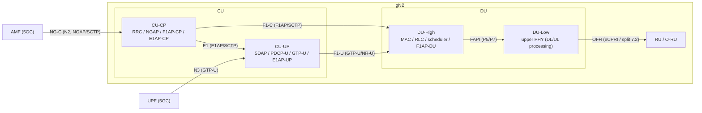
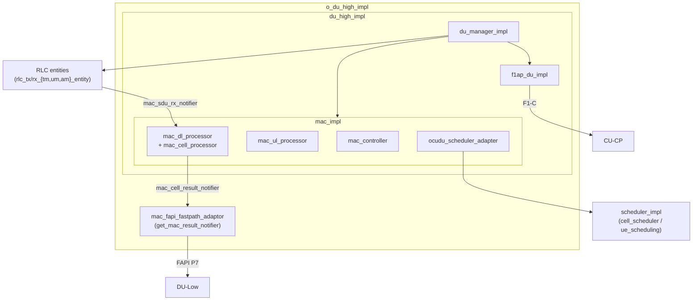
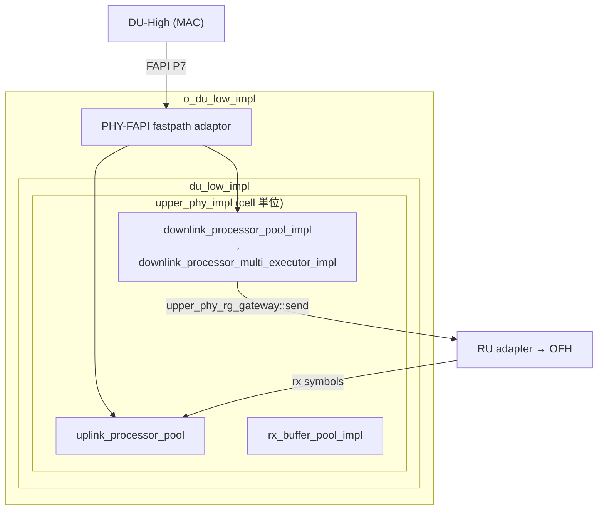
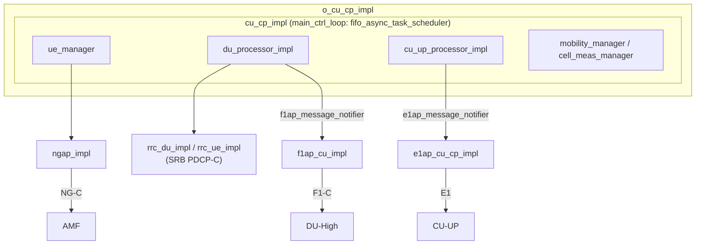
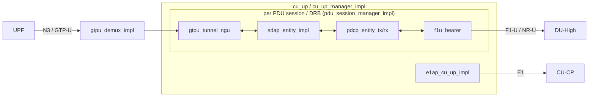
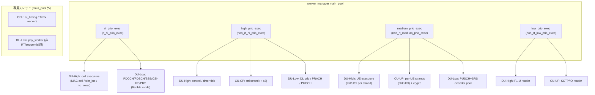
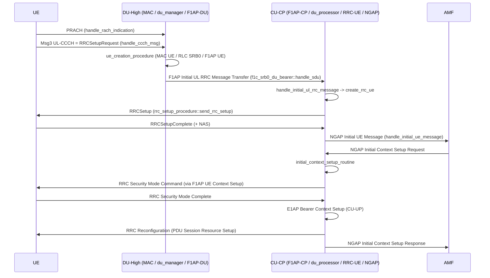
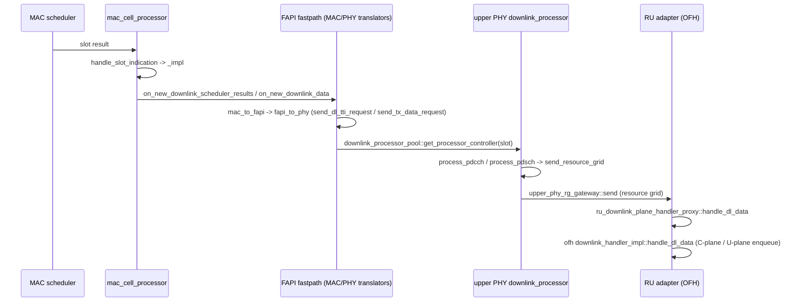

# OCUDU 実装技術リファレンス（dev）

本書は OCUDU の実装構造を、DU-High / DU-Low / CU-CP / CU-UP の 4 コンポーネントと、
2 つの横断章（① task executor・スレッドモデル、② F1/E1/NG インターフェースとコールフロー）
に分けて解説する技術リファレンスである。

> **記述の根拠について**
> 本書のすべての記述は、チェックアウト中の作業ツリー（`git` ブランチ
> `claude/awesome-euler-rv6wmi`、最新コミット `7a2b9e3`）の実ファイルに基づく。
> 引用は `path:line` 形式で示す。確認できなかった事項は推測せず「未確認」と明記する。
> 説明文・見出しは日本語、ソースの識別子・クラス名・関数名・ファイルパス・config キーは
> 英語のまま表記する。

---

## 0. はじめに（移行に伴う命名の変更）

OCUDU は 2025/12 に srsRAN_Project から移行したコードベースである。ディレクトリ構成は
srsRAN を引き継いでいるが、**名前空間とインクルードルートが全面的に改称されている**。
本書を読む際、および srsRAN 由来の資料を参照する際は次の対応に注意する。

| srsRAN 時点 | OCUDU（dev） | 確認箇所 |
|---|---|---|
| `namespace srsran` | `namespace ocudu` | 例: `include/ocudu/adt/detail/concurrent_queue_params.h:8` |
| `include/srsran/...` | `include/ocudu/...` | ルートディレクトリ |
| `srslog` | `ocudulog` | `lib/ocudulog/`, `lib/support/executors/priority_task_worker.cpp:5` |
| `srsvec` | `ocuduvec` | `lib/ocuduvec/` |

さらに、コンポーネント固有のサブ名前空間が使われる。

| サブ名前空間 | 用途 | 確認箇所 |
|---|---|---|
| `ocudu::odu` | DU（DU-High / DU-Low） | `lib/du/o_du_impl.h:15-16`、`worker_manager.cpp:244` |
| `ocudu::ocucp` | CU-CP | `worker_manager.cpp:216` |
| `ocudu::ocuup` | CU-UP | `worker_manager.cpp:227` |

加えて、いくつかの構造・命名が srsRAN から変化している。本書で特に注意すべきもの:

- **スケジューラ・ポリシー**: srsRAN の `time_pf`（proportional fair）に相当するファイルは存在せず、
  PF ロジックは QoS-aware ポリシー `scheduler_time_qos` に統合された
  （`lib/scheduler/policy/scheduler_time_qos.{h,cpp}`）。config キーも
  `pf_sched_fairness_coeff` ではなく `pf_fairness_coeff`
  （`include/ocudu/scheduler/config/scheduler_expert_config.h:45`）。詳細は §7.4。
- **`concurrent_priority_queue`**: その名のクラスは存在しない。優先度付きタスクキューの実体は
  `detail::priority_task_queue`（`include/ocudu/support/executors/detail/priority_task_queue.h`）。詳細は §6.2。

---

## 1. 全体アーキテクチャ

OCUDU は O-RAN 準拠 gNB を構成する。論理ノードは CU-CP / CU-UP / DU（DU-High + DU-Low）/ RU で、
標準インターフェース NG（N2/N3）・E1・F1（F1-C/F1-U）・OFH で結合される。アプリ実体としては、
モノリシックな gNB（`apps/gnb/`）、CU（CU-CP + CU-UP、`apps/cu/`）、DU 単体（`apps/du/`）が
ビルドできる。DU は `o_du_impl` が DU-High（`o_du_high`）と DU-Low（`o_du_low`）を所有する
（`lib/du/o_du_impl.h:42-46`）。



各インターフェースの担当方向:

| IF | 接続 | 上位プロトコル | 本書での詳細 |
|---|---|---|---|
| NG-C | CU-CP ↔ AMF | NGAP over SCTP | §7.1 / §4 |
| NG-U (N3) | CU-UP ↔ UPF | GTP-U | §5 |
| E1 | CU-CP ↔ CU-UP | E1AP over SCTP | §7.1 |
| F1-C | CU-CP ↔ DU-High | F1AP over SCTP | §7.1 / §7.2 |
| F1-U | CU-UP ↔ DU-High | GTP-U (NR-U) | §2 / §5 |
| FAPI | DU-High ↔ DU-Low | FAPI P5/P7 | §7.3 |
| OFH | DU-Low ↔ RU | eCPRI / O-RAN split 7.2 | §3 / §7.3 |

---

## 2. DU-High

### 2.1 役割（責務）

DU-High は DU の上位 L2 と F1AP-DU を統合するコンポーネント。`du_high_impl` が内部の 3 要素
（`du_manager`、`f1ap_du`、`mac_interface`）を所有・起動する（`lib/du/du_high/du_high_impl.h:20`）。
さらに `o_du_high_impl` がこれを包み、FAPI fastpath adaptor と E2 agent を統合した O-RAN 版 DU-High
を構成する（`lib/du/du_high/o_du_high_impl.h:30`）。中核の `du_manager` は UE コンテキストの
生成／更新／削除、cell 管理、F1/MAC イベント処理、非同期タスク実行ループを統括する
（`lib/du/du_high/du_manager/du_manager_impl.h:20`）。

### 2.2 担当する 3GPP レイヤー

- **MAC** … `lib/mac/`（エントリは `mac_interface` / `mac_impl`）
- **RLC** … `lib/rlc/`（TM/UM/AM の TX/RX エンティティ）
- **MAC scheduler** … `lib/scheduler/`（`mac_scheduler` 実装。ポリシーは §7.4）
- **F1AP-DU** … `lib/f1ap/du/`（CU との F1-C 制御プレーン）

F1-U（`include/ocudu/f1u/du/`）と PHY（FAPI）は DU-High の **境界先** であり、内部実装ではない。

### 2.3 主要クラスとファイルパス

| クラス | 役割 | 宣言 |
|---|---|---|
| `du_high_impl` | DU-High 統合実体（du_manager + f1ap_du + mac） | `lib/du/du_high/du_high_impl.h:20` |
| `o_du_high_impl` | O-RAN 版（+ FAPI fastpath adaptor + E2） | `lib/du/du_high/o_du_high_impl.h:30` |
| `du_manager_impl` | UE/cell 管理・非同期タスクループ | `lib/du/du_high/du_manager/du_manager_impl.h:20` |
| `mac_impl` | MAC 統合（`mac_sched` + `dl_unit` + `ul_unit` + `ctrl_unit`、`mac_impl.h:55-69`） | `lib/mac/mac_impl.h:18` |
| `mac_dl_processor` | MAC DL 構成 | `lib/mac/mac_dl/mac_dl_processor.h:28` |
| `mac_cell_processor` | cell 単位 DL 処理・slot handler | `lib/mac/mac_dl/mac_cell_processor.h:24` |
| `mac_ul_processor` | MAC UL PDU 処理 | `lib/mac/mac_ul/mac_ul_processor.h:27` |
| `mac_controller` | MAC 制御（UE/cell config） | `lib/mac/mac_ctrl/mac_controller.h:27` |
| `ocudu_scheduler_adapter` | MAC→scheduler エントリ実装 | `lib/mac/mac_sched/ocudu_scheduler_adapter.h:35` |
| `scheduler_impl` | スケジューラ本体（`mac_scheduler` 実装） | `lib/scheduler/scheduler_impl.h:15` |
| `cell_scheduler` | cell 単位スケジューリング | `lib/scheduler/cell_scheduler.h:28` |
| `f1ap_du_impl` | F1AP-DU 実体 | `lib/f1ap/du/f1ap_du_impl.h:23` |

RLC エンティティは `lib/rlc/` 配下。`rlc_factory.cpp` が `msg.config.mode` で TM/UM/AM を分岐生成する
（`lib/rlc/rlc_factory.cpp:14-48`）。主要クラスは `rlc_tm_entity`（`rlc_tm_entity.h:13`）、
`rlc_um_entity`（`rlc_um_entity.h:13`）、`rlc_am_entity`（`rlc_am_entity.h:13`）と、それぞれの
TX/RX（例: `rlc_tx_am_entity.h:80`、`rlc_rx_am_entity.h:70`）。



### 2.4 スレッドモデル

executor の割当は `lib/du/du_high/du_high_executor_mapper.cpp`、インターフェースは
`include/ocudu/du/du_high/du_high_executor_mapper.h` と `include/ocudu/mac/mac_executor_mapper.h`。
カテゴリは次の 3 系統。

- **Cell executors**（cell ごと）: `mac_cell_executor`（`mac_executor_mapper.h:20`）、
  `slot_ind_executor`（slot indication 用・高優先、`mac_executor_mapper.h:23`）、
  `rlc_lower_executor`（`du_high_executor_mapper.h:28`）。専用ワーカ方式
  （`dedicated_cell_worker_executor_mapper`）とプール＋strand 方式
  （`strand_cell_worker_executor_mapper`）の 2 実装がある。
- **UE executors**（strand ごと）: 1 strand を 3 優先度に分け `ctrl_exec` / `ul_exec` / `dl_exec`
  に割当（`du_high_executor_mapper.cpp:189-219`）。UE→strand 写像方針は
  `map_policy{per_cell, round_robin}`（`du_high_executor_mapper.h:106`）。
- **Control executor**: 1 strand を 2 優先度で `du_control_executor()` と `du_e2_executor()` に分け、
  最高優先度を timer tick に充てる（`du_high_executor_mapper.cpp:384-419`）。

`worker_manager` がこれらを main pool の executor に束ねる（`worker_manager.cpp:242-264`）:

| カテゴリ | 割当先 executor |
|---|---|
| cell executors（`cell_executors.pool_executors`） | `rt_hi_prio_exec`（main pool `"rt_prio_exec"`） |
| UE executors（`ue_executors.pool_executor`） | `non_rt_medium_prio_exec` |
| UE F1-U reader（`ue_executors.f1u_reader_executor`） | `non_rt_low_prio_exec` |
| control executors（`ctrl_executors.pool_executor`） | `non_rt_hi_prio_exec` |

MAC へは `mac_config` 経由で `ue_exec_mapper` / `cell_exec_mapper` / `ctrl_exec` が渡される
（`include/ocudu/mac/mac_config.h:46-48`）。RLC エンティティは `pcell_executor`（cell の rlc_lower）と
`ue_executor` を受け取る（`include/ocudu/rlc/rlc_factory.h:29-30`）。

### 2.5 入出力インターフェース

- **上り（F1-C / CU 方向）**: `f1ap_du`（`include/ocudu/f1ap/du/f1ap_du.h:226`）が
  `f1ap_message_handler` 等を統合。CU への送信は `f1ap_message_notifier tx_pdu_notifier`
  （`lib/f1ap/du/f1ap_du_impl.h:146`）。接続は `f1c_connection_client`。
- **上り（F1-U / ユーザプレーン）**: `f1u_bearer` / `f1u_gateway`（`include/ocudu/f1u/du/`）。
- **MAC 上位境界（RLC SDU）**: `mac_sdu_rx_notifier::on_new_sdu(byte_buffer_slice)`
  （`include/ocudu/mac/mac_sdu_handler.h:14-20`）、UL PDU 入力は `mac_pdu_handler`
  （`include/ocudu/mac/mac_pdu_handler.h:36`）。
- **下り（FAPI / DU-Low 方向）**: `mac_cell_result_notifier`
  （`include/ocudu/mac/mac_cell_result.h:91`）。`on_new_downlink_scheduler_results`（:97）、
  `on_new_downlink_data`（:100）、`on_new_uplink_scheduler_results`（:103）、
  `on_cell_results_completion`（:106）。MAC は `mac_config::phy_notifier`（`mac_result_notifier&`）で
  PHY 側に接続する（`mac_config.h:49`）。
- **MAC↔scheduler 境界**: `mac_scheduler`（`include/ocudu/scheduler/mac_scheduler.h:18`）。
  `scheduler_impl::slot_indication(...)` が `sched_result` を返す（`scheduler_impl.h:33`）。

### 2.6 主な config キー

DU-High ユニット config（`apps/units/flexible_o_du/o_du_high/du_high/du_high_config.h`）:

| キー（struct field） | 既定値 | 箇所 |
|---|---|---|
| `gnb_id` | `{411,22}` | `du_high_config.h:1365` |
| `gnb_du_id` | — | `:1367` |
| `cells_cfg`（`vector<du_high_unit_cell_config>`） | — | `:1381` |
| `du_high_unit_scheduler_config::nof_preselected_newtx_ues` | `1024` | `:93` |
| `du_high_unit_scheduler_config::policy_cfg`（`optional<scheduler_policy_config>`） | — | `:95` |
| `du_high_unit_logger_config::{du,mac,rlc,f1ap,f1u}_level` | `warning` | `:42-54` |
| `du_high_unit_tracer_config::executor_tracing_enable` | `false` | `:64` |

スケジューラ動作に関わる主要 expert config は §7.4 を参照。MAC config の主要フィールドは
`include/ocudu/mac/mac_config.h:36-55`（`phy_notifier`、`ue_exec_mapper`、`sched_cfg` 等）。

> 未確認: scheduler の CLI11 オプション文字列（`--` 名）と struct field の完全な対応は本調査では
> 全件照合していない。

---

## 3. DU-Low

### 3.1 役割（責務）

DU-Low は **upper PHY（上位物理層）** を構成・所有する。複数 cell の `upper_phy` インスタンスを束ね、
上位の DU-High/MAC（FAPI 経由）と下位の RU/OFH の間で物理層処理を担う。`du_low_impl` は
`std::vector<std::unique_ptr<upper_phy>>` を保持する（`lib/du/du_low/du_low_impl.h:18-21`）。
upper PHY は **ステートレス** であり、`du_low_impl::start()` は実質何もしない
（`lib/du/du_low/du_low_impl.cpp:31-34`）。O-RAN 版 `o_du_low_impl` は DU-Low と PHY-FAPI fastpath
adaptor をまとめる（`lib/du/du_low/o_du_low_impl.h:17`）。

### 3.2 担当する 3GPP レイヤー

物理層上位（upper PHY）。下り（DL）と上り（UL）の双方を処理する
（`include/ocudu/phy/upper/upper_phy.h:24-32`）。扱うチャネル／信号は PDCCH, PDSCH, SSB, NZP-CSI-RS,
PRS, PUCCH, PUSCH, PRACH, SRS（`include/ocudu/phy/upper/upper_phy_execution_configuration.h:32-57`）。

### 3.3 主要クラスとファイルパス

| 役割 | クラス | 宣言 |
|---|---|---|
| DU-Low 実体 | `du_low_impl` | `lib/du/du_low/du_low_impl.h:18` |
| O-DU-Low 実体 | `o_du_low_impl` | `lib/du/du_low/o_du_low_impl.h:17` |
| Upper PHY 実体 | `upper_phy_impl` | `lib/phy/upper/upper_phy_impl.h:59` |
| DL processor（IF） | `downlink_processor` | `include/ocudu/phy/upper/downlink_processor.h:34` |
| DL processor（実装） | `downlink_processor_multi_executor_impl` | `lib/phy/upper/downlink_processor_multi_executor_impl.h:50` |
| DL processor pool | `downlink_processor_pool_impl` | `lib/phy/upper/downlink_processor_pool_impl.h:27` |
| UL processor（IF） | `uplink_processor` | `include/ocudu/phy/upper/uplink_processor.h:19` |
| PDSCH | `pdsch_processor_impl` / `pdsch_processor_flexible_impl` | `lib/phy/upper/channel_processors/pdsch/...` |
| PUSCH | `pusch_processor_impl` / `pusch_decoder_impl` | `lib/phy/upper/channel_processors/pusch/...` |
| Rx buffer pool | `rx_buffer_pool_impl` | `lib/phy/upper/rx_buffer_pool_impl.h:21` |

ファクトリは `make_du_low`（`lib/du/du_low/du_low_factory.cpp:13`、cell ごとに
`upper_phy_factory->create()`）と `make_o_du_low`（`lib/du/du_low/o_du_low_factory.cpp:52`）。



### 3.4 スレッドモデル

executor カテゴリは `upper_phy_execution_configuration`
（`include/ocudu/phy/upper/upper_phy_execution_configuration.h:32-57`）で定義され、各々
`task_executor*` と `max_concurrency` のペア（`upper_phy_executor`、`:12-28`）。割当は
`du_low_executor_mapper`（`include/ocudu/du/du_low/du_low_executor_mapper.h:26`、実装
`lib/du/du_low/du_low_executor_mapper.cpp:60`）で行い、2 モードを持つ。

- **single-exec モード**: 全チャネルを 1 つの `common_executor` に割当
  （`du_low_executor_mapper.cpp:71-80`）。PUSCH ch-estimator は inline executor、PDSCH codeblock と
  PUSCH decoder は同期実行（`:82-85`）。`worker_manager` 側では非 RT 時に専用 `phy_worker`
  （`locking_mpsc`）を作って割り当てる（`worker_manager.cpp:398-412`）。
- **flexible モード**: 4 優先度 executor を入力に取り（`du_low_executor_mapper.cpp:101-120`）、
  DL 高優先（PDCCH/SSB/CSI-RS/PRS）を `rt_hi_prio_exec` に、DL grid pool/PRACH を `non_rt_hi_prio_exec`
  に割当。PDSCH/PUCCH/PUSCH+SRS には `task_fork_limiter` を被せて並列度を制限する
  （`max_pdsch_concurrency` / `max_pucch_concurrency` / `max_pusch_and_srs_concurrency`）。
  `worker_manager` 側の入力は `rt_hi_prio_exec` / `non_rt_hi_prio_exec` / `non_rt_medium_prio_exec` /
  `non_rt_low_prio_exec`（`worker_manager.cpp:418-425`）。

スロット→processor の対応は、`downlink_processor_pool_impl::get_processor_controller(slot)`
（`lib/phy/upper/downlink_processor_pool_impl.cpp:18`）が、slot の numerology からプールを選び、
ラウンドロビンで processor を選択する（`processor_pool_helpers.h:43-56`）。各 processor は内部で
チャネル別 executor を固定保持する（`downlink_processor_multi_executor_impl.h`）。

### 3.5 入出力インターフェース

- **上り境界（FAPI ← MAC）**: `upper_phy`（`include/ocudu/phy/upper/upper_phy.h:33`）が
  `get_downlink_processor_pool()`（:52）、`get_uplink_request_processor()`（:58）、
  `get_rx_symbol_handler()`（:43）、`get_timing_handler()`（:46）を公開。結果通知は
  `upper_phy_rx_results_notifier`（`include/ocudu/phy/upper/upper_phy_rx_results_notifier.h:135`）。
  FAPI 結線は `o_du_low_impl` コンストラクタが行う（`lib/du/du_low/o_du_low_impl.cpp:24-31`）。
- **下り境界（RU/OFH）**: DL 送出は `upper_phy_rg_gateway::send(context, grid)`
  （`include/ocudu/phy/upper/upper_phy_rg_gateway.h:24`）。UL 要求は
  `upper_phy_rx_symbol_request_notifier`（同 `upper_phy_rx_symbol_request_notifier.h:20`）、
  UL シンボル入力は `upper_phy_rx_symbol_handler`（同 `upper_phy_rx_symbol_handler.h`）。
  RU 側アダプタ `upper_phy_ru_dl_rg_adapter::send` が `dl_handler->handle_dl_data` を呼ぶ
  （`include/ocudu/ru/ru_adapters.h:29-32`）。OFH 実装は `ofh::sector_impl`
  （`lib/ofh/ofh_sector_impl.h:37`）で、`ofh::transmitter`（`get_downlink_handler` /
  `get_uplink_request_handler`）と `ofh::downlink_handler::handle_dl_data` を提供する。

### 3.6 主な config キー

DU-Low ユニット config（`apps/units/flexible_o_du/o_du_low/du_low_config.h`、CLI は
`du_low_config_cli11_schema.cpp`）。

| CLI キー | struct field | 箇所 |
|---|---|---|
| `--max_proc_delay` | `max_processing_delay_slots`（既定 5） | `du_low_config.h:21` |
| `--pusch_dec_max_iterations` | `pusch_decoder_max_iterations`（既定 6） | schema `:189-194` |
| `--pusch_dec_enable_early_stop` | `pusch_decoder_early_stop` | schema `:195-199` |
| `--pusch_channel_equalizer_algorithm` | （zf/mmse） | schema `:228-233` |
| `--pdsch_processor_type` | `pdsch_processor_type`（auto/generic/flexible） | `du_low_config.h:128` |
| `--max_pucch_concurrency` | `max_pucch_concurrency` | `du_low_config.h:138` |
| `--max_pusch_and_srs_concurrency` | `max_pusch_and_srs_concurrency` | `du_low_config.h:143` |
| `--max_pdsch_concurrency` | `max_pdsch_concurrency` | `du_low_config.h:151` |

> 未確認: `du_low_executor_mapper` の flexible 構成に渡される `non_rt_low_prio_exec` は、mapper 実装内で
> 明示利用が確認できなかった（`du_low_executor_mapper.h:58` に定義はある）。

---

## 4. CU-CP

### 4.1 役割（責務）

CU-CP は gNB の Central Unit – Control Plane。コントロールプレーン・メッセージング全般、特に PDCP
プロトコルの制御プレーン部分を担当する UE-centric なコンポーネント（`lib/cu_cp/README.md:5-7`）。
5 つの主要コンポーネントと 4 つの主要インターフェース（NG-C / E1 / F1-C / E2）を持つ
（`README.md:11-24`）。

### 4.2 担当する 3GPP レイヤー

- **RRC** … `lib/rrc/`（`rrc_du` / `rrc_ue`、トップレベル配置）
- **NGAP / NG-C（N2）** … `lib/ngap/`（AMF と接続）
- **F1AP-CP / F1-C** … `lib/f1ap/cu_cp/`（DU-High と接続）
- **E1AP-CP / E1** … `lib/e1ap/cu_cp/`（CU-UP と接続）
- **PDCP-C（SRB の暗号化／完全性保護）** … **RRC UE 内** に存在する。SRB1/SRB2 の `pdcp_entity` は
  `srb_pdcp_context` が保持し（`lib/rrc/ue/rrc_ue_srb_context.h:37-39`）、
  `pdcp_make_default_srb_config()` で構成される（同 `:54`）。`lib/cu_cp` 配下ではない点に注意。

> 配置に関する注記: RRC / NGAP は物理的に `lib/rrc` / `lib/ngap`（トップレベル）にあり、F1AP-CP /
> E1AP-CP は `lib/f1ap/cu_cp` / `lib/e1ap/cu_cp` にある。本章は「CU-CP が利用するレイヤー」として
> これらをまとめて解説する。

### 4.3 主要クラスとファイルパス

| クラス | 役割 | 宣言 |
|---|---|---|
| `cu_cp_impl` | CU-CP 統合実体 | `lib/cu_cp/cu_cp_impl.h:46` |
| `o_cu_cp_impl` / `o_cu_cp_with_e2_impl` | O-RAN 版（+ E2） | `lib/cu_cp/o_cu_cp_impl.h:18` / `:40` |
| `du_processor_impl` | DU ごとの処理（F1AP-CP, RRC UE 生成） | `lib/cu_cp/du_processor/du_processor_impl.h:22` |
| `cu_up_processor_impl` | CU-UP ごとの処理（E1） | `lib/cu_cp/cu_up_processor/cu_up_processor_impl.h:15` |
| `ue_manager` | UE コンテキスト管理 | `lib/cu_cp/ue_manager/ue_manager_impl.h:25` |
| `rrc_du_impl` | RRC（DU 単位） | `lib/rrc/rrc_du_impl.h:92` |
| `rrc_ue_impl` | RRC（UE 単位） | `lib/rrc/ue/rrc_ue_impl.h:19` |
| `ngap_impl` | NGAP 実体 | `lib/ngap/ngap_impl.h:22` |
| `f1ap_cu_impl` | F1AP-CP 実体 | `lib/f1ap/cu_cp/f1ap_cu_impl.h:21` |
| `e1ap_cu_cp_impl` | E1AP-CP 実体 | `lib/e1ap/cu_cp/e1ap_cu_cp_impl.h:18` |
| `mobility_manager` | ハンドオーバ制御 | `lib/cu_cp/mobility_manager/mobility_manager_impl.h:46` |
| `cell_meas_manager` | 測定設定管理 | `lib/cu_cp/cell_meas_manager/cell_meas_manager_impl.h:33` |

> 命名注意: `mobility_manager_impl` / `cell_meas_manager_impl` というクラスは存在しない（ファイル名のみ
> `*_impl`）。実クラス名は `mobility_manager` / `cell_meas_manager`。



### 4.4 スレッドモデル

CU-CP は **非 RT ワーカープール上の 1 本の strand（sequential executor）** で動作する。
`cu_cp_executor_mapper_impl`（`lib/cu_cp/cu_cp_executor_mapper.cpp:15`）が、`pool_executor` 上に
`task_strand<task_executor*, concurrent_queue_policy::lockfree_mpmc>`（queue size 2048）を生成し
（`:17-23`）、`ctrl_executor()` がこの strand を返す（`:33`）。`e2_executor()` も同一 strand を
再利用する（`:35-39`）。一方、受信パース用の `n2_rx_executor()` / `f1c_rx_executor()` /
`e1_rx_executor()` 等は `pool_exec` をそのまま返す（並列受信、`:41-49`）。

`pool_executor` は `non_rt_hi_prio_exec`（main pool の `"high_prio_exec"`）に束ねられる
（`worker_manager.cpp:216-217`）。さらに CU-CP 内部のタスク直列化は、`cu_cp_impl` が持つ
`fifo_async_task_scheduler main_ctrl_loop`（`lib/cu_cp/cu_cp_impl.h:34-44`）でも担保され、UE 単位
タスクは各 UE の task scheduler に積まれる。

### 4.5 入出力インターフェース

| IF | handler / notifier | 宣言 |
|---|---|---|
| NG-C | `ngap_message_handler` / `ngap_message_notifier` | `include/ocudu/ngap/ngap.h:29` / `:47` |
| F1-C | `f1ap_message_handler` / `f1ap_message_notifier` | `include/ocudu/f1ap/f1ap_message_handler.h:12` / `f1ap_message_notifier.h:12` |
| E1 | `e1ap_message_handler` / `e1ap_message_notifier` | `include/ocudu/e1ap/common/e1ap_common.h:12` / `:30` |

CU-CP 内のアダプタ（`lib/cu_cp/adapters/`）が各レイヤーを結線する。代表例: NAS PDU を転送する
`ngap_rrc_ue_adapter`（`adapters/ngap_adapters.h:213`）、RRC↔F1AP の CCCH/DCCH 転送
`f1ap_rrc_ul_ccch_adapter` / `f1ap_rrc_ul_dcch_adapter`（`adapters/f1ap_adapters.h:15` / `:31`）、
E1AP→CU-CP の `e1ap_cu_cp_adapter`（`adapters/e1ap_adapters.h:13`）。

### 4.6 主な config キー

CU-CP ユニット config（`apps/units/o_cu_cp/cu_cp/cu_cp_unit_config.h`、CLI は
`cu_cp_unit_config_cli11_schema.cpp`）。

| キー（struct field / CLI） | 既定値 | 箇所 |
|---|---|---|
| `inactivity_timer`（`--inactivity_timer`） | `120`（秒） | `cu_cp_unit_config.h:383` |
| `max_nof_dus` | `6` | `:375` |
| `max_nof_cu_ups` | `6` | `:377` |
| `max_nof_ues` | `8192` | `:379` |
| `max_nof_drbs_per_ue` | `8` | `:381` |
| `security.integrity_protection`（`--integrity`） | `"not_needed"` | `:162` |
| `security.confidentiality_protection`（`--confidentiality`） | `"required"` | `:163` |
| `security.nea_preference_list`（暗号化順序） | `"nea0,nea2,nea1,nea3"` | `:164` |
| `security.nia_preference_list`（完全性順序） | `"nia2,nia1,nia3"` | `:165` |
| `amf.port` | `38412` | `:43` |
| `rrc.rrc_procedure_guard_time_ms` | `1000` | `:157` |

---

## 5. CU-UP

### 5.1 役割（責務）

CU-UP は gNB の Central Unit – User Plane。ユーザプレーン・メッセージング、特に PDCP と SDAP の
ユーザプレーン部分を担当する（`lib/cu_up/README.md:5-7`）。N3（UPF への GTP-U）、F1-U（DU への
NR-U）、E1（CU-CP）を終端する。実体は `cu_up`（`lib/cu_up/cu_up_impl.h:23`）で、コンストラクタが
N3 TEID allocator、NG-U GTP-U demux/echo、NG-U セッション、E1AP、CU-UP manager を結線する
（`lib/cu_up/cu_up_impl.cpp:67-170`）。O-RAN 版は `o_cu_up_impl`（`lib/cu_up/o_cu_up_impl.h:18`）。

### 5.2 担当する 3GPP レイヤー

| レイヤー | 生成箇所 | エンティティ |
|---|---|---|
| SDAP | `pdu_session_manager_impl.cpp:103-104` | `sdap_entity_impl`（`lib/sdap/sdap_entity_impl.h:18`） |
| PDCP-U（TX/RX） | `pdu_session_manager_impl.cpp:265-282` | `pdcp_entity_tx`（`lib/pdcp/pdcp_entity_tx.h:92`）/ `pdcp_entity_rx`（`lib/pdcp/pdcp_entity_rx.h:68`） |
| GTP-U / NG-U（N3） | `pdu_session_manager_impl.cpp:106-123` | `gtpu_tunnel_ngu_{rx,tx}_impl`（`lib/gtpu/`） |
| F1-U（NR-U） | `pdu_session_manager_impl.cpp:353-365` | `f1u_bearer`（`f1u_cu_up_gateway`） |
| E1AP-UP | `cu_up_impl.cpp:142-149` | `e1ap_cu_up_impl`（`lib/e1ap/cu_up/e1ap_cu_up_impl.h:22`） |

SDAP/PDCP/GTP-U のエンティティ実装は `lib/cu_up` 外（`lib/sdap` / `lib/pdcp` / `lib/gtpu`）にあり、
CU-UP は PDU session / DRB 単位でこれらを生成・結線する。

### 5.3 主要クラスとファイルパス

| クラス | 役割 | 宣言 |
|---|---|---|
| `cu_up` | CU-UP 統合実体 | `lib/cu_up/cu_up_impl.h:23` |
| `o_cu_up_impl` | O-RAN 版（+ E2） | `lib/cu_up/o_cu_up_impl.h:18` |
| `cu_up_manager_impl` | UE/セッション管理 | `lib/cu_up/cu_up_manager_impl.h:44` |
| `pdu_session_manager_impl` | PDU session/DRB 生成・データパス結線 | `lib/cu_up/pdu_session_manager_impl.h:44` |
| `ngu_session_manager_impl` | NG-U セッション多重 | `lib/cu_up/ngu_session_manager_impl.h:11` |
| `ue_manager` | UE 管理 | `lib/cu_up/ue_manager.h:43` |
| `gtpu_demux_impl` | N3 受信の TEID 振り分け | `lib/gtpu/gtpu_demux_impl.h:26` |
| `e1ap_cu_up_impl` | E1AP-UP 実体 | `lib/e1ap/cu_up/e1ap_cu_up_impl.h:22` |



### 5.4 スレッドモデル

CU-UP は **UE 単位の strand** を用いる。`include/ocudu/cu_up/cu_up_executor_mapper.h` が
2 層のインターフェースを定義する: CU-UP 全体の `cu_up_executor_mapper`（`:45`、`ctrl_executor` /
`io_ul_executor` / `n3_rx_executor` / `e1_rx_executor` / `f1u_rx_executor` /
`create_ue_executor_mapper`）と、UE 単位の `ue_executor_mapper`（`:18`、`ctrl_executor` /
`ul_pdu_executor` / `dl_pdu_executor` / `crypto_executor`）。

実装 `strand_based_cu_up_executor_mapper`（`lib/cu_up/cu_up_executor_mapper.cpp:180`）の要点:

- 1 本の基底 strand `cu_up_strand`（`medium_prio_executor` を包む）が、worker pool への全アクセスを
  逐次化する（`:184-188`、アーキ説明 `:169-179`）。**crypto を除き並列化はまだ行われていない**。
- **UE 単位 strand**（`max_nof_ue_strands` 本）を生成し、各 strand を 3 優先度に分けて
  `ue_ctrl_execs` / `ue_ul_execs` / `ue_dl_execs`（= ctrl / UL-PDU / DL-PDU）に割当
  （`:249-262`）。UE→strand は round-robin（`:95`、`:127`）。
- crypto executor は共有（非逐次）の `medium_prio_executor`（唯一の並列パス、`:268`、`:72`）。
- IO/UL strand（`io_ul_executor()`、`:210`）は `dedicated_io_strand` 有効時に専用 strand を持つ
  （`:239-242`）。
- PDCP / GTP-U のマッピング: `pdu_session_manager_impl.cpp:277-280` で PDCP に
  `ue_dl_executor` / `ue_ul_executor` / `ue_ctrl_executor` / `crypto_executor` を割当。NG-U DL の
  GTP-U tunnel は demux に UE の `ue_dl_exec` で登録（`:131`）。

`worker_manager` での生成は `worker_manager.cpp:227-238`（`medium` / `low` / `hi` の各 executor と
`dedicated_io_ul_strand` を渡す）。`max_nof_ue_strands` の既定は 16
（`worker_manager_config.h:76`）。

### 5.5 入出力インターフェースとデータプレーン経路

- **E1（CU-CP 方向）**: `e1ap_cu_up_impl`（`e1ap_cu_up_impl.h:22`）。`handle_message`（`:40`）、
  bearer context setup/modify/release（`:78-90`）。
- **N3 / NG-U**: demux `gtpu_demux::add_tunnel(teid, executor, rx_iface)`（`gtpu_demux_impl.h:39`）。
  NG-U セッション多重は `ngu_session_manager::get_next_ngu_gateway()`（`lib/cu_up/ngu_session_manager.h:15`）。
- **F1-U**: `f1u_cu_up_gateway::create_cu_bearer(...)` → `create_f1u_bearer(...)`
  （`pdu_session_manager_impl.cpp:334-365`）。

データプレーン経路（`pdu_session_manager_impl.cpp` のアダプタ結線）:

- **UL**: F1-U(GTP-U from DU) → PDCP → SDAP → NG-U(GTP-U to UPF)。
  F1-U→PDCP（`:369-370`）、PDCP(RX)→SDAP（`:381`）、SDAP→GTP-U TX（`:125`）。
- **DL**: NG-U(GTP-U from UPF) → SDAP → PDCP → F1-U(to DU)。
  GTP-U(RX)→SDAP（`:126`）、SDAP→PDCP（`:380`）、PDCP→F1-U（`:371`）。

### 5.6 主な config キー

CU-UP ユニット config（`apps/units/o_cu_up/cu_up/cu_up_unit_config.h`）。

| キー（struct field） | 既定値 | 箇所 |
|---|---|---|
| `ngu_socket.bind_addr` | `"127.0.0.1"` | `cu_up_unit_config.h:41` |
| `ngu_gtpu.gtpu_queue_size` | `2046` | `:49` |
| `ngu_gtpu.gtpu_batch_size` | `256` | `:50` |
| `f1u.queue_size` | `8192` | `:65` |
| `f1u.t_notify` | `5` | `:67` |
| `qos.five_qi` | `9` | `:72` |
| `qos.mode` | `"am"` | `:73` |
| `exec.dl_ue_executor_queue_size` | `8192` | `:91` |
| `exec.ul_ue_executor_queue_size` | `8192` | `:92` |
| `max_nof_ues` | `16384` | `:104` |

> 注: UPF 宛先アドレス／TEID は静的 config ではなく、E1 Bearer Context の UL TNL 情報から
> セッション単位で与えられる（`pdu_session_manager_impl.cpp:108-109`）。

---

## 6. 横断① task executor・スレッドモデル

### 6.1 main worker pool と 4 つの優先度 executor

アプリのスレッド資源は `worker_manager` が一元管理する。中心は `create_main_worker_pool`
（`apps/services/worker_manager/worker_manager.cpp:323-366`）が作る単一の `"main_pool"` で、4 つの
名前付き executor を持つ。

| executor 名 | キュー policy | 用途（コード内コメント） | ハンドル変数 |
|---|---|---|---|
| `rt_prio_exec` | `moodycamel_lockfree_bounded_mpmc` | upper PHY DL + MAC scheduling | `rt_hi_prio_exec`（`:357`） |
| `high_prio_exec` | `moodycamel_lockfree_mpmc` | control plane + timer 管理 | `non_rt_hi_prio_exec`（`:356`） |
| `medium_prio_exec` | `moodycamel_lockfree_mpmc` | PCAP + CU-UP | `non_rt_medium_prio_exec`（`:355`） |
| `low_prio_exec` | `moodycamel_lockfree_bounded_mpmc` | 外部ノードからのデータ受信 | `non_rt_low_prio_exec`（`:354`） |

worker 数は `get_default_nof_workers`（`:267-298`）で概算され、`nof_cells*(dl_ant+ul_ant+1)+2` を
基準に利用可能 CPU から spare を引いた値になる。各コンポーネントの executor は、これら 4 つを
土台に `create_{cu_cp,cu_up,du_high,du_low,ofh}_executors`（`:214-491`）が strand / pool として
構築する。OFH と SDR RU は別途専用スレッド（`ru_timing` / TxRx）を持つ（`:436` 以降）。

### 6.2 concurrent queue と priority_task_worker

キューの種別は `concurrent_queue_policy`（`include/ocudu/adt/detail/concurrent_queue_params.h:23-30`）
で 6 種定義される: `lockfree_spsc` / `lockfree_mpmc` / `locking_mpmc` / `locking_mpsc` /
`moodycamel_lockfree_mpmc` / `moodycamel_lockfree_bounded_mpmc`。待機方式は
`concurrent_queue_wait_policy{condition_variable, sleep, non_blocking}`（同 `:37`）。実体は
テンプレート `concurrent_queue<T, Policy, WaitPolicy>`（前方宣言 `:71`）で、policy ごとに
`mpmc_queue.h` / `spsc_queue.h` / `moodycamel_mpmc_queue.h` / `mutexed_mpmc_queue.h` /
`mutexed_mpsc_queue.h` / `moodycamel_bounded_mpmc_queue.h` に特殊化が置かれる。

> srsRAN にあった単一ヘッダ `adt/concurrent_queue.h` は存在しない。また
> `concurrent_priority_queue` というクラスも存在しない。優先度付きタスク処理は次の
> `priority_task_worker` / `priority_task_queue` が担う。

`priority_task_worker`（`include/ocudu/support/executors/priority_task_worker.h:21`）は、優先度
レベルごとに別キューを持つワーカ。タスクは `push_task(task_priority prio, unique_task)` で積む。
優先度は `enqueue_priority`（`concurrent_queue_params.h:51`、`min=0`～`max=SIZE_MAX`。値が小さいほど
低優先）で表され、`task_priority::max` が最高優先（キュー index 0）にマップされる
（`priority_task_queue.h:15-22`）。

このワーカ向けの executor `priority_task_worker_executor` には最適化があり、`prio == max` かつ
同一スレッドからの `execute()` はキューを経由せずインライン実行する
（`priority_task_worker.h:79-95`）。

### 6.3 ドレイン順は strict priority（pop ループ実読）

各優先度レーンのドレイン順は、`detail::priority_task_queue` の pop 実装で確定できる。

- `priority_task_queue::try_pop`（`lib/support/executors/priority_task_queue.cpp:155-164`）は
  `prio_idx = 0`（最高優先）から走査し、**最初に pop に成功したレーンで即 `return`** する。
- `try_pop_bulk`（`:166-178`）も最高優先レーンからバッチを充填し、batch が埋まるまで下位へ進む。
- consumer 版（`:214-235`）も同一ロジック。
- ワーカの実行ループ `priority_task_worker::run_pop_task_loop`
  （`lib/support/executors/priority_task_worker.cpp:26-40`）は
  `while (consumer.pop_blocking(t)) { t(); t = {}; }` で、上記 pop を回す。

したがってドレインは **strict priority**（上位レーンが空のときのみ下位レーンを処理）であり、
レーン間の round-robin・重み付け・アンチスターベーションは行わない。低優先タスクは高優先レーンが
空になるまで待たされる。



---

## 7. 横断② F1/E1/NG インターフェースとコールフロー

### 7.1 インターフェースのメッセージ・エントリポイント

各 AP の共通インターフェースは「受信＝`handle_message`」「送信＝`on_new_message`」の対で表される。

| AP | 受信ハンドラ（実体） | 送信 notifier |
|---|---|---|
| F1AP-DU | `f1ap_du_impl::handle_message`（`lib/f1ap/du/f1ap_du_impl.cpp:366`） | `tx_pdu_notifier->on_new_message`（`:530`） |
| F1AP-CP | `f1ap_cu_impl::handle_message`（`lib/f1ap/cu_cp/f1ap_cu_impl.cpp:136`） | `f1ap_message_notifier` |
| E1AP-CP | `e1ap_cu_cp_impl::handle_message`（`lib/e1ap/cu_cp/e1ap_cu_cp_impl.cpp:215`） | `e1ap_message_notifier` |
| E1AP-UP | `e1ap_cu_up_impl::handle_message`（`lib/e1ap/cu_up/e1ap_cu_up_impl.cpp:176`） | `e1ap_message_notifier` |
| NGAP | `ngap_impl::handle_message`（`lib/ngap/ngap_impl.cpp:377`） | `tx_pdu_notifier->on_new_message`（`:184`） |

代表的な手続き（procedure）クラス:

- F1 Setup: DU 側 `f1ap_du_setup_procedure`（`lib/f1ap/du/procedures/f1ap_du_setup_procedure.cpp:35`）、
  CU 側 `handle_f1_setup_procedure`（`lib/f1ap/cu_cp/procedures/f1_setup_procedure.cpp:170`）。
- F1 UE Context Setup: DU 側 `f1ap_du_ue_context_setup_procedure`
  （`lib/f1ap/du/procedures/f1ap_du_ue_context_setup_procedure.cpp:55`）、CU 側
  `ue_context_setup_procedure`（`lib/f1ap/cu_cp/procedures/ue_context_setup_procedure.cpp:60`）。
- E1 Bearer Context Setup: CU-CP 側 `bearer_context_setup_procedure`
  （`lib/e1ap/cu_cp/procedures/bearer_context_setup_procedure.cpp:29`）。
- NG Setup: `ng_setup_procedure`（`lib/ngap/procedures/ng_setup_procedure.cpp:33`）。
- NG Initial Context Setup: `ngap_initial_context_setup_procedure`
  （`lib/ngap/procedures/ngap_initial_context_setup_procedure.cpp:37`）。

NGAP は SCTP gateway を介して AMF に接続する。受信は `sctp_to_n2_pdu_notifier::on_new_sdu`
（unpack 後 `cu_cp_rx_pdu_notifier->on_new_message`、`lib/ngap/gateways/n2_connection_client_factory.cpp:29`）、
送信は `n2_to_sctp_pdu_notifier::on_new_message`（pack 後 SCTP、同 `:57`）。

### 7.2 コールフロー: UE registration / attach（CU-CP ↔ DU）

UE の初期接続は、DU での RACH/RRC Setup から、CU-CP の RRC UE 生成・NGAP 接続、AMF からの
Initial Context Setup までの一連の手続きで進む。各ホップの実体を以下に示す。

**Step 1 — DU 側で新規 UE 検出 → Initial UL RRC Message Transfer 送出**

1. RACH: `mac_cell_rach_handler_impl::handle_rach_indication`（`lib/mac/mac_sched/mac_rach_handler.cpp:31`）
2. Msg3 UL-CCCH: `pdu_rx_handler::handle_ccch_msg` → `on_ul_ccch_msg_received`
   （`lib/mac/mac_ul/pdu_rx_handler.cpp:294`）
3. DU-Manager: `du_manager_impl::handle_ul_ccch_indication` → `ue_mng.handle_ue_create_request`
   （`lib/du/du_high/du_manager/du_manager_impl.cpp:37`, `:42`）
4. `ue_creation_procedure`: CCCH を push し、F1AP UE を生成
   （`lib/du/du_high/du_manager/procedures/ue_creation_procedure.cpp:83`, `:280`）
5. DU F1AP SRB0 送出: `f1c_srb0_du_bearer::handle_sdu`（`init_ul_rrc_msg_transfer` を pack して送信、
   `lib/f1ap/du/ue_context/f1c_du_bearer_impl.cpp:43`, `:72`）

**Step 2 — CU-CP F1AP 受信 → RRC UE 生成 → NGAP Initial UE Message**

6. `f1ap_cu_impl::handle_initial_ul_rrc_message`（`lib/f1ap/cu_cp/f1ap_cu_impl.cpp:309`）が
   `request_new_ue_creation`（`:344`）と `on_ue_rrc_context_creation_request`（`:370`）を呼ぶ
7. `du_processor_impl::handle_ue_rrc_context_creation_request`（`lib/cu_cp/du_processor/du_processor_impl.cpp:215`）
   → `create_rrc_ue`（`:174`）→ `rrc->add_ue`（`:202`）
8. RRC Setup: `rrc_setup_procedure`（`lib/rrc/ue/procedures/rrc_setup_procedure.cpp:42`）が
   `send_rrc_setup`（`:53`）、RRCSetupComplete 受領後に `send_initial_ue_msg`（`:120`, `:149`）
9. NGAP: `ngap_impl::handle_initial_ue_message`（`lib/ngap/ngap_impl.cpp:145`）が AMF へ
   Initial UE Message を送出（`:184`）

**Step 3 — AMF → Initial Context Setup → CU-CP routine**

10. NGAP 受信: `ngap_impl::handle_initial_context_setup_request`（`lib/ngap/ngap_impl.cpp:514`）が
    `ngap_initial_context_setup_procedure` を起動（`:613`）
11. CU-CP: `cu_cp_impl::handle_new_initial_context_setup_request`（`lib/cu_cp/cu_cp_impl.cpp:802`）が
    `launch_async<initial_context_setup_routine>`（`:822`）
12. `initial_context_setup_routine`（`lib/cu_cp/routines/initial_context_setup_routine.cpp:38`）の順序:
    - `security_mng.init_security_context`（`:46`）
    - `rrc_ue.get_security_mode_command_context`（`:53`）
    - **F1AP UE Context Setup**（SMC を DU へ）: `f1ap_ue_ctxt_mng.handle_ue_context_setup_request`（`:74`）
    - RRC Security Mode Complete 待ち（`:89`）→ UE Capability Enquiry（`:110`）
    - **PDU Session Resource Setup（RRC Reconfiguration を含む）**:
      `pdu_session_setup_handler.handle_new_pdu_session_resource_setup_request`（`:139`）
13. **E1AP Bearer Context Setup**（PDU session routine 内）:
    `e1ap_bearer_ctxt_mng.handle_bearer_context_setup_request`
    （`lib/cu_cp/routines/pdu_session_resource_setup_routine.cpp:125`）



### 7.3 コールフロー: 下り slot 処理パス（DU-High → DU-Low → OFH）

スロット境界をトリガに、MAC スケジューラ結果 → FAPI → upper PHY → RU(OFH) と処理が流れる。

**Step 1 — MAC: slot indication と DL 結果のハンドオフ**

- エントリ: `mac_cell_processor::handle_slot_indication`（`lib/mac/mac_dl/mac_cell_processor.cpp:181`）
  → `handle_slot_indication_impl`（`:314`）
- PHY へ通知（`mac_cell_result_notifier`、`include/ocudu/mac/mac_cell_result.h:91`）:
  `on_new_downlink_scheduler_results`（呼び出し `:347`, `:373`）、`on_new_downlink_data`（`:386`）
- FAPI 実装: `mac_to_fapi_fastpath_translator::on_new_downlink_scheduler_results`
  （`lib/fapi_adaptor/mac/p7/mac_to_fapi_fastpath_translator.cpp:122`）、`on_new_downlink_data`（`:169`）

**Step 2 — DU-Low: FAPI → upper PHY downlink processor**

- FAPI→PHY: `fapi_to_phy_fastpath_translator::send_dl_tti_request`
  （`lib/fapi_adaptor/phy/p7/fapi_to_phy_fastpath_translator.cpp:278`）、`send_tx_data_request`（`:620`）
- processor 選択: `downlink_processor_pool_impl::get_processor_controller(slot)`
  （`lib/phy/upper/downlink_processor_pool_impl.cpp:18`）
- 処理: `downlink_processor_multi_executor_impl::process_pdcch`
  （`lib/phy/upper/downlink_processor_multi_executor_impl.cpp:54`）、`process_pdsch`（`:86`）、
  `configure_resource_grid`（`:223`）、`send_resource_grid`（`:259`）→ `gateway.send`（`:265`）

**Step 3 — resource grid → RU(OFH) 送出**

- gateway: `upper_phy_rg_gateway::send`（`include/ocudu/phy/upper/upper_phy_rg_gateway.h:24`）
- RU adapter: `upper_phy_ru_dl_rg_adapter::send` → `dl_handler->handle_dl_data`
  （`include/ocudu/ru/ru_adapters.h:29`, `:32`）
- RU OFH proxy: `ru_downlink_plane_handler_proxy::handle_dl_data`
  （`lib/ru/ofh/ru_ofh_downlink_plane_handler_proxy.cpp:13`）→ `sector->handle_dl_data`（`:19`）
- OFH DL handler: `downlink_handler_impl::handle_dl_data`
  （`lib/ofh/transmitter/ofh_downlink_handler_impl.cpp:61`）→ C-plane enqueue（`:113`）/
  U-plane enqueue（`:118`）



### 7.4 補足: スケジューラ・ポリシー（time_qos / time_rr）

MAC スケジューラの UE 選択ポリシーは `lib/scheduler/policy/` にあり、共通インターフェース
`scheduler_policy`（`lib/scheduler/policy/scheduler_policy.h:37`）は `compute_ue_dl_priorities` /
`compute_ue_ul_priorities`（UE ごとに `ue_sched_priority = double` を算出）と
`save_dl_newtx_grants` / `save_ul_newtx_grants` を持つ。生成は `create_scheduler_strategy`
（`lib/scheduler/policy/scheduler_policy_factory.cpp:11-21`）で、config の variant により分岐する。

> srsRAN の `time_pf` は本ツリーには存在しない。proportional fair（PF）は QoS-aware ポリシー
> `scheduler_time_qos` の一要素として統合された。

**`scheduler_time_rr`（time-domain round-robin、`lib/scheduler/policy/scheduler_time_rr.cpp`）**

優先度を「現在の割当カウント − その UE が最後に割当を受けたカウント」で与える
（`priority = dl_alloc_count - ue_last_dl_alloc_count[ue_index]`、`:17`、UL も同様 `:27`）。割当の
たびにカウンタを更新する（`:39-41`）。長く割当を受けていない UE ほど高優先になる。

**`scheduler_time_qos`（QoS-aware、`lib/scheduler/policy/scheduler_time_qos.cpp`）**

UE 優先度を 4 つの重みの積で算出する（`combine_qos_metrics`、`:242-256`）:

```
priority = gbr_weight * pf_weight * prio_weight * delay_weight
```

- **pf_weight**: `compute_pf_metric`（`:221-240`）。`estim_rate / pow(avg_rate, fairness_coeff)`。
  係数は `pf_fairness_coeff`。平均レートは指数移動平均で更新される（`ue_history_repository`、
  `exp_avg_alpha` 使用、`:44-62`）。瞬時レート推定は qam256 を基準に算出（`rate_estimator`、
  `estimate_max_dl_tbs` `:117`、`estimate_max_ul_tbs` `:140`）。
- **gbr_weight**: GBR フローの目標レート未達時に重みを上げる（DL `:294-305`、UL `:361-373`）。
  `combine_function == gbr_prioritized` の場合は GBR を PF より優先（`:248-252`）。
- **prio_weight**: QoS priority と ARP priority の組み合わせ（DL `:315-317`、UL `:380-382`）。
- **delay_weight**: PDB（packet delay budget）に対する HOL 遅延比（DL のみ、`:287-292`）。

config（`include/ocudu/scheduler/config/scheduler_expert_config.h`）:

| キー（struct field） | 既定値 | 箇所 |
|---|---|---|
| `time_qos_scheduler_config::combine_function`（`{gbr_prioritized, geometric_mean}`） | `gbr_prioritized` | `:38-41` |
| `time_qos_scheduler_config::pf_fairness_coeff` | `2.0` | `:45` |
| `time_qos_scheduler_config::priority_enabled` | `true` | `:47` |
| `time_qos_scheduler_config::pdb_enabled` | `true` | `:49` |
| `time_qos_scheduler_config::gbr_enabled` | `true` | `:51` |
| `scheduler_policy_config`（`variant<time_qos, time_rr>`） | `time_qos_scheduler_config{}` | `:58`, `:205` |
| `pre_policy_rr_ue_group_size` | `32` | `:211` |

---

## 8. 未確認事項一覧

本書の作成過程で、実ツリーから確証を得られなかった事項を以下にまとめる。

- `ngap_pdu_session_resource_setup_procedure::operator()` の正確な行番号。ファイル
  `lib/ngap/procedures/ngap_pdu_session_resource_setup_procedure.cpp` は存在するが、本文での
  行レベル引用は未照合。
- DU-Low の flexible executor 構成に渡される `non_rt_low_prio_exec`
  （`du_low_executor_mapper.h:58`）の mapper 実装内での具体的用途。定義はあるが利用箇所が未確認。
- scheduler の CLI11 オプション文字列（`--` 名）と `scheduler_expert_config` の struct field 名の
  完全な対応。struct field は確認済みだが CLI 文字列リテラルとの全件照合は未実施。
- 本書の `path:line` は作業ツリー（コミット `7a2b9e3`）時点のもの。以後の編集で行番号がずれる
  可能性がある。

---

## 付録: 引用ファイル索引（主要分）

- 全体・DU 合成: `lib/du/o_du_impl.h`
- DU-High: `lib/du/du_high/{du_high_impl.h, o_du_high_impl.h, du_high_executor_mapper.cpp}`,
  `lib/du/du_high/du_manager/du_manager_impl.{h,cpp}`,
  `lib/mac/{mac_impl.h, mac_dl/mac_cell_processor.cpp, mac_ul/pdu_rx_handler.cpp, mac_sched/ocudu_scheduler_adapter.h}`,
  `lib/scheduler/scheduler_impl.h`, `lib/rlc/rlc_factory.cpp`, `lib/f1ap/du/f1ap_du_impl.{h,cpp}`,
  `include/ocudu/mac/{mac_config.h, mac_cell_result.h, mac_executor_mapper.h}`
- DU-Low: `lib/du/du_low/{du_low_impl.{h,cpp}, o_du_low_impl.{h,cpp}, du_low_executor_mapper.cpp}`,
  `lib/phy/upper/{upper_phy_impl.h, downlink_processor_pool_impl.cpp, downlink_processor_multi_executor_impl.cpp}`,
  `include/ocudu/phy/upper/{upper_phy.h, downlink_processor.h, upper_phy_rg_gateway.h, upper_phy_execution_configuration.h}`,
  `include/ocudu/ru/ru_adapters.h`, `lib/ofh/transmitter/ofh_downlink_handler_impl.cpp`,
  `lib/ru/ofh/ru_ofh_downlink_plane_handler_proxy.cpp`
- CU-CP: `lib/cu_cp/{cu_cp_impl.h, cu_cp_executor_mapper.cpp, du_processor/du_processor_impl.{h,cpp},
  routines/initial_context_setup_routine.cpp, routines/pdu_session_resource_setup_routine.cpp}`,
  `lib/rrc/{rrc_du_impl.h, ue/rrc_ue_impl.h, ue/rrc_ue_srb_context.h, ue/procedures/rrc_setup_procedure.cpp}`,
  `lib/ngap/{ngap_impl.{h,cpp}, procedures/...}`, `lib/f1ap/cu_cp/f1ap_cu_impl.cpp`,
  `lib/e1ap/cu_cp/e1ap_cu_cp_impl.cpp`, `apps/units/o_cu_cp/cu_cp/cu_cp_unit_config.h`
- CU-UP: `lib/cu_up/{cu_up_impl.{h,cpp}, cu_up_executor_mapper.cpp, pdu_session_manager_impl.cpp}`,
  `lib/pdcp/{pdcp_entity_tx.h, pdcp_entity_rx.h}`, `lib/sdap/sdap_entity_impl.h`,
  `lib/gtpu/gtpu_demux_impl.h`, `lib/e1ap/cu_up/e1ap_cu_up_impl.{h,cpp}`,
  `apps/units/o_cu_up/cu_up/cu_up_unit_config.h`
- 横断（thread/executor）: `apps/services/worker_manager/worker_manager.cpp`,
  `include/ocudu/adt/detail/concurrent_queue_params.h`,
  `include/ocudu/support/executors/priority_task_worker.h`,
  `include/ocudu/support/executors/detail/priority_task_queue.h`,
  `lib/support/executors/priority_task_queue.cpp`, `lib/support/executors/priority_task_worker.cpp`
- 横断（scheduler policy）: `lib/scheduler/policy/{scheduler_policy.h, scheduler_policy_factory.cpp,
  scheduler_time_qos.cpp, scheduler_time_rr.cpp}`, `include/ocudu/scheduler/config/scheduler_expert_config.h`
