# OCUDU 実装技術リファレンス（dev）

本書は OCUDU の実装構造を、DU-High / DU-Low / CU-CP / CU-UP の 4 コンポーネントと、
7 つの横断章（① task executor・スレッドモデル、② F1/E1/NG インターフェースとコールフロー、
③ Open Fronthaul (OFH / split 7.2x) のタイミングと締め切り処理、④ 非標準化アルゴリズム
（scheduler 判断系 / 受信 DSP）、⑤ スケーリング（cell / UE / RU 単位とリソース割当）、
⑥ ライフサイクルと障害時挙動、⑦ メトリクスと可観測性）に分けて解説する技術リファレンスである。

> **記述の根拠について**
> 本書のすべての記述は、チェックアウト中の作業ツリー（`git` ブランチ
> `claude/awesome-euler-rv6wmi`、最新コミット `7a2b9e3`）の実ファイルに基づく。
> 引用は `path:line` 形式で示す。確認できなかった事項は推測せず「未確認」と明記する。
> 説明文・見出しは日本語、ソースの識別子・クラス名・関数名・ファイルパス・config キーは
> 英語のまま表記する。

---

## 0. はじめに（移行に伴う命名の変更）

OCUDU は 2025/12 に srsRAN_Project から移行したコードベースである。ディレクトリ構成は
srsRAN を引き継いでいるが、**名前空間とインクルードルートが全面的に改称されている**。
本書を読む際、および srsRAN 由来の資料を参照する際は次の対応に注意する。

| srsRAN 時点 | OCUDU（dev） | 確認箇所 |
|---|---|---|
| `namespace srsran` | `namespace ocudu` | 例: `include/ocudu/adt/detail/concurrent_queue_params.h:8` |
| `include/srsran/...` | `include/ocudu/...` | ルートディレクトリ |
| `srslog` | `ocudulog` | `lib/ocudulog/`, `lib/support/executors/priority_task_worker.cpp:5` |
| `srsvec` | `ocuduvec` | `lib/ocuduvec/` |

さらに、コンポーネント固有のサブ名前空間が使われる。

| サブ名前空間 | 用途 | 確認箇所 |
|---|---|---|
| `ocudu::odu` | DU（DU-High / DU-Low） | `lib/du/o_du_impl.h:15-16`、`worker_manager.cpp:244` |
| `ocudu::ocucp` | CU-CP | `worker_manager.cpp:216` |
| `ocudu::ocuup` | CU-UP | `worker_manager.cpp:227` |

加えて、いくつかの構造・命名が srsRAN から変化している。本書で特に注意すべきもの:

- **スケジューラ・ポリシー**: srsRAN の `time_pf`（proportional fair）に相当するファイルは存在せず、
  PF ロジックは QoS-aware ポリシー `scheduler_time_qos` に統合された
  （`lib/scheduler/policy/scheduler_time_qos.{h,cpp}`）。config キーも
  `pf_sched_fairness_coeff` ではなく `pf_fairness_coeff`
  （`include/ocudu/scheduler/config/scheduler_expert_config.h:45`）。詳細は §7.4。
- **`concurrent_priority_queue`**: その名のクラスは存在しない。優先度付きタスクキューの実体は
  `detail::priority_task_queue`（`include/ocudu/support/executors/detail/priority_task_queue.h`）。詳細は §6.2。

---

## 1. 全体アーキテクチャ

OCUDU は O-RAN 準拠 gNB を構成する。論理ノードは CU-CP / CU-UP / DU（DU-High + DU-Low）/ RU で、
標準インターフェース NG（N2/N3）・E1・F1（F1-C/F1-U）・OFH で結合される。アプリ実体としては、
モノリシックな gNB（`apps/gnb/`）、CU（CU-CP + CU-UP、`apps/cu/`）、DU 単体（`apps/du/`）が
ビルドできる。DU は `o_du_impl` が DU-High（`o_du_high`）と DU-Low（`o_du_low`）を所有する
（`lib/du/o_du_impl.h:42-46`）。

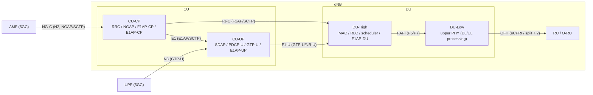

各インターフェースの担当方向:

| IF | 接続 | 上位プロトコル | 本書での詳細 |
|---|---|---|---|
| NG-C | CU-CP ↔ AMF | NGAP over SCTP | §7.1 / §4 |
| NG-U (N3) | CU-UP ↔ UPF | GTP-U | §5 |
| E1 | CU-CP ↔ CU-UP | E1AP over SCTP | §7.1 |
| F1-C | CU-CP ↔ DU-High | F1AP over SCTP | §7.1 / §7.2 |
| F1-U | CU-UP ↔ DU-High | GTP-U (NR-U) | §2 / §5 |
| FAPI | DU-High ↔ DU-Low | FAPI P5/P7 | §7.3 |
| OFH | DU-Low ↔ RU | eCPRI / O-RAN split 7.2 | §3 / §7.3 |

---

## 2. DU-High

### 2.1 役割（責務）

DU-High は DU の上位 L2 と F1AP-DU を統合するコンポーネント。`du_high_impl` が内部の 3 要素
（`du_manager`、`f1ap_du`、`mac_interface`）を所有・起動する（`lib/du/du_high/du_high_impl.h:20`）。
さらに `o_du_high_impl` がこれを包み、FAPI fastpath adaptor と E2 agent を統合した O-RAN 版 DU-High
を構成する（`lib/du/du_high/o_du_high_impl.h:30`）。中核の `du_manager` は UE コンテキストの
生成／更新／削除、cell 管理、F1/MAC イベント処理、非同期タスク実行ループを統括する
（`lib/du/du_high/du_manager/du_manager_impl.h:20`）。

### 2.2 担当する 3GPP レイヤー

- **MAC** … `lib/mac/`（エントリは `mac_interface` / `mac_impl`）
- **RLC** … `lib/rlc/`（TM/UM/AM の TX/RX エンティティ）
- **MAC scheduler** … `lib/scheduler/`（`mac_scheduler` 実装。ポリシーは §7.4）
- **F1AP-DU** … `lib/f1ap/du/`（CU との F1-C 制御プレーン）

F1-U（`include/ocudu/f1u/du/`）と PHY（FAPI）は DU-High の **境界先** であり、内部実装ではない。

### 2.3 主要クラスとファイルパス

| クラス | 役割 | 宣言 |
|---|---|---|
| `du_high_impl` | DU-High 統合実体（du_manager + f1ap_du + mac） | `lib/du/du_high/du_high_impl.h:20` |
| `o_du_high_impl` | O-RAN 版（+ FAPI fastpath adaptor + E2） | `lib/du/du_high/o_du_high_impl.h:30` |
| `du_manager_impl` | UE/cell 管理・非同期タスクループ | `lib/du/du_high/du_manager/du_manager_impl.h:20` |
| `mac_impl` | MAC 統合（`mac_sched` + `dl_unit` + `ul_unit` + `ctrl_unit`、`mac_impl.h:55-69`） | `lib/mac/mac_impl.h:18` |
| `mac_dl_processor` | MAC DL 構成 | `lib/mac/mac_dl/mac_dl_processor.h:28` |
| `mac_cell_processor` | cell 単位 DL 処理・slot handler | `lib/mac/mac_dl/mac_cell_processor.h:24` |
| `mac_ul_processor` | MAC UL PDU 処理 | `lib/mac/mac_ul/mac_ul_processor.h:27` |
| `mac_controller` | MAC 制御（UE/cell config） | `lib/mac/mac_ctrl/mac_controller.h:27` |
| `ocudu_scheduler_adapter` | MAC→scheduler エントリ実装 | `lib/mac/mac_sched/ocudu_scheduler_adapter.h:35` |
| `scheduler_impl` | スケジューラ本体（`mac_scheduler` 実装） | `lib/scheduler/scheduler_impl.h:15` |
| `cell_scheduler` | cell 単位スケジューリング | `lib/scheduler/cell_scheduler.h:28` |
| `f1ap_du_impl` | F1AP-DU 実体 | `lib/f1ap/du/f1ap_du_impl.h:23` |

RLC エンティティは `lib/rlc/` 配下。`rlc_factory.cpp` が `msg.config.mode` で TM/UM/AM を分岐生成する
（`lib/rlc/rlc_factory.cpp:14-48`）。主要クラスは `rlc_tm_entity`（`rlc_tm_entity.h:13`）、
`rlc_um_entity`（`rlc_um_entity.h:13`）、`rlc_am_entity`（`rlc_am_entity.h:13`）と、それぞれの
TX/RX（例: `rlc_tx_am_entity.h:80`、`rlc_rx_am_entity.h:70`）。

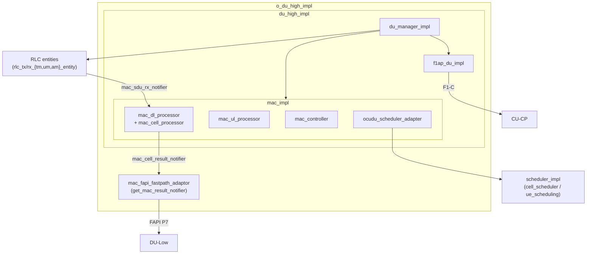

### 2.4 スレッドモデル

executor の割当は `lib/du/du_high/du_high_executor_mapper.cpp`、インターフェースは
`include/ocudu/du/du_high/du_high_executor_mapper.h` と `include/ocudu/mac/mac_executor_mapper.h`。
カテゴリは次の 3 系統。

- **Cell executors**（cell ごと）: `mac_cell_executor`（`mac_executor_mapper.h:20`）、
  `slot_ind_executor`（slot indication 用・高優先、`mac_executor_mapper.h:23`）、
  `rlc_lower_executor`（`du_high_executor_mapper.h:28`）。専用ワーカ方式
  （`dedicated_cell_worker_executor_mapper`）とプール＋strand 方式
  （`strand_cell_worker_executor_mapper`）の 2 実装がある。
- **UE executors**（strand ごと）: 1 strand を 3 優先度に分け `ctrl_exec` / `ul_exec` / `dl_exec`
  に割当（`du_high_executor_mapper.cpp:189-219`）。UE→strand 写像方針は
  `map_policy{per_cell, round_robin}`（`du_high_executor_mapper.h:106`）。
- **Control executor**: 1 strand を 2 優先度で `du_control_executor()` と `du_e2_executor()` に分け、
  最高優先度を timer tick に充てる（`du_high_executor_mapper.cpp:384-419`）。

`worker_manager` がこれらを main pool の executor に束ねる（`worker_manager.cpp:242-264`）:

| カテゴリ | 割当先 executor |
|---|---|
| cell executors（`cell_executors.pool_executors`） | `rt_hi_prio_exec`（main pool `"rt_prio_exec"`） |
| UE executors（`ue_executors.pool_executor`） | `non_rt_medium_prio_exec` |
| UE F1-U reader（`ue_executors.f1u_reader_executor`） | `non_rt_low_prio_exec` |
| control executors（`ctrl_executors.pool_executor`） | `non_rt_hi_prio_exec` |

MAC へは `mac_config` 経由で `ue_exec_mapper` / `cell_exec_mapper` / `ctrl_exec` が渡される
（`include/ocudu/mac/mac_config.h:46-48`）。RLC エンティティは `pcell_executor`（cell の rlc_lower）と
`ue_executor` を受け取る（`include/ocudu/rlc/rlc_factory.h:29-30`）。

### 2.5 入出力インターフェース

- **上り（F1-C / CU 方向）**: `f1ap_du`（`include/ocudu/f1ap/du/f1ap_du.h:226`）が
  `f1ap_message_handler` 等を統合。CU への送信は `f1ap_message_notifier tx_pdu_notifier`
  （`lib/f1ap/du/f1ap_du_impl.h:146`）。接続は `f1c_connection_client`。
- **上り（F1-U / ユーザプレーン）**: `f1u_bearer` / `f1u_gateway`（`include/ocudu/f1u/du/`）。
- **MAC 上位境界（RLC SDU）**: `mac_sdu_rx_notifier::on_new_sdu(byte_buffer_slice)`
  （`include/ocudu/mac/mac_sdu_handler.h:14-20`）、UL PDU 入力は `mac_pdu_handler`
  （`include/ocudu/mac/mac_pdu_handler.h:36`）。
- **下り（FAPI / DU-Low 方向）**: `mac_cell_result_notifier`
  （`include/ocudu/mac/mac_cell_result.h:91`）。`on_new_downlink_scheduler_results`（:97）、
  `on_new_downlink_data`（:100）、`on_new_uplink_scheduler_results`（:103）、
  `on_cell_results_completion`（:106）。MAC は `mac_config::phy_notifier`（`mac_result_notifier&`）で
  PHY 側に接続する（`mac_config.h:49`）。
- **MAC↔scheduler 境界**: `mac_scheduler`（`include/ocudu/scheduler/mac_scheduler.h:18`）。
  `scheduler_impl::slot_indication(...)` が `sched_result` を返す（`scheduler_impl.h:33`）。

### 2.6 主な config キー

DU-High ユニット config（`apps/units/flexible_o_du/o_du_high/du_high/du_high_config.h`）:

| キー（struct field） | 既定値 | 箇所 |
|---|---|---|
| `gnb_id` | `{411,22}` | `du_high_config.h:1365` |
| `gnb_du_id` | — | `:1367` |
| `cells_cfg`（`vector<du_high_unit_cell_config>`） | — | `:1381` |
| `du_high_unit_scheduler_config::nof_preselected_newtx_ues` | `1024` | `:93` |
| `du_high_unit_scheduler_config::policy_cfg`（`optional<scheduler_policy_config>`） | — | `:95` |
| `du_high_unit_logger_config::{du,mac,rlc,f1ap,f1u}_level` | `warning` | `:42-54` |
| `du_high_unit_tracer_config::executor_tracing_enable` | `false` | `:64` |

スケジューラ動作に関わる主要 expert config は §7.4 を参照。MAC config の主要フィールドは
`include/ocudu/mac/mac_config.h:36-55`（`phy_notifier`、`ue_exec_mapper`、`sched_cfg` 等）。

> 未確認: scheduler の CLI11 オプション文字列（`--` 名）と struct field の完全な対応は本調査では
> 全件照合していない。

---

## 3. DU-Low

### 3.1 役割（責務）

DU-Low は **upper PHY（上位物理層）** を構成・所有する。複数 cell の `upper_phy` インスタンスを束ね、
上位の DU-High/MAC（FAPI 経由）と下位の RU/OFH の間で物理層処理を担う。`du_low_impl` は
`std::vector<std::unique_ptr<upper_phy>>` を保持する（`lib/du/du_low/du_low_impl.h:18-21`）。
upper PHY は **ステートレス** であり、`du_low_impl::start()` は実質何もしない
（`lib/du/du_low/du_low_impl.cpp:31-34`）。O-RAN 版 `o_du_low_impl` は DU-Low と PHY-FAPI fastpath
adaptor をまとめる（`lib/du/du_low/o_du_low_impl.h:17`）。

### 3.2 担当する 3GPP レイヤー

物理層上位（upper PHY）。下り（DL）と上り（UL）の双方を処理する
（`include/ocudu/phy/upper/upper_phy.h:24-32`）。扱うチャネル／信号は PDCCH, PDSCH, SSB, NZP-CSI-RS,
PRS, PUCCH, PUSCH, PRACH, SRS（`include/ocudu/phy/upper/upper_phy_execution_configuration.h:32-57`）。

### 3.3 主要クラスとファイルパス

| 役割 | クラス | 宣言 |
|---|---|---|
| DU-Low 実体 | `du_low_impl` | `lib/du/du_low/du_low_impl.h:18` |
| O-DU-Low 実体 | `o_du_low_impl` | `lib/du/du_low/o_du_low_impl.h:17` |
| Upper PHY 実体 | `upper_phy_impl` | `lib/phy/upper/upper_phy_impl.h:59` |
| DL processor（IF） | `downlink_processor` | `include/ocudu/phy/upper/downlink_processor.h:34` |
| DL processor（実装） | `downlink_processor_multi_executor_impl` | `lib/phy/upper/downlink_processor_multi_executor_impl.h:50` |
| DL processor pool | `downlink_processor_pool_impl` | `lib/phy/upper/downlink_processor_pool_impl.h:27` |
| UL processor（IF） | `uplink_processor` | `include/ocudu/phy/upper/uplink_processor.h:19` |
| PDSCH | `pdsch_processor_impl` / `pdsch_processor_flexible_impl` | `lib/phy/upper/channel_processors/pdsch/...` |
| PUSCH | `pusch_processor_impl` / `pusch_decoder_impl` | `lib/phy/upper/channel_processors/pusch/...` |
| Rx buffer pool | `rx_buffer_pool_impl` | `lib/phy/upper/rx_buffer_pool_impl.h:21` |

ファクトリは `make_du_low`（`lib/du/du_low/du_low_factory.cpp:13`、cell ごとに
`upper_phy_factory->create()`）と `make_o_du_low`（`lib/du/du_low/o_du_low_factory.cpp:52`）。

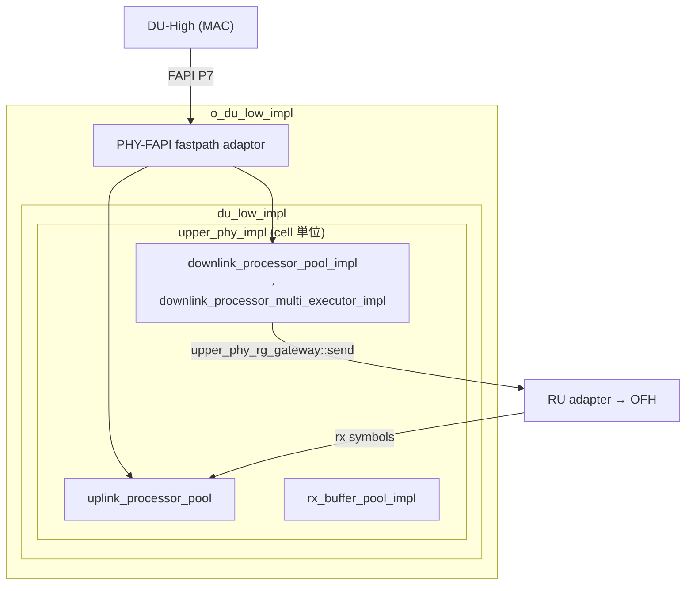

### 3.4 スレッドモデル

executor カテゴリは `upper_phy_execution_configuration`
（`include/ocudu/phy/upper/upper_phy_execution_configuration.h:32-57`）で定義され、各々
`task_executor*` と `max_concurrency` のペア（`upper_phy_executor`、`:12-28`）。割当は
`du_low_executor_mapper`（`include/ocudu/du/du_low/du_low_executor_mapper.h:26`、実装
`lib/du/du_low/du_low_executor_mapper.cpp:60`）で行い、2 モードを持つ。

- **single-exec モード**: 全チャネルを 1 つの `common_executor` に割当
  （`du_low_executor_mapper.cpp:71-80`）。PUSCH ch-estimator は inline executor、PDSCH codeblock と
  PUSCH decoder は同期実行（`:82-85`）。`worker_manager` 側では非 RT 時に専用 `phy_worker`
  （`locking_mpsc`）を作って割り当てる（`worker_manager.cpp:398-412`）。
- **flexible モード**: 4 優先度 executor を入力に取り（`du_low_executor_mapper.cpp:101-120`）、
  DL 高優先（PDCCH/SSB/CSI-RS/PRS）を `rt_hi_prio_exec` に、DL grid pool/PRACH を `non_rt_hi_prio_exec`
  に割当。PDSCH/PUCCH/PUSCH+SRS には `task_fork_limiter` を被せて並列度を制限する
  （`max_pdsch_concurrency` / `max_pucch_concurrency` / `max_pusch_and_srs_concurrency`）。
  `worker_manager` 側の入力は `rt_hi_prio_exec` / `non_rt_hi_prio_exec` / `non_rt_medium_prio_exec` /
  `non_rt_low_prio_exec`（`worker_manager.cpp:418-425`）。

スロット→processor の対応は、`downlink_processor_pool_impl::get_processor_controller(slot)`
（`lib/phy/upper/downlink_processor_pool_impl.cpp:18`）が、slot の numerology からプールを選び、
ラウンドロビンで processor を選択する（`processor_pool_helpers.h:43-56`）。各 processor は内部で
チャネル別 executor を固定保持する（`downlink_processor_multi_executor_impl.h`）。

### 3.5 入出力インターフェース

- **上り境界（FAPI ← MAC）**: `upper_phy`（`include/ocudu/phy/upper/upper_phy.h:33`）が
  `get_downlink_processor_pool()`（:52）、`get_uplink_request_processor()`（:58）、
  `get_rx_symbol_handler()`（:43）、`get_timing_handler()`（:46）を公開。結果通知は
  `upper_phy_rx_results_notifier`（`include/ocudu/phy/upper/upper_phy_rx_results_notifier.h:135`）。
  FAPI 結線は `o_du_low_impl` コンストラクタが行う（`lib/du/du_low/o_du_low_impl.cpp:24-31`）。
- **下り境界（RU/OFH）**: DL 送出は `upper_phy_rg_gateway::send(context, grid)`
  （`include/ocudu/phy/upper/upper_phy_rg_gateway.h:24`）。UL 要求は
  `upper_phy_rx_symbol_request_notifier`（同 `upper_phy_rx_symbol_request_notifier.h:20`）、
  UL シンボル入力は `upper_phy_rx_symbol_handler`（同 `upper_phy_rx_symbol_handler.h`）。
  RU 側アダプタ `upper_phy_ru_dl_rg_adapter::send` が `dl_handler->handle_dl_data` を呼ぶ
  （`include/ocudu/ru/ru_adapters.h:29-32`）。OFH 実装は `ofh::sector_impl`
  （`lib/ofh/ofh_sector_impl.h:37`）で、`ofh::transmitter`（`get_downlink_handler` /
  `get_uplink_request_handler`）と `ofh::downlink_handler::handle_dl_data` を提供する。

### 3.6 主な config キー

DU-Low ユニット config（`apps/units/flexible_o_du/o_du_low/du_low_config.h`、CLI は
`du_low_config_cli11_schema.cpp`）。

| CLI キー | struct field | 箇所 |
|---|---|---|
| `--max_proc_delay` | `max_processing_delay_slots`（既定 5） | `du_low_config.h:21` |
| `--pusch_dec_max_iterations` | `pusch_decoder_max_iterations`（既定 6） | schema `:189-194` |
| `--pusch_dec_enable_early_stop` | `pusch_decoder_early_stop` | schema `:195-199` |
| `--pusch_channel_equalizer_algorithm` | （zf/mmse） | schema `:228-233` |
| `--pdsch_processor_type` | `pdsch_processor_type`（auto/generic/flexible） | `du_low_config.h:128` |
| `--max_pucch_concurrency` | `max_pucch_concurrency` | `du_low_config.h:138` |
| `--max_pusch_and_srs_concurrency` | `max_pusch_and_srs_concurrency` | `du_low_config.h:143` |
| `--max_pdsch_concurrency` | `max_pdsch_concurrency` | `du_low_config.h:151` |

> 未確認: `du_low_executor_mapper` の flexible 構成に渡される `non_rt_low_prio_exec` は、mapper 実装内で
> 明示利用が確認できなかった（`du_low_executor_mapper.h:58` に定義はある）。

---

## 4. CU-CP

### 4.1 役割（責務）

CU-CP は gNB の Central Unit – Control Plane。コントロールプレーン・メッセージング全般、特に PDCP
プロトコルの制御プレーン部分を担当する UE-centric なコンポーネント（`lib/cu_cp/README.md:5-7`）。
5 つの主要コンポーネントと 4 つの主要インターフェース（NG-C / E1 / F1-C / E2）を持つ
（`README.md:11-24`）。

### 4.2 担当する 3GPP レイヤー

- **RRC** … `lib/rrc/`（`rrc_du` / `rrc_ue`、トップレベル配置）
- **NGAP / NG-C（N2）** … `lib/ngap/`（AMF と接続）
- **F1AP-CP / F1-C** … `lib/f1ap/cu_cp/`（DU-High と接続）
- **E1AP-CP / E1** … `lib/e1ap/cu_cp/`（CU-UP と接続）
- **PDCP-C（SRB の暗号化／完全性保護）** … **RRC UE 内** に存在する。SRB1/SRB2 の `pdcp_entity` は
  `srb_pdcp_context` が保持し（`lib/rrc/ue/rrc_ue_srb_context.h:37-39`）、
  `pdcp_make_default_srb_config()` で構成される（同 `:54`）。`lib/cu_cp` 配下ではない点に注意。

> 配置に関する注記: RRC / NGAP は物理的に `lib/rrc` / `lib/ngap`（トップレベル）にあり、F1AP-CP /
> E1AP-CP は `lib/f1ap/cu_cp` / `lib/e1ap/cu_cp` にある。本章は「CU-CP が利用するレイヤー」として
> これらをまとめて解説する。

### 4.3 主要クラスとファイルパス

| クラス | 役割 | 宣言 |
|---|---|---|
| `cu_cp_impl` | CU-CP 統合実体 | `lib/cu_cp/cu_cp_impl.h:46` |
| `o_cu_cp_impl` / `o_cu_cp_with_e2_impl` | O-RAN 版（+ E2） | `lib/cu_cp/o_cu_cp_impl.h:18` / `:40` |
| `du_processor_impl` | DU ごとの処理（F1AP-CP, RRC UE 生成） | `lib/cu_cp/du_processor/du_processor_impl.h:22` |
| `cu_up_processor_impl` | CU-UP ごとの処理（E1） | `lib/cu_cp/cu_up_processor/cu_up_processor_impl.h:15` |
| `ue_manager` | UE コンテキスト管理 | `lib/cu_cp/ue_manager/ue_manager_impl.h:25` |
| `rrc_du_impl` | RRC（DU 単位） | `lib/rrc/rrc_du_impl.h:92` |
| `rrc_ue_impl` | RRC（UE 単位） | `lib/rrc/ue/rrc_ue_impl.h:19` |
| `ngap_impl` | NGAP 実体 | `lib/ngap/ngap_impl.h:22` |
| `f1ap_cu_impl` | F1AP-CP 実体 | `lib/f1ap/cu_cp/f1ap_cu_impl.h:21` |
| `e1ap_cu_cp_impl` | E1AP-CP 実体 | `lib/e1ap/cu_cp/e1ap_cu_cp_impl.h:18` |
| `mobility_manager` | ハンドオーバ制御 | `lib/cu_cp/mobility_manager/mobility_manager_impl.h:46` |
| `cell_meas_manager` | 測定設定管理 | `lib/cu_cp/cell_meas_manager/cell_meas_manager_impl.h:33` |

> 命名注意: `mobility_manager_impl` / `cell_meas_manager_impl` というクラスは存在しない（ファイル名のみ
> `*_impl`）。実クラス名は `mobility_manager` / `cell_meas_manager`。

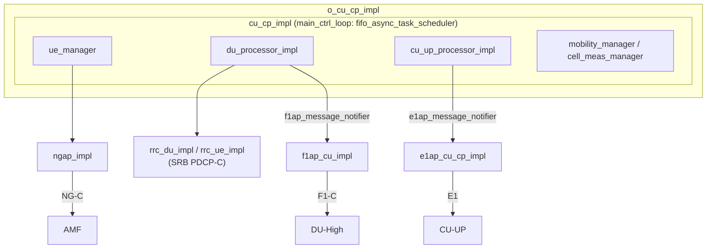

### 4.4 スレッドモデル

CU-CP は **非 RT ワーカープール上の 1 本の strand（sequential executor）** で動作する。
`cu_cp_executor_mapper_impl`（`lib/cu_cp/cu_cp_executor_mapper.cpp:15`）が、`pool_executor` 上に
`task_strand<task_executor*, concurrent_queue_policy::lockfree_mpmc>`（queue size 2048）を生成し
（`:17-23`）、`ctrl_executor()` がこの strand を返す（`:33`）。`e2_executor()` も同一 strand を
再利用する（`:35-39`）。一方、受信パース用の `n2_rx_executor()` / `f1c_rx_executor()` /
`e1_rx_executor()` 等は `pool_exec` をそのまま返す（並列受信、`:41-49`）。

`pool_executor` は `non_rt_hi_prio_exec`（main pool の `"high_prio_exec"`）に束ねられる
（`worker_manager.cpp:216-217`）。さらに CU-CP 内部のタスク直列化は、`cu_cp_impl` が持つ
`fifo_async_task_scheduler main_ctrl_loop`（`lib/cu_cp/cu_cp_impl.h:34-44`）でも担保され、UE 単位
タスクは各 UE の task scheduler に積まれる。

### 4.5 入出力インターフェース

| IF | handler / notifier | 宣言 |
|---|---|---|
| NG-C | `ngap_message_handler` / `ngap_message_notifier` | `include/ocudu/ngap/ngap.h:29` / `:47` |
| F1-C | `f1ap_message_handler` / `f1ap_message_notifier` | `include/ocudu/f1ap/f1ap_message_handler.h:12` / `f1ap_message_notifier.h:12` |
| E1 | `e1ap_message_handler` / `e1ap_message_notifier` | `include/ocudu/e1ap/common/e1ap_common.h:12` / `:30` |

CU-CP 内のアダプタ（`lib/cu_cp/adapters/`）が各レイヤーを結線する。代表例: NAS PDU を転送する
`ngap_rrc_ue_adapter`（`adapters/ngap_adapters.h:213`）、RRC↔F1AP の CCCH/DCCH 転送
`f1ap_rrc_ul_ccch_adapter` / `f1ap_rrc_ul_dcch_adapter`（`adapters/f1ap_adapters.h:15` / `:31`）、
E1AP→CU-CP の `e1ap_cu_cp_adapter`（`adapters/e1ap_adapters.h:13`）。

### 4.6 主な config キー

CU-CP ユニット config（`apps/units/o_cu_cp/cu_cp/cu_cp_unit_config.h`、CLI は
`cu_cp_unit_config_cli11_schema.cpp`）。

| キー（struct field / CLI） | 既定値 | 箇所 |
|---|---|---|
| `inactivity_timer`（`--inactivity_timer`） | `120`（秒） | `cu_cp_unit_config.h:383` |
| `max_nof_dus` | `6` | `:375` |
| `max_nof_cu_ups` | `6` | `:377` |
| `max_nof_ues` | `8192` | `:379` |
| `max_nof_drbs_per_ue` | `8` | `:381` |
| `security.integrity_protection`（`--integrity`） | `"not_needed"` | `:162` |
| `security.confidentiality_protection`（`--confidentiality`） | `"required"` | `:163` |
| `security.nea_preference_list`（暗号化順序） | `"nea0,nea2,nea1,nea3"` | `:164` |
| `security.nia_preference_list`（完全性順序） | `"nia2,nia1,nia3"` | `:165` |
| `amf.port` | `38412` | `:43` |
| `rrc.rrc_procedure_guard_time_ms` | `1000` | `:157` |

---

## 5. CU-UP

### 5.1 役割（責務）

CU-UP は gNB の Central Unit – User Plane。ユーザプレーン・メッセージング、特に PDCP と SDAP の
ユーザプレーン部分を担当する（`lib/cu_up/README.md:5-7`）。N3（UPF への GTP-U）、F1-U（DU への
NR-U）、E1（CU-CP）を終端する。実体は `cu_up`（`lib/cu_up/cu_up_impl.h:23`）で、コンストラクタが
N3 TEID allocator、NG-U GTP-U demux/echo、NG-U セッション、E1AP、CU-UP manager を結線する
（`lib/cu_up/cu_up_impl.cpp:67-170`）。O-RAN 版は `o_cu_up_impl`（`lib/cu_up/o_cu_up_impl.h:18`）。

### 5.2 担当する 3GPP レイヤー

| レイヤー | 生成箇所 | エンティティ |
|---|---|---|
| SDAP | `pdu_session_manager_impl.cpp:103-104` | `sdap_entity_impl`（`lib/sdap/sdap_entity_impl.h:18`） |
| PDCP-U（TX/RX） | `pdu_session_manager_impl.cpp:265-282` | `pdcp_entity_tx`（`lib/pdcp/pdcp_entity_tx.h:92`）/ `pdcp_entity_rx`（`lib/pdcp/pdcp_entity_rx.h:68`） |
| GTP-U / NG-U（N3） | `pdu_session_manager_impl.cpp:106-123` | `gtpu_tunnel_ngu_{rx,tx}_impl`（`lib/gtpu/`） |
| F1-U（NR-U） | `pdu_session_manager_impl.cpp:353-365` | `f1u_bearer`（`f1u_cu_up_gateway`） |
| E1AP-UP | `cu_up_impl.cpp:142-149` | `e1ap_cu_up_impl`（`lib/e1ap/cu_up/e1ap_cu_up_impl.h:22`） |

SDAP/PDCP/GTP-U のエンティティ実装は `lib/cu_up` 外（`lib/sdap` / `lib/pdcp` / `lib/gtpu`）にあり、
CU-UP は PDU session / DRB 単位でこれらを生成・結線する。

### 5.3 主要クラスとファイルパス

| クラス | 役割 | 宣言 |
|---|---|---|
| `cu_up` | CU-UP 統合実体 | `lib/cu_up/cu_up_impl.h:23` |
| `o_cu_up_impl` | O-RAN 版（+ E2） | `lib/cu_up/o_cu_up_impl.h:18` |
| `cu_up_manager_impl` | UE/セッション管理 | `lib/cu_up/cu_up_manager_impl.h:44` |
| `pdu_session_manager_impl` | PDU session/DRB 生成・データパス結線 | `lib/cu_up/pdu_session_manager_impl.h:44` |
| `ngu_session_manager_impl` | NG-U セッション多重 | `lib/cu_up/ngu_session_manager_impl.h:11` |
| `ue_manager` | UE 管理 | `lib/cu_up/ue_manager.h:43` |
| `gtpu_demux_impl` | N3 受信の TEID 振り分け | `lib/gtpu/gtpu_demux_impl.h:26` |
| `e1ap_cu_up_impl` | E1AP-UP 実体 | `lib/e1ap/cu_up/e1ap_cu_up_impl.h:22` |

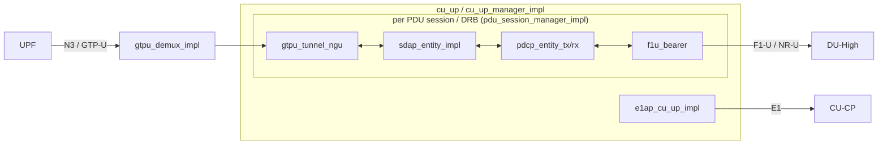

### 5.4 スレッドモデル

CU-UP は **UE 単位の strand** を用いる。`include/ocudu/cu_up/cu_up_executor_mapper.h` が
2 層のインターフェースを定義する: CU-UP 全体の `cu_up_executor_mapper`（`:45`、`ctrl_executor` /
`io_ul_executor` / `n3_rx_executor` / `e1_rx_executor` / `f1u_rx_executor` /
`create_ue_executor_mapper`）と、UE 単位の `ue_executor_mapper`（`:18`、`ctrl_executor` /
`ul_pdu_executor` / `dl_pdu_executor` / `crypto_executor`）。

実装 `strand_based_cu_up_executor_mapper`（`lib/cu_up/cu_up_executor_mapper.cpp:180`）の要点:

- 1 本の基底 strand `cu_up_strand`（`medium_prio_executor` を包む）が、worker pool への全アクセスを
  逐次化する（`:184-188`、アーキ説明 `:169-179`）。**crypto を除き並列化はまだ行われていない**。
- **UE 単位 strand**（`max_nof_ue_strands` 本）を生成し、各 strand を 3 優先度に分けて
  `ue_ctrl_execs` / `ue_ul_execs` / `ue_dl_execs`（= ctrl / UL-PDU / DL-PDU）に割当
  （`:249-262`）。UE→strand は round-robin（`:95`、`:127`）。
- crypto executor は共有（非逐次）の `medium_prio_executor`（唯一の並列パス、`:268`、`:72`）。
- IO/UL strand（`io_ul_executor()`、`:210`）は `dedicated_io_strand` 有効時に専用 strand を持つ
  （`:239-242`）。
- PDCP / GTP-U のマッピング: `pdu_session_manager_impl.cpp:277-280` で PDCP に
  `ue_dl_executor` / `ue_ul_executor` / `ue_ctrl_executor` / `crypto_executor` を割当。NG-U DL の
  GTP-U tunnel は demux に UE の `ue_dl_exec` で登録（`:131`）。

`worker_manager` での生成は `worker_manager.cpp:227-238`（`medium` / `low` / `hi` の各 executor と
`dedicated_io_ul_strand` を渡す）。`max_nof_ue_strands` の既定は 16
（`worker_manager_config.h:76`）。

### 5.5 入出力インターフェースとデータプレーン経路

- **E1（CU-CP 方向）**: `e1ap_cu_up_impl`（`e1ap_cu_up_impl.h:22`）。`handle_message`（`:40`）、
  bearer context setup/modify/release（`:78-90`）。
- **N3 / NG-U**: demux `gtpu_demux::add_tunnel(teid, executor, rx_iface)`（`gtpu_demux_impl.h:39`）。
  NG-U セッション多重は `ngu_session_manager::get_next_ngu_gateway()`（`lib/cu_up/ngu_session_manager.h:15`）。
- **F1-U**: `f1u_cu_up_gateway::create_cu_bearer(...)` → `create_f1u_bearer(...)`
  （`pdu_session_manager_impl.cpp:334-365`）。

データプレーン経路（`pdu_session_manager_impl.cpp` のアダプタ結線）:

- **UL**: F1-U(GTP-U from DU) → PDCP → SDAP → NG-U(GTP-U to UPF)。
  F1-U→PDCP（`:369-370`）、PDCP(RX)→SDAP（`:381`）、SDAP→GTP-U TX（`:125`）。
- **DL**: NG-U(GTP-U from UPF) → SDAP → PDCP → F1-U(to DU)。
  GTP-U(RX)→SDAP（`:126`）、SDAP→PDCP（`:380`）、PDCP→F1-U（`:371`）。

### 5.6 主な config キー

CU-UP ユニット config（`apps/units/o_cu_up/cu_up/cu_up_unit_config.h`）。

| キー（struct field） | 既定値 | 箇所 |
|---|---|---|
| `ngu_socket.bind_addr` | `"127.0.0.1"` | `cu_up_unit_config.h:41` |
| `ngu_gtpu.gtpu_queue_size` | `2046` | `:49` |
| `ngu_gtpu.gtpu_batch_size` | `256` | `:50` |
| `f1u.queue_size` | `8192` | `:65` |
| `f1u.t_notify` | `5` | `:67` |
| `qos.five_qi` | `9` | `:72` |
| `qos.mode` | `"am"` | `:73` |
| `exec.dl_ue_executor_queue_size` | `8192` | `:91` |
| `exec.ul_ue_executor_queue_size` | `8192` | `:92` |
| `max_nof_ues` | `16384` | `:104` |

> 注: UPF 宛先アドレス／TEID は静的 config ではなく、E1 Bearer Context の UL TNL 情報から
> セッション単位で与えられる（`pdu_session_manager_impl.cpp:108-109`）。

---

## 6. 横断① task executor・スレッドモデル

### 6.1 main worker pool と 4 つの優先度 executor

アプリのスレッド資源は `worker_manager` が一元管理する。中心は `create_main_worker_pool`
（`apps/services/worker_manager/worker_manager.cpp:323-366`）が作る単一の `"main_pool"` で、4 つの
名前付き executor を持つ。

| executor 名 | キュー policy | 用途（コード内コメント） | ハンドル変数 |
|---|---|---|---|
| `rt_prio_exec` | `moodycamel_lockfree_bounded_mpmc` | upper PHY DL + MAC scheduling | `rt_hi_prio_exec`（`:357`） |
| `high_prio_exec` | `moodycamel_lockfree_mpmc` | control plane + timer 管理 | `non_rt_hi_prio_exec`（`:356`） |
| `medium_prio_exec` | `moodycamel_lockfree_mpmc` | PCAP + CU-UP | `non_rt_medium_prio_exec`（`:355`） |
| `low_prio_exec` | `moodycamel_lockfree_bounded_mpmc` | 外部ノードからのデータ受信 | `non_rt_low_prio_exec`（`:354`） |

worker 数は `get_default_nof_workers`（`:267-298`）で概算され、`nof_cells*(dl_ant+ul_ant+1)+2` を
基準に利用可能 CPU から spare を引いた値になる。各コンポーネントの executor は、これら 4 つを
土台に `create_{cu_cp,cu_up,du_high,du_low,ofh}_executors`（`:214-491`）が strand / pool として
構築する。OFH と SDR RU は別途専用スレッド（`ru_timing` / TxRx）を持つ（`:436` 以降）。

### 6.2 concurrent queue と priority_task_worker

キューの種別は `concurrent_queue_policy`（`include/ocudu/adt/detail/concurrent_queue_params.h:23-30`）
で 6 種定義される: `lockfree_spsc` / `lockfree_mpmc` / `locking_mpmc` / `locking_mpsc` /
`moodycamel_lockfree_mpmc` / `moodycamel_lockfree_bounded_mpmc`。待機方式は
`concurrent_queue_wait_policy{condition_variable, sleep, non_blocking}`（同 `:37`）。実体は
テンプレート `concurrent_queue<T, Policy, WaitPolicy>`（前方宣言 `:71`）で、policy ごとに
`mpmc_queue.h` / `spsc_queue.h` / `moodycamel_mpmc_queue.h` / `mutexed_mpmc_queue.h` /
`mutexed_mpsc_queue.h` / `moodycamel_bounded_mpmc_queue.h` に特殊化が置かれる。

> srsRAN にあった単一ヘッダ `adt/concurrent_queue.h` は存在しない。また
> `concurrent_priority_queue` というクラスも存在しない。優先度付きタスク処理は次の
> `priority_task_worker` / `priority_task_queue` が担う。

`priority_task_worker`（`include/ocudu/support/executors/priority_task_worker.h:21`）は、優先度
レベルごとに別キューを持つワーカ。タスクは `push_task(task_priority prio, unique_task)` で積む。
優先度は `enqueue_priority`（`concurrent_queue_params.h:51`、`min=0`～`max=SIZE_MAX`。値が小さいほど
低優先）で表され、`task_priority::max` が最高優先（キュー index 0）にマップされる
（`priority_task_queue.h:15-22`）。

このワーカ向けの executor `priority_task_worker_executor` には最適化があり、`prio == max` かつ
同一スレッドからの `execute()` はキューを経由せずインライン実行する
（`priority_task_worker.h:79-95`）。

### 6.3 ドレイン順は strict priority（pop ループ実読）

各優先度レーンのドレイン順は、`detail::priority_task_queue` の pop 実装で確定できる。

- `priority_task_queue::try_pop`（`lib/support/executors/priority_task_queue.cpp:155-164`）は
  `prio_idx = 0`（最高優先）から走査し、**最初に pop に成功したレーンで即 `return`** する。
- `try_pop_bulk`（`:166-178`）も最高優先レーンからバッチを充填し、batch が埋まるまで下位へ進む。
- consumer 版（`:214-235`）も同一ロジック。
- ワーカの実行ループ `priority_task_worker::run_pop_task_loop`
  （`lib/support/executors/priority_task_worker.cpp:26-40`）は
  `while (consumer.pop_blocking(t)) { t(); t = {}; }` で、上記 pop を回す。

したがってドレインは **strict priority**（上位レーンが空のときのみ下位レーンを処理）であり、
レーン間の round-robin・重み付け・アンチスターベーションは行わない。低優先タスクは高優先レーンが
空になるまで待たされる。

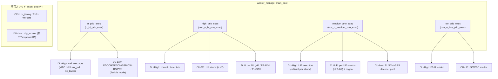

---

## 7. 横断② F1/E1/NG インターフェースとコールフロー

### 7.1 インターフェースのメッセージ・エントリポイント

各 AP の共通インターフェースは「受信＝`handle_message`」「送信＝`on_new_message`」の対で表される。

| AP | 受信ハンドラ（実体） | 送信 notifier |
|---|---|---|
| F1AP-DU | `f1ap_du_impl::handle_message`（`lib/f1ap/du/f1ap_du_impl.cpp:366`） | `tx_pdu_notifier->on_new_message`（`:530`） |
| F1AP-CP | `f1ap_cu_impl::handle_message`（`lib/f1ap/cu_cp/f1ap_cu_impl.cpp:136`） | `f1ap_message_notifier` |
| E1AP-CP | `e1ap_cu_cp_impl::handle_message`（`lib/e1ap/cu_cp/e1ap_cu_cp_impl.cpp:215`） | `e1ap_message_notifier` |
| E1AP-UP | `e1ap_cu_up_impl::handle_message`（`lib/e1ap/cu_up/e1ap_cu_up_impl.cpp:176`） | `e1ap_message_notifier` |
| NGAP | `ngap_impl::handle_message`（`lib/ngap/ngap_impl.cpp:377`） | `tx_pdu_notifier->on_new_message`（`:184`） |

代表的な手続き（procedure）クラス:

- F1 Setup: DU 側 `f1ap_du_setup_procedure`（`lib/f1ap/du/procedures/f1ap_du_setup_procedure.cpp:35`）、
  CU 側 `handle_f1_setup_procedure`（`lib/f1ap/cu_cp/procedures/f1_setup_procedure.cpp:170`）。
- F1 UE Context Setup: DU 側 `f1ap_du_ue_context_setup_procedure`
  （`lib/f1ap/du/procedures/f1ap_du_ue_context_setup_procedure.cpp:55`）、CU 側
  `ue_context_setup_procedure`（`lib/f1ap/cu_cp/procedures/ue_context_setup_procedure.cpp:60`）。
- E1 Bearer Context Setup: CU-CP 側 `bearer_context_setup_procedure`
  （`lib/e1ap/cu_cp/procedures/bearer_context_setup_procedure.cpp:29`）。
- NG Setup: `ng_setup_procedure`（`lib/ngap/procedures/ng_setup_procedure.cpp:33`）。
- NG Initial Context Setup: `ngap_initial_context_setup_procedure`
  （`lib/ngap/procedures/ngap_initial_context_setup_procedure.cpp:37`）。

NGAP は SCTP gateway を介して AMF に接続する。受信は `sctp_to_n2_pdu_notifier::on_new_sdu`
（unpack 後 `cu_cp_rx_pdu_notifier->on_new_message`、`lib/ngap/gateways/n2_connection_client_factory.cpp:29`）、
送信は `n2_to_sctp_pdu_notifier::on_new_message`（pack 後 SCTP、同 `:57`）。

### 7.2 コールフロー: UE registration / attach（CU-CP ↔ DU）

UE の初期接続は、DU での RACH/RRC Setup から、CU-CP の RRC UE 生成・NGAP 接続、AMF からの
Initial Context Setup までの一連の手続きで進む。各ホップの実体を以下に示す。

**Step 1 — DU 側で新規 UE 検出 → Initial UL RRC Message Transfer 送出**

1. RACH: `mac_cell_rach_handler_impl::handle_rach_indication`（`lib/mac/mac_sched/mac_rach_handler.cpp:31`）
2. Msg3 UL-CCCH: `pdu_rx_handler::handle_ccch_msg` → `on_ul_ccch_msg_received`
   （`lib/mac/mac_ul/pdu_rx_handler.cpp:294`）
3. DU-Manager: `du_manager_impl::handle_ul_ccch_indication` → `ue_mng.handle_ue_create_request`
   （`lib/du/du_high/du_manager/du_manager_impl.cpp:37`, `:42`）
4. `ue_creation_procedure`: CCCH を push し、F1AP UE を生成
   （`lib/du/du_high/du_manager/procedures/ue_creation_procedure.cpp:83`, `:280`）
5. DU F1AP SRB0 送出: `f1c_srb0_du_bearer::handle_sdu`（`init_ul_rrc_msg_transfer` を pack して送信、
   `lib/f1ap/du/ue_context/f1c_du_bearer_impl.cpp:43`, `:72`）

**Step 2 — CU-CP F1AP 受信 → RRC UE 生成 → NGAP Initial UE Message**

6. `f1ap_cu_impl::handle_initial_ul_rrc_message`（`lib/f1ap/cu_cp/f1ap_cu_impl.cpp:309`）が
   `request_new_ue_creation`（`:344`）と `on_ue_rrc_context_creation_request`（`:370`）を呼ぶ
7. `du_processor_impl::handle_ue_rrc_context_creation_request`（`lib/cu_cp/du_processor/du_processor_impl.cpp:215`）
   → `create_rrc_ue`（`:174`）→ `rrc->add_ue`（`:202`）
8. RRC Setup: `rrc_setup_procedure`（`lib/rrc/ue/procedures/rrc_setup_procedure.cpp:42`）が
   `send_rrc_setup`（`:53`）、RRCSetupComplete 受領後に `send_initial_ue_msg`（`:120`, `:149`）
9. NGAP: `ngap_impl::handle_initial_ue_message`（`lib/ngap/ngap_impl.cpp:145`）が AMF へ
   Initial UE Message を送出（`:184`）

**Step 3 — AMF → Initial Context Setup → CU-CP routine**

10. NGAP 受信: `ngap_impl::handle_initial_context_setup_request`（`lib/ngap/ngap_impl.cpp:514`）が
    `ngap_initial_context_setup_procedure` を起動（`:613`）
11. CU-CP: `cu_cp_impl::handle_new_initial_context_setup_request`（`lib/cu_cp/cu_cp_impl.cpp:802`）が
    `launch_async<initial_context_setup_routine>`（`:822`）
12. `initial_context_setup_routine`（`lib/cu_cp/routines/initial_context_setup_routine.cpp:38`）の順序:
    - `security_mng.init_security_context`（`:46`）
    - `rrc_ue.get_security_mode_command_context`（`:53`）
    - **F1AP UE Context Setup**（SMC を DU へ）: `f1ap_ue_ctxt_mng.handle_ue_context_setup_request`（`:74`）
    - RRC Security Mode Complete 待ち（`:89`）→ UE Capability Enquiry（`:110`）
    - **PDU Session Resource Setup（RRC Reconfiguration を含む）**:
      `pdu_session_setup_handler.handle_new_pdu_session_resource_setup_request`（`:139`）
13. **E1AP Bearer Context Setup**（PDU session routine 内）:
    `e1ap_bearer_ctxt_mng.handle_bearer_context_setup_request`
    （`lib/cu_cp/routines/pdu_session_resource_setup_routine.cpp:125`）

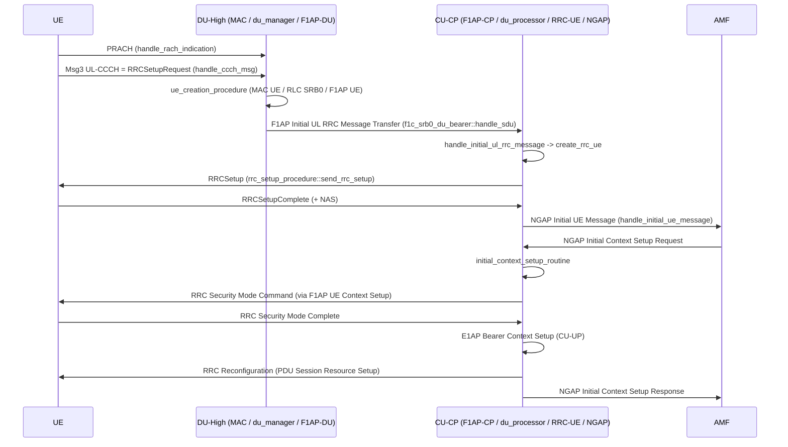

### 7.3 コールフロー: 下り slot 処理パス（DU-High → DU-Low → OFH）

スロット境界をトリガに、MAC スケジューラ結果 → FAPI → upper PHY → RU(OFH) と処理が流れる。

**Step 1 — MAC: slot indication と DL 結果のハンドオフ**

- エントリ: `mac_cell_processor::handle_slot_indication`（`lib/mac/mac_dl/mac_cell_processor.cpp:181`）
  → `handle_slot_indication_impl`（`:314`）
- PHY へ通知（`mac_cell_result_notifier`、`include/ocudu/mac/mac_cell_result.h:91`）:
  `on_new_downlink_scheduler_results`（呼び出し `:347`, `:373`）、`on_new_downlink_data`（`:386`）
- FAPI 実装: `mac_to_fapi_fastpath_translator::on_new_downlink_scheduler_results`
  （`lib/fapi_adaptor/mac/p7/mac_to_fapi_fastpath_translator.cpp:122`）、`on_new_downlink_data`（`:169`）

**Step 2 — DU-Low: FAPI → upper PHY downlink processor**

- FAPI→PHY: `fapi_to_phy_fastpath_translator::send_dl_tti_request`
  （`lib/fapi_adaptor/phy/p7/fapi_to_phy_fastpath_translator.cpp:278`）、`send_tx_data_request`（`:620`）
- processor 選択: `downlink_processor_pool_impl::get_processor_controller(slot)`
  （`lib/phy/upper/downlink_processor_pool_impl.cpp:18`）
- 処理: `downlink_processor_multi_executor_impl::process_pdcch`
  （`lib/phy/upper/downlink_processor_multi_executor_impl.cpp:54`）、`process_pdsch`（`:86`）、
  `configure_resource_grid`（`:223`）、`send_resource_grid`（`:259`）→ `gateway.send`（`:265`）

**Step 3 — resource grid → RU(OFH) 送出**

- gateway: `upper_phy_rg_gateway::send`（`include/ocudu/phy/upper/upper_phy_rg_gateway.h:24`）
- RU adapter: `upper_phy_ru_dl_rg_adapter::send` → `dl_handler->handle_dl_data`
  （`include/ocudu/ru/ru_adapters.h:29`, `:32`）
- RU OFH proxy: `ru_downlink_plane_handler_proxy::handle_dl_data`
  （`lib/ru/ofh/ru_ofh_downlink_plane_handler_proxy.cpp:13`）→ `sector->handle_dl_data`（`:19`）
- OFH DL handler: `downlink_handler_impl::handle_dl_data`
  （`lib/ofh/transmitter/ofh_downlink_handler_impl.cpp:61`）→ C-plane enqueue（`:113`）/
  U-plane enqueue（`:118`）

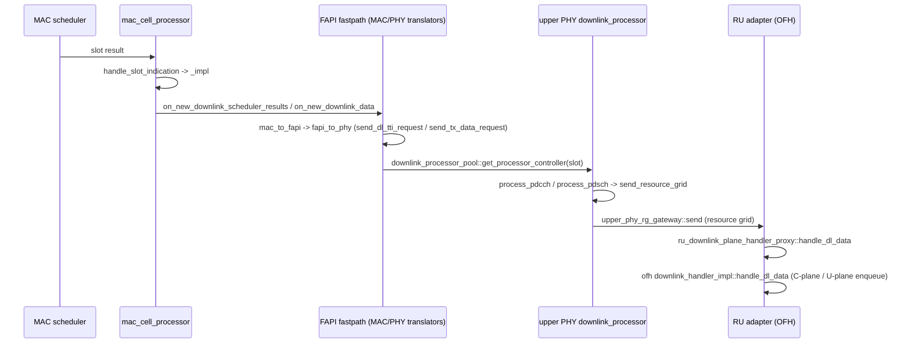

### 7.4 補足: スケジューラ・ポリシー（time_qos / time_rr）

MAC スケジューラの UE 選択ポリシーは `lib/scheduler/policy/` にあり、共通インターフェース
`scheduler_policy`（`lib/scheduler/policy/scheduler_policy.h:37`）は `compute_ue_dl_priorities` /
`compute_ue_ul_priorities`（UE ごとに `ue_sched_priority = double` を算出）と
`save_dl_newtx_grants` / `save_ul_newtx_grants` を持つ。生成は `create_scheduler_strategy`
（`lib/scheduler/policy/scheduler_policy_factory.cpp:11-21`）で、config の variant により分岐する。

> srsRAN の `time_pf` は本ツリーには存在しない。proportional fair（PF）は QoS-aware ポリシー
> `scheduler_time_qos` の一要素として統合された。

**`scheduler_time_rr`（time-domain round-robin、`lib/scheduler/policy/scheduler_time_rr.cpp`）**

優先度を「現在の割当カウント − その UE が最後に割当を受けたカウント」で与える
（`priority = dl_alloc_count - ue_last_dl_alloc_count[ue_index]`、`:17`、UL も同様 `:27`）。割当の
たびにカウンタを更新する（`:39-41`）。長く割当を受けていない UE ほど高優先になる。

**`scheduler_time_qos`（QoS-aware、`lib/scheduler/policy/scheduler_time_qos.cpp`）**

UE 優先度を 4 つの重みの積で算出する（`combine_qos_metrics`、`:242-256`）:

```
priority = gbr_weight * pf_weight * prio_weight * delay_weight
```

- **pf_weight**: `compute_pf_metric`（`:221-240`）。`estim_rate / pow(avg_rate, fairness_coeff)`。
  係数は `pf_fairness_coeff`。平均レートは指数移動平均で更新される（`ue_history_repository`、
  `exp_avg_alpha` 使用、`:44-62`）。瞬時レート推定は qam256 を基準に算出（`rate_estimator`、
  `estimate_max_dl_tbs` `:117`、`estimate_max_ul_tbs` `:140`）。
- **gbr_weight**: GBR フローの目標レート未達時に重みを上げる（DL `:294-305`、UL `:361-373`）。
  `combine_function == gbr_prioritized` の場合は GBR を PF より優先（`:248-252`）。
- **prio_weight**: QoS priority と ARP priority の組み合わせ（DL `:315-317`、UL `:380-382`）。
- **delay_weight**: PDB（packet delay budget）に対する HOL 遅延比（DL のみ、`:287-292`）。

config（`include/ocudu/scheduler/config/scheduler_expert_config.h`）:

| キー（struct field） | 既定値 | 箇所 |
|---|---|---|
| `time_qos_scheduler_config::combine_function`（`{gbr_prioritized, geometric_mean}`） | `gbr_prioritized` | `:38-41` |
| `time_qos_scheduler_config::pf_fairness_coeff` | `2.0` | `:45` |
| `time_qos_scheduler_config::priority_enabled` | `true` | `:47` |
| `time_qos_scheduler_config::pdb_enabled` | `true` | `:49` |
| `time_qos_scheduler_config::gbr_enabled` | `true` | `:51` |
| `scheduler_policy_config`（`variant<time_qos, time_rr>`） | `time_qos_scheduler_config{}` | `:58`, `:205` |
| `pre_policy_rr_ue_group_size` | `32` | `:211` |

---

## 8. 横断③ Open Fronthaul (OFH / split 7.2x) のタイミングと締め切り処理

本章は DU-Low と RU を結ぶ Open Fronthaul（O-RAN 7.2x 分割）の **タイミングと締め切り（deadline）
処理** を扱う。最重要テーマは「**air deadline に対して late な C-plane / U-plane パケットが、
どこで判定され、どこで破棄・計数されるか**」を実コードで確定することである（§8.5）。OFH 本体は
`lib/ofh/`（`namespace ocudu::ofh`）、RU としての結線は `lib/ru/ofh/`（`namespace ocudu`）にある。

### 8.1 概要と pipeline コンポーネント地図

OFH は **送信（DL）** と **受信（UL）** の 2 つのデータ経路を、**OTA（over-the-air）シンボル境界**
を刻む 1 本のリアルタイム・タイミング源で駆動する。

- **DL TX 経路**: upper PHY → `ru_downlink_plane_handler_proxy`（§7.3）→ `sector_impl` →
  `downlink_handler_impl`（late gate）→ C-plane/U-plane data flow（圧縮・直列化）→ `eth_frame_pool`
  → `message_transmitter_impl`（OTA シンボルごとに送信）→ Ethernet/DPDK。
- **UL RX 経路**: Ethernet/DPDK receiver → `message_receiver_impl`（filter / seq-id / window 計数）→
  `data_flow_uplane_uplink`（decode・破棄判定）→ resource grid 書込 → upper PHY 通知。締め切りで
  `closed_rx_window_handler` が窓を閉じる。
- **タイミング源**: `realtime_timing_worker`（GPS clock）→ OTA シンボル通知 → 全 window checker・
  `message_transmitter`・`closed_rx_window_handler`。

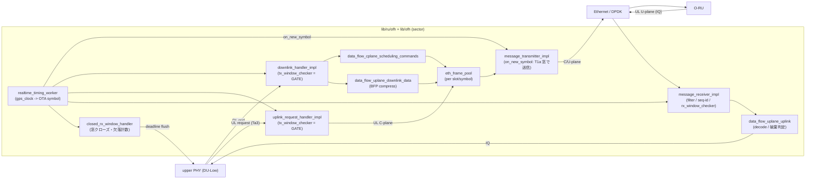

### 8.2 タイミング基盤: slot_symbol_point と OTA 駆動

**OTA 時刻の表現** は `slot_symbol_point`（`include/ocudu/ofh/timing/slot_symbol_point.h:12`）。slot と
シンボル index を 1 つの packed 値（`nof_symbols:4 / numerology:3 / count_val:25`、`:98-100`）で持ち、
ハイパーフレームの wrap-around を考慮した比較演算子（`operator<` `:76-90`、距離 `operator-` `:129-149`）
を備える。OFH では SFN を 1 byte に制限する（`OFH_MAX_NOF_SFN = 256`、`ofh_rx_window_checker.cpp:11`、
`calculate_ofh_slot_symbol_point` `:20-27`）。

**OTA 駆動** は `realtime_timing_worker`（`lib/ofh/timing/realtime_timing_worker.{h,cpp}`、
`ota_symbol_boundary_notifier_manager` を実装）。

- クロック源は `gps_clock::now()`（`realtime_timing_worker.h:60-68`）で、**`clock_gettime(CLOCK_REALTIME)`
  を読み、固定 GPS オフセットを引く**だけ（`:63,67`）。`timing_loop`（`realtime_timing_worker.cpp:92`）が
  `poll()`（`:123`）を回し、GPS 時刻の秒内 fraction から現在シンボル index を求め、進んだ分の OTA
  シンボルを `notify_slot_symbol_point` で通知する（`:188-203`）。スリープ間隔は `symbol_duration / 15`
  （`:26`）。
- 起動時に system clock が 1981 年以降であることを要求し（GPS epoch 1980.1.6、`:30-38`）、
  `gps_offset` を `gps_Alpha` / `gps_Beta` と `UNIX_TO_GPS_SECONDS_OFFSET` から計算する（`:40-42`）。
  この定数は **うるう秒 18 をハードコード**している（`realtime_timing_worker.h:49`、最終更新 2016 年想定）。
- タイミングスレッドが遅延した場合は "Real-time timing worker woke up late, skipped N symbols" を出し、
  `update_skipped_symbols(delta)` を計上する（`:161-166`）。

**OTA notifier の購読**（`ru_ofh_impl.cpp:84-97`）: 各 sector の送信側 OTA notifier
（`transmitter` の `get_ota_symbol_boundary_notifier()`、`:91`）と受信側 OTA notifier
（`receiver` の同 getter、`:92`）を集め、`ofh_timing_mngr->get_ota_symbol_boundary_notifier_manager().subscribe(...)`
（`:97`）でタイミング源に登録する。受信側 notifier は `rx_window_checker` と `closed_rx_window_handler`
を束ねる（`ofh_receiver_impl.cpp:96,122`）。送信側 notifier は `transmitter_ota_symbol_task_dispatcher`
（DL/UL の `tx_window_checker` ＋ `message_transmitter`）。

**同期源（PTP / SyncE）の扱い** — ラベルを区別して記す:

- **［事実・コードが行うこと］** OFH は disciplined clock（`CLOCK_REALTIME`）を読み、そこから OTA の
  slot/symbol タイミングを導出するのみ（`realtime_timing_worker.h:60-68`）。クロックの規律（servo）は
  実装しない。
- **［外部依存・断定］** system clock は **外部の PTP デーモン（`ptp4l` / `phc2sys` 等、linuxptp）で
  規律されている前提**。本ツリーに PTP servo は無い。根拠は、worker が PTP による時刻の後退を明示的に
  ハンドリングしている点 — "The clock may jump backwards as it is continuously being adjusted by PTP"
  および "detected PTP-synchronized time going backward" のログ（`realtime_timing_worker.cpp:135-138`）。
- **［外部同期との接続点 = config］** OFH unit config には **PTP インターフェースや PHC index を直接
  指す option は存在しない**（後述 §8.9、`ru_ofh_config.h` を全数確認）。同期に関わるのは GPS オフセット
  調整の `gps_Alpha`（`--gps_alpha`）/ `gps_Beta`（`--gps_beta`）と、busy-wait 切替の
  `enable_busy_waiting` のみ。
- **［SyncE］** in-tree にコード上の登場は無い（純物理層）。SyncE 規律は NIC / OS 層に委譲される。
- **［真に未確認］** うるう秒定数（18）の将来更新運用、クロック未規律時の fallback の有無（コードは
  `CLOCK_REALTIME` をそのまま信頼し、劣化は "woke up late" のスキップ計数として現れる）。§9 に集約。

### 8.3 DL 送信ウィンドウ（T1a 系）

**窓パラメータ** は `tx_window_timing_parameters`
（`include/ocudu/ofh/transmitter/ofh_transmitter_timing_parameters.h:13-33`、すべて「現在 OTA シンボルからの
オフセット symbol 数」）:

| フィールド | 由来 | 対象 |
|---|---|---|
| `sym_cp_dl_start` / `sym_cp_dl_end` | `T1a_max_cp_dl` / `T1a_min_cp_dl` | DL C-plane 送信窓 |
| `sym_cp_ul_start` / `sym_cp_ul_end` | `T1a_max_cp_ul` / `T1a_min_cp_ul` | UL C-plane 送信窓（§8.4, Ta3 相当） |
| `sym_up_dl_start` / `sym_up_dl_end` | `T1a_max_up` / `T1a_min_up` | DL U-plane 送信窓 |

**DL 入口**: `downlink_handler_impl::handle_dl_data`（`lib/ofh/transmitter/ofh_downlink_handler_impl.cpp:61`）。
処理順は (1) `frame_pool_dl_cp/up->clear_slot()` で前 slot の残骸を掃除し late を計数（`:77-78`、
`update_cp_dl_lates`/`update_up_dl_lates`）、(2) **late gate**（`is_late`、`:85`）、(3) cell port ごとに
C-plane（`enqueue_section_type_1_message`、`:113`）と U-plane（`:118`）を enqueue。

**送信エンジン**: `message_transmitter_impl::on_new_symbol`（`ofh_message_transmitter_impl.cpp:75-115`）が
OTA シンボルごとに、各 T1a 窓に対応する区間 `[+sym_*_end, +sym_*_start]` の frame を 3 つの pool
（DL C-plane / UL C-plane / DL U-plane）から取り出し、burst で Ethernet 送信する（`:84-98`）。これが
T1a 送信窓の実時間的な強制点である。

**DL late 判定（GATE）**: `tx_window_checker::is_late`（`lib/ofh/transmitter/ofh_tx_window_checker.h:33`）。
`rg_point = slot@symbol0 - advance_time_in_symbols`、現在 `ota < rg_point` なら not-late、そうでなければ
`late_counter++` して **true を返す**。`handle_dl_data:85` はこれを受け、true なら
「dropped late downlink resource grid ... No OFH data will be transmitted」をログし、
`err_notifier.on_late_downlink_message(...)` を呼んで **return（その slot を丸ごと破棄）**（`:85-96`）。
`advance_time_in_symbols` は `calculate_nof_symbols_before_ota`（`helpers.h:20-31`）=
`max(1, processing_time/symbol_duration) + max(sym_cp_dl_end, sym_cp_ul_end, sym_up_dl_end)`。

> 要点: **送信側は window checker が gate**。late と判定された DL grid はその場で破棄され、計数
> （`nof_late_dl_grids`）と破棄が一致する。UL C-plane 要求も同様（§8.4）。受信側（§8.5）はこれと
> 非対称である。

### 8.4 UL 受信ウィンドウ（Ta4）と UL C-plane 要求（Ta3）

**UL U-plane 受信窓（Ta4）**: `rx_window_timing_parameters`
（`include/ocudu/ofh/receiver/ofh_receiver_timing_parameters.h:13`）の `sym_start`（`Ta4_min` 由来）/
`sym_end`（`Ta4_max` 由来）で表す。受信パケットの OTA からの距離 `diff` をこの `[sym_start, sym_end]`
と比較して On Time / Early / Late を判定する（§8.5）。窓のクローズ時刻は
`closed_rx_window_handler` の `notification_delay_in_symbols = nof_symbols_to_process_uplink + sym_end + 1`
（`ofh_closed_rx_window_handler.cpp:12`）。なお `nof_symbols_to_process_uplink` は **0 にハードコード**
されている（`ofh_receiver_impl.cpp:61`）ため、実質クローズは `Ta4_max 相当 + 1 symbol`。

**UL C-plane 要求（Ta3 相当）**: gNB が RU に UL 送信を指示する C-plane は、`cp_ul` 窓
（`sym_cp_ul_start/end` = `T1a_max/min_cp_ul`）で送る。入口は
`uplink_request_handler_impl`（`lib/ofh/transmitter/ofh_uplink_request_handler_impl.cpp`）で、
`handle_prach_occasion`（`:105`）/ UL slot 要求が **late gate**（`is_late`、`:113` ほか）を通り、late なら
`on_late_prach_message` 等を呼んで **return（要求破棄）**（`:113-123`）。late は `nof_late_ul_requests` に
計上される。要求時に `uplink_context_repository` / `prach_context_repository` /
`uplink_cplane_context_repository` へ context を登録し、後で RX 側が IQ を書き込めるようにする。

下図は air（OTA）基準での DL/UL 窓の時間関係（既定値は §8.9）。Mermaid の制約上、正確なオフセットは
§8.9 の表を参照（横軸は概念的順序）。

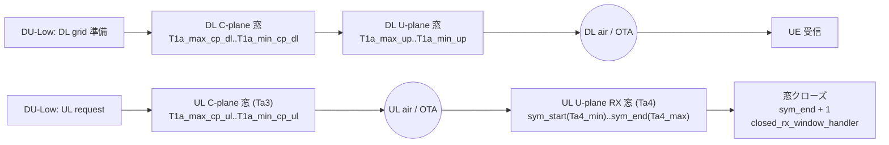

### 8.5 ★窓の強制と統計（最重要: 計数 reason と discard reason の非一致）

OFH の締め切り処理を読み解く鍵は、**「窓判定（計数）」と「実際の破棄」が別物**である点と、
**送信側（gate）と受信側（観測のみ）が非対称**である点である。これは「Too Late を見たとき、どの
カウンタがどの段で上がったか」で切り分けるための土台になる。

#### 8.5.1 受信窓判定は「観測のみ」で gate しない

`rx_window_checker::update_rx_window_statistics`（`lib/ofh/receiver/ofh_rx_window_checker.cpp:64-95`）は、
受信メッセージの slot/symbol と現在 OTA の距離 `diff` を計算し:

- `diff > sym_end`（= Ta4_max 超過）→ **Too Late** → `increment_late_counter()`（`:80-84`）
- `diff < sym_start`（= Ta4_min 未満）→ **Too Early** → `increment_early_counter()`（`:87-91`）
- それ以外 → **On Time** → `increment_on_time_counter()`（`:94`）

呼び出し側 `message_receiver_impl::process_new_frame` は `update_rx_window_statistics(*slot_point)`
（`ofh_message_receiver_impl.cpp:104`）を呼んだ **後、結果に関わらず無条件で下流の decode へ進む**
（`:107-122`）。つまり `rx_window_checker` は **gate ではなく観測専用**。Too Late と計数されても、
そのパケットは decode され、context が残っていれば grid に書かれうる。

#### 8.5.2 実際にパケットが落ちる点

受信経路で実破棄が起きるのは以下（すべて window checker とは独立）:

1. **seq-id が過去（重複/古い）** → `sequence_id_checker_impl::update_and_compare_seq_id` が `<0`
   を返す（`ofh_sequence_id_checker_impl.h:33-67`、eAxC 別 counter、modular 距離で過去/未来を判定）
   → `message_receiver` が **破棄＋`increase_dropped_messages`**（`ofh_message_receiver_impl.cpp:77-85`）。
   これは **window 計数より前**（`:75` < `:104`）なので、過去 seq-id のパケットは late/early/on-time の
   いずれにも計上されない。seq-id 未来（`>0`）は破棄せず `update_skipped_messages`（lost 数）として継続。
   なお seq-id 検査は `ignore_ecpri_seq_id_field`（既定 false）で dummy 実装に切替可能
   （`ofh_receiver_factories.cpp:145-147`）。
2. **eth/eCPRI フィルタ不一致**（MAC src/dst、eth_type、eCPRI msg_type≠iq_data、eAxC 未設定）→ 無言
   return（log のみ、`ofh_message_receiver_impl.cpp:56,62,127-184`）。
3. **slot/filter index の peek 失敗** → 破棄（log、`:96-101,107-112`）。
4. **U-plane decode 失敗** → 破棄＋`increase_dropped_messages`（`ofh_data_flow_uplane_uplink_data_impl.cpp:32-35`）。
5. **U-plane の filter index が C-plane context と不一致**（= 対応する UL C-plane が未確立/別物）→
   破棄＋`increase_dropped_messages`（`:70-83`、`ul_cplane_context_repo->get(slot, eaxc)` と照合）。
   *「U-plane が宙に浮く」型の破棄その 1*。
6. **symbol index が C-plane の範囲外 / PRB 範囲不正** → 破棄（`:86-97`）。
7. **UL resource grid context が無い**（窓クローズ済 or 未生成）→ 破棄＋`increase_dropped_messages`
   （`ofh_uplane_rx_symbol_data_flow_writer.cpp:18-29`、`ul_context_repo->get(slot,symbol)` が空）。
   *「宙に浮く」型その 2。late パケットが実際に捨てられる主因がここ*。
8. **締め切りでの窓クローズ**: `closed_rx_window_handler::on_new_symbol`（`ofh_closed_rx_window_handler.cpp:27`）
   が OTA 境界の度に、`notification_delay_in_symbols` 遅れた slot の context を pop し、未完のまま
   upper PHY へ通知（"notifying incomplete UL symbol"、`:73,86`）。その際 `nof_missed_uplink_symbols`
   （`:76`）/ `nof_missing_prach_contexts`（`:113`）を計上する。

#### 8.5.3 計数 reason × discard reason の対応表

**表 A — 計数カウンタ（統計）。gate か観測かを併記**:

| カウンタ | 上がる段（呼び出し箇所） | gate? | metrics 名 |
|---|---|---|---|
| On Time / Too Early / Too Late | `rx_window_checker`（`ofh_rx_window_checker.cpp:80-94`、呼出 `message_receiver:104`） | **観測のみ** | `nof_on_time/early/late_messages`（`:110-112`） |
| DL late grid | `tx_window_checker.is_late`（`downlink_handler_impl.cpp:85`） | **GATE（破棄）** | `nof_late_dl_grids`（`downlink_handler_metrics_collector.h:44`） |
| UL late request | `tx_window_checker.is_late`（`uplink_request_handler_impl.cpp:113`） | **GATE（破棄）** | `nof_late_ul_requests`（`uplink_request_handler_metrics_collector.h:33`） |
| TX frame pool stale | `eth_frame_pool::clear_slot`（`ethernet_frame_pool.h:413-477`） | 掃除 | `cp_dl_lates`/`up_dl_lates`/`cp_ul_lates` |
| timing skip | `realtime_timing_worker::poll`（`:161-166`） | — | `update_skipped_symbols` |

**表 B — 受信側 実破棄 reason。どのカウンタがどの段で上がるか**:

| discard reason | 段（箇所） | 計上カウンタ | window 計数との関係 |
|---|---|---|---|
| seq-id 過去（重複/古い） | `message_receiver:77-85` | `increase_dropped_messages` | **window より前** → late/early/on-time に出ない |
| eth/eCPRI フィルタ不一致 | `message_receiver:56,62` | （log のみ） | window 到達前 |
| slot/filter peek 失敗 | `message_receiver:96-112` | （log のみ） | window 直前後 |
| U-plane decode 失敗 | `data_flow_uplane_uplink:32-35` | `increase_dropped_messages` | window の **後**（On Time 計数済でも落ちる） |
| C-plane context 不一致（宙に浮く 1） | `data_flow_uplane_uplink:70-83` | `increase_dropped_messages` | window の後 |
| symbol/PRB 範囲不正 | `data_flow_uplane_uplink:86-97` | `increase_dropped_messages` | window の後 |
| grid context 無し（宙に浮く 2 / late 実体） | `uplane_rx_symbol_data_flow_writer:18-29` | `increase_dropped_messages` | window の後。**Too Late の主たる実破棄** |
| 締め切りで窓クローズ（未完通知） | `closed_rx_window_handler:60-123` | `nof_missed_uplink_symbols` / `nof_missing_prach_contexts` | window 計数とは独立の別カウンタ |

#### 8.5.4 非一致のまとめ（デバッグ時の読み方）

- **`nof_late_messages`（rx_window_checker）≠ 実 drop 数**。受信窓は観測専用なので、Too Late と数えても
  context が残っていれば書かれる場合があり、逆に context 失効（窓クローズ）で落ちた分は
  `increase_dropped_messages` / `nof_missed_uplink_symbols` 側に出て、late カウンタとは別管理。
- **On Time と数えられても落ちることがある**（C-plane 不一致・grid context 無し等、表 B の window 後段）。
- **seq-id 過去の破棄は late/early/on-time に一切出ない**（window 計数より前段で return するため）。
- **送信側（DL grid / UL request）は gate なので「late = drop」が一致**（`nof_late_dl_grids` /
  `nof_late_ul_requests` ＝ 破棄数）。受信側だけが「計数 ≠ 破棄」になる。
- 現場切り分け: Too Late を `nof_late_messages` で観測 → 実害は `increase_dropped_messages`
  （grid context 無し）と `nof_missed_uplink_symbols`（窓クローズ）で確認、というように **段ごとに別の
  カウンタ** を見る。

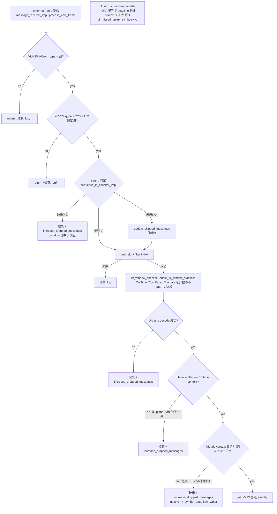

### 8.6 C-plane data flow（section type / scheduling command）

C-plane は RU へ「いつ・どの eAxC・どの PRB/シンボル・どの圧縮」で送受信するかを指示する。

- **section type**（`include/ocudu/ofh/serdes/ofh_message_properties.h:90-101`）: `type_0`（idle/guard）、
  `type_1`（通常の DL/UL 無線チャネル）、`type_3`（PRACH・mixed numerology）、`type_5/6`（enum のみ、
  builder 未実装）。`filter_index_type`（`:39-49`）が PRACH 種別を表し、`is_a_prach_message`（`:83-87`）
  で判定。
- **builder**: `cplane_message_builder`（`include/ocudu/ofh/serdes/ofh_cplane_message_builder.h:15`）が
  `build_dl_ul_radio_channel_message`（type1、`:29`）/ `build_idle_guard_period_message`（type0、`:37`）/
  `build_prach_mixed_numerology_message`（type3、`:46`）を提供。圧縮ヘッダの有無で static / dynamic に
  特殊化される（`ofh_cplane_message_builder_static_compression_impl` / `_dynamic_compression_impl`）。
- **data flow**: `data_flow_cplane_scheduling_commands_impl`
  （`lib/ofh/transmitter/ofh_data_flow_cplane_scheduling_commands_impl.cpp`）。`enqueue_section_type_1_message`
  （`:148-212`、UL 方向では `ul_cplane_context_repo->add(...)` で RX 側検証用 context を登録、`:187-195`）と
  `enqueue_section_type_3_prach_message`（`:214-287`、`prach_cplane_context_repo` に登録、`:266-272`）。
  eAxC は C-plane section ではなく eCPRI ヘッダ（`rtc_id`）で運ぶ（`:107-120`）。

### 8.7 U-plane data flow と圧縮/伸張（BFP・exponent）＋ PRACH

**U-plane decode**: `uplane_message_decoder`（`include/ocudu/ofh/serdes/ofh_uplane_message_decoder.h:33`、
`decode(results, message)`）。`uplane_message_decoder_results` は `params`（slot / symbol_id /
filter_index / direction / compression_params）＋ `sections`（start_prb / nof_prbs / iq_samples）
（`ofh_uplane_message_decoder_properties.h:43`、`ofh_uplane_message_properties.h:14-19`）。slot/symbol と
filter index は受信本体で先読みする（`uplane_peeker::peek_slot_symbol_point` /
`peek_filter_index`、`ofh_uplane_message_decoder_impl.cpp:353-402`）。

**圧縮種別**（`include/ocudu/ofh/compression/compression_params.h:23-40`）: `none, BFP, block_scaling,
mu_law, modulation, bfp_selective, mod_selective, reserved`。**実装があるのは `none` と `BFP` のみ**で、
他は `iq_compression_death_impl`（アプリ停止）にマップされる（`compression_factory.cpp:76-85,137-146`）。

**BFP の exponent 処理**（`lib/ofh/compression/iq_compression_bfp_impl.{h,cpp}`）:

- 各 PRB の 24 サンプル（I/Q×12）から `max_abs` を求め、`determine_exponent`（`.h:45-59`、先頭ゼロ数
  `__builtin_clz` から算出）で **PRB 単位の exponent** を決定（`compress_prb_generic` `:33-59`）。
- 全サンプルを exponent 分だけ右シフトし、**先頭に 1 byte の exponent を書き**、続けて `data_width`
  bit 幅で bit-pack する（`:49-58`）。よって圧縮 PRB = `[1-byte exponent][12*2*data_width bit の IQ]`。
- 伸張は `decompress_prb_generic`（`:89-113`）で exponent → `scaler = 1<<exponent`、unpack → 符号拡張 →
  scaler 乗算。
- SIMD 変種 `iq_compression_bfp_{avx2,avx512,neon}` があり、`compression_factory` が CPU feature を見て
  選択する（`compression_factory.cpp:28-150`、`__x86_64__` / `__ARM_NEON` ガード）。

**PRACH U-plane**（受信、`lib/ofh/receiver/ofh_data_flow_uplane_uplink_prach_impl.{h,cpp}`）: 通常 UL とは
**別 eAxC・別 data flow・別 context repo**（`prach_context_repository`）。受信本体が
`is_a_prach_message(filter_index)` で PRACH と通常 UL を振り分ける（`ofh_message_receiver_impl.cpp:115-122`）。
PRACH 経路も `decode_type1_message`（`:91-113`）で decode → 破棄判定（§8.5 と同型）→
`write_to_prach_buffer`（`ofh_uplane_prach_symbol_data_flow_writer.cpp`）→ 完成時に
`on_new_prach_window_data` 通知（`ofh_uplane_prach_data_flow_notifier.cpp`）。PRACH の U-plane パケット自体は
wire 上 section type 1 で、PRACH であることは filter index で示される。

### 8.8 スレッド / executor（ru_timing / ru_txrx の RT 優先度・コア pin）

§6.1 で「main_pool 外の専用スレッド」と述べた OFH のスレッド群の実体は `worker_manager::create_ofh_executors`
（`apps/services/worker_manager/worker_manager.cpp:436-491`、呼出は `:143`）。

| executor | worker / thread | RT 優先度 | queue policy | 駆動対象 |
|---|---|---|---|---|
| timing | `ru_timing`（共有） | `os_thread_realtime_priority::max() - 0`（最高、`:458`） | `locking_mpsc`, size 4（`:456`） | OFH timing manager / OTA シンボル |
| txrx | `ru_txrx_#i`（共有） | `max() - 1`（`:479`） | `lockfree_mpmc`, `task_worker_queue_size`（`:477`） | Ethernet TX/RX、OTA dispatcher → `message_transmitter.on_new_symbol` |
| downlink | `rt_hi_prio_exec`（main_pool `rt_prio_exec`、`max()-2`、§6.1） | — | moodycamel | DL C/U-plane data flow（grid 読み・圧縮・直列化） |
| uplink | `rt_hi_prio_exec` 上の strand（`ru_ofh_executor_mapper.cpp:77`） | — | strand(lockfree_mpmc) 2048 | OFH receiver（伸張・逆直列化） |

コア pin は `ru_timing_cpu`（無指定なら先頭 cell の RU affinity、`:452-454`）と `txrx_affinities`
（`:441,480`）。`ru_ofh_executor_mapper`（`lib/ru/ofh/ru_ofh_executor_mapper.cpp`）は txrx スレッドを
sector 間で共有割当する（`nof_sectors_per_txrx_thread = ceil(nof_sectors / nof_txrx_threads)`、`:67-78`）。
OTA → 送信の流れは `transmitter_ota_symbol_task_dispatcher::on_new_symbol`
（`ofh_transmitter_ota_symbol_task_dispatcher.h:41-60`）が DL/UL window checker を**同期実行**し、
`message_transmitter` を **txrx executor へ defer** する（`:48-53`）。

### 8.9 config キー

OFH のタイミング/圧縮/eCPRI/Ethernet/DPDK 設定は **`apps/units/flexible_o_du/split_7_2/helpers/ru_ofh_config.h`**
（CLI: `ru_ofh_config_cli11_schema.cpp`、変換: `ru_ofh_config_translator.cpp`）にある。`o_du_low/` 配下ではない。

**タイミング窓（`std::chrono::microseconds`、struct は大文字 `T1a_`/`Ta4_`、CLI は小文字）**:

| struct field | 既定 (µs) | CLI | 由来パラメータ |
|---|---|---|---|
| `T1a_max_cp_dl` / `T1a_min_cp_dl` | 500 / 258 | `--t1a_max_cp_dl` / `--t1a_min_cp_dl` | DL C-plane 窓（`config.h:72,74`） |
| `T1a_max_cp_ul` / `T1a_min_cp_ul` | 500 / 285 | `--t1a_max_cp_ul` / `--t1a_min_cp_ul` | UL C-plane 窓 Ta3（`:76,78`） |
| `T1a_max_up` / `T1a_min_up` | 300 / 85 | `--t1a_max_up` / `--t1a_min_up` | DL U-plane 窓（`:80,82`） |
| `Ta4_max` / `Ta4_min` | 500 / 85 | `--ta4_max` / `--ta4_min` | UL U-plane RX 窓（`:84,86`） |

**µs → symbol 変換**（`ru_ofh_config_translator.cpp`）: TX 窓は `T1a_max → sym_*_start = floor(/symbol_duration)`、
`T1a_min → sym_*_end = ceil(...)`（`:50-55`）。RX 窓は `Ta4_min → sym_start`、`Ta4_max → sym_end`（`:33-34`）。
DL handler の "advance time" は `dl_processing_time`（既定 400µs、`config.h:198`、CLI 無し）＋
T1a_min 由来 end の最大（`helpers.h:20-31`）。`ul_processing_time` は既定 30µs（`:200`）。

**その他タイミング系**: `ignore_ecpri_seq_id_field`（`--ignore_ecpri_seq_id`、既定 false、§8.5 の seq-id 検査
切替）、`is_prach_control_plane_enabled`（`--is_prach_cp_enabled`、既定 true）、
`log_unreceived_ru_frames`（`--warn_unreceived_ru_frames`：never/always/after_traffic_detection）、
`enable_log_warnings_for_lates`（`--log_lates_as_warnings`）。`nof_symbols_to_process_uplink` は config 化
されておらず **0 ハードコード**（`ofh_receiver_impl.cpp:61`）。

**GPS / clock / thread**: `gps_Alpha`（`--gps_alpha`、既定 0）、`gps_Beta`（`--gps_beta`、既定 0）、
`enable_busy_waiting`（`--enable_busy_waiting`）、`ru_timing_cpu`（`--timing_cpu`）、`txrx_affinities`
（`--txrx_cpus`）。**PTP/PHC を指す option は無し**（§8.2）。

**compression**: `compression_method_{ul,dl,prach}`（既定 `"bfp"`、`config.h:100,104,108`）、
`compression_bitwidth_{ul,dl,prach}`（既定 9）、`is_{uplink,downlink}_static_comp_hdr_enabled`（既定 true、
static vs dynamic）、IQ scaling（`ru_reference_level_dBFS` 既定 -12.0 等）。

**eCPRI / Ethernet / DPDK**: `network_interface`（DPDK 時は PCIe id）、`mtu_size`（既定 9000）、
`ru_mac_address` / `du_mac_address`、`vlan_tag_cp` / `vlan_tag_up`、eAxC（`ru_prach_port_id`={4} /
`ru_dl_port_id`={0} / `ru_ul_port_id`={0}）。DPDK 使用は `hal_config` の有無で決まり（`translator:80`、
`uses_dpdk`）、`eal_args`（`--eal_args`）は `#ifdef DPDK_FOUND` 時のみ。

**`max_processing_delay_slots` との関係**: DU-Low の `max_processing_delay_slots`
（`apps/units/flexible_o_du/o_du_low/du_low_config.h:21`、`--max_proc_delay`、既定 5）は OFH 窓へ
**そのまま渡されるだけで、T1a/Ta4 や `nof_symbols_to_process_uplink` との整合検証は無い**
（split_7_2 validator は DU-Low と OFH を独立に検証、OFH validator は各 TX 窓 > 1 symbol のみ確認）。
DU-Low 内のパイプライン段数決定に使われる値で、OFH 窓とは別系統である（詳細は §9）。

---

## 9. 横断④ 非標準化アルゴリズム（scheduler 判断系 / 受信 DSP）

3GPP / O-RAN は signaling とインターフェースを規定するが、**判断ロジックは実装裁量**に委ねる箇所が
多い。本章はそうした非標準アルゴリズムを、MAC スケジューラ（A）と DU-Low upper PHY 受信 DSP（B）に
分けて横断的に深掘りする。各節は次の **4 点テンプレ**で統一する。

1. **標準が固定する部分** … 3GPP/O-RAN が縛る箇所
2. **実装裁量の実アルゴリズム**（`path:line`） … ツリーの実コード
3. **主要 tunable / config キー** … struct field・CLI
4. **ハードコード定数・閾値・ヒューリスティック** … magic number（各社の差が最も出る箇所）

> 既存章との切り分け: §7.4 は scheduler policy（`scheduler_time_qos` / `scheduler_time_rr`）の
> **優先度 metric 算出**式（QoS 重み・RR カウント差）を扱った。§8.7 は OFH wire 層（eCPRI/U-plane）の
> **BFP 伸張**を扱った。本章はこれらを再掲せず参照に留め、§7.4 が触れない「metric 算出後の段」と、
> §8.7 が伸張した IQ を入力とする「upper PHY 信号処理」を扱う。

---

### A. MAC スケジューラの判断パイプライン（§7.4 の先）

**§7.4 と本節 A の境界**: §7.4 の `scheduler_policy` は UE ごとの優先度 metric（DL/UL の `ue_sched_priority`）
を算出する段だった。本節 A はその **metric が出た後**の段——UE 事前選択・並べ替え・RB/grant 割当・
リンクアダプテーション・HARQ・電力制御・slicing・PUCCH/UCI——を扱う。判断パイプラインのオーケストレータは
`lib/scheduler/ue_scheduling/intra_slice_scheduler.cpp`（DL `dl_sched():168`、UL `ul_sched():197`）で、
両者とも **budget 決定 → reTx 先行 → newTx** の順で動く。

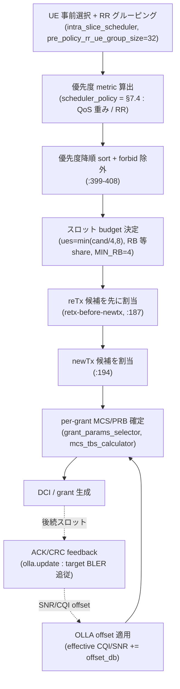

#### 9.A.1 UE 事前選択と RR グルーピング

1. **標準**: per-slot にどの UE を選ぶか・どう rotate するかは 3GPP 非規定（完全実装裁量）。標準に紐づく
   唯一の candidacy 入力は HARQ process 数（`has_empty_dl_harqs()`）。
2. **実装**: `slice_ue_group_scheduler::fill_ue_candidate_group`
   （`intra_slice_scheduler.cpp:58-119`）。SFN 切替ごとに group offset を回転（`jump = max(min(max_dl_ue_count,
   max_ul_ue_count), pre_policy_rr_ue_group_size)`、`:74`；`group_offset = (group_offset + jump) % ue_idx_mod`、
   `:75`）、ただし `nof_ues > group_size` のときのみ（`:66`）。候補は `ues_with_data` bitmap を
   `group_offset` から走査し `group_size = min(nof_ues, pre_policy_rr_ue_group_size)`（`:88`）まで集める。
   候補は `forbid_sched_priority` で初期化され（`:723`）、metric 算出後に降順 sort（`:399-404`）し forbid を
   除外（`:407-410`）。
3. **config**: `pre_policy_rr_ue_group_size = 32`（`scheduler_expert_config.h:211`）、アプリ層
   `nof_preselected_newtx_ues = 1024`（`du_high_config.h:93`、CLI `--nof_preselected_newtx_ues`）が前者へ
   マップ（`du_high_config_translators.cpp:1215`）。
4. **定数・ヒューリスティック**: 既定 **32 / 1024**。回転 jump の下限を group_size に固定し「最低 1 グループ
   分は必ず進める」（`:74`）。grouping は `nof_ues > group_size` のときだけ作動、それ以外は index 0 から全走査
   （`:81`）。`forbid_sched_priority = lowest()` を初期値兼カル印に二重利用。`max_expected_ran_slices = 8`
   で reserve（`:148`）。

#### 9.A.2 並べ替え後の RB / grant 割当

1. **標準**: TBS/MCS テーブル・実効符号化率 ≤ 0.95（TS 38.214）、VRB↔PRB マッピング（TS 38.211 §7.3.1.6）、
   DCI フィールド符号化は標準。RB 数と UE 間配分は実装裁量。
2. **実装**: 2 段構成。budget 決定 `get_max_grants_and_rb_grant_size`（`:228-283`）→ 制御確保
   `schedule_dl_newtx_candidates` Stage1（`:458-504`）→ CRB/MCS/RB 確定 Stage2（`:510-560`）。VRB は
   `rb_helper::find_empty_interval_of_length`（**first-fit**、無ければ最長空き、`rb_helper.h:84-110`）。
   per-grant MCS/PRB は `compute_newtx_required_mcs_and_prbs`（`grant_params_selector.cpp:32-64`）で
   link adaptation（§9.A.3）と `get_nof_prbs` から算出。reTx は前回 MCS/TBS を再利用し RB 長が変わると postpone
   （`:345-353`）。
3. **config**: `pdsch_nof_rbs{1,MAX_NOF_PRBS}`、`pusch_nof_rbs`、`max_pdschs_per_slot`、`max_puschs_per_slot`、
   `max_pucchs_per_slot{31}`、`max_ul_grants_per_slot{32}`、`dl_mcs{0,28}` / `ul_mcs{0,28}`
   （`scheduler_expert_config.h:160-203`）。
4. **定数・ヒューリスティック ★**: `ues_to_alloc = min(max_ue_grants, max(nof_candidates/4, 1), **8**)`
   （`:251-253`、「候補を 4 で割り、1 スロット最大 8 UE」）。`MIN_RB_PER_GRANT = 4`（`:281`）。CORESET CCE を
   **/2**（DL/UL 折半）し **AL2 仮定**で PDCCH 候補数算出（`:259`）。RB は `max_nof_rbs / ues_to_alloc` の
   **等share**＋余り繰越（`rbs_missing`）＋最終 grant に残余（`:518-522,559`）。CSI-RS スロットは `mcs -= 1`、
   上限 28 / **26**(qam64) / **24**(qam256)（`ue_cell_grid_allocator.cpp:63-78`）。partial slot で `nof_prbs==1`
   かつ 14 シンボル未満なら **2** に引上げ（KO 確率ヒューリスティック、`grant_params_selector.cpp:59-61`）。
   UL `mcs==5 && nof_prbs==1` は経験則で `++nof_prbs`（`:163-168`）。capacity 定数:
   `MAX_PDSCH_PDUS_PER_SLOT = 35`、`MAX_PUSCH_PDUS_PER_SLOT = 16`、`MAX_PUCCH_PDUS_PER_SLOT = 128`
   （`slot_pdu_capacity_constants.h`）。`max_pucchs = min(max_pucchs, max_ul_grants - 1)`（**-1** は PUSCH 用に
   1 grant 確保、`:23-24`）。

#### 9.A.3 リンクアダプテーション: CQI→MCS 選択と OLLA

1. **標準**: CQI→spectral-efficiency / MCS→SE テーブル（TS 38.214）、実効符号化率上限 0.95、テーブルごとの
   最大 MCS（qam256/transform-precoding は 27、他 28）。**OLLA 自体は非標準**（vendor 技術、Sampath 1997 /
   eOLLA 2016、`outer_loop_link_adaptation.h:14-18`）。
2. **実装**: OLLA 更新則（`outer_loop_link_adaptation.h:43-53`）は `current_offset += ack ? delta_down :
   -delta_up` を `±max_snr_offset` でクランプ。DL は CQI→MCS を**線形補間**（`ue_link_adaptation_controller.cpp:98-122`）、
   UL は min-SNR テーブルを `upper_bound`（`mcs_calculator.cpp:114-151`）。OLLA offset は `get_effective_cqi()`
   / `get_effective_snr()` で推定値に加算（`:76-96`）。OLLA は実使用 MCS が OLLA 推奨 MCS と一致するときのみ
   更新（`:43-45`）。wideband CQI は**平均せず latest-value 上書き**（`ue_channel_state_manager.cpp:36-39`）。
   joint MCS/TBS は max_mcs から符号化率 > 0.95 まで減算（`mcs_tbs_calculator.cpp:203-317`）。
3. **config**（`scheduler_expert_config.h`）: `olla_cqi_inc=0.001`（`:179`、`--olla_cqi_inc_step`、0 で無効）、
   `olla_dl_target_bler=0.01`（`:181`、`--olla_target_bler`）、`olla_max_cqi_offset=4.0`（`:183`）、
   `olla_ul_snr_inc=0.001`（`:185`）、`olla_ul_target_bler=0.01`、`olla_max_ul_snr_offset=5.0`、
   `dl_mcs/ul_mcs{0,28}`、`initial_cqi=3`、`initial_ul_sinr=5.0`。`dl_mcs.length()==0` で**固定 MCS** 化。
4. **定数・ヒューリスティック ★**: **`delta_up = (1 - target_bler) * snr_inc_step / target_bler`**
   （`outer_loop_link_adaptation.h:30`）— target 0.01 で **NACK 当り −0.099 dB / ACK 当り +0.001 dB**、定常で
   BLER ≈ target。`target_bler ∈ (0, 0.5)` を assert（`:33`）。収束ガード `delta_down < 2·e·target_bler / 1.03`
   （`:37`、`1.03` と `2·exp(1)` は eOLLA 論文由来の magic）。MCS 飽和 workaround（max MCS で増加禁止 / min MCS で
   減少禁止、`:48-49`）。CQI→MCS `cqi_to_mcs_table[3][16]`（`mcs_calculator.cpp:30-39`）。UL SNR→MCS テーブル
   （64QAM 29 entries、MCS0 = **−5.7998 dB** … MCS28 = **16.591 dB**、`:57-66`、「ZMQ/AWGN・SISO・20 MHz TDD で実測」
   とコメント）。符号化率上限 **0.95**。

#### 9.A.4 HARQ: 再送スケジューリング優先度・process 選択

1. **標準**: HARQ mode（TS 38.300）、NDI トグル、`nrofHARQ-ProcessesForPDSCH ∈ {2,4,6,10,12,16,32}`。retx 回数と
   retx-vs-newTx 順序は実装裁量。
2. **実装**: **reTx 先行**を hard-wire（`intra_slice_scheduler.cpp:187` retx → `:194` newtx）。retx 候補は
   `cell_harqs.pending_dl_retxs()` の intrusive list を走査（`:285-332`）。state machine `handle_ack`
   （`cell_harq_manager.cpp:353-388`）は NACK かつ `nof_retxs < max` で `set_pending_retx`、ACK または上限到達で
   `dealloc_harq`。NDI flip は **newTx のみ**（`h.ndi = !h.ndi`、`:295`）。process 数は DL = `min(cfg, 16)` 既定 8、
   UL 既定 16（`ue_cell.cpp:32-39`）。
3. **config**: `max_nof_dl_harq_retxs=4`（`:146`）、`max_nof_ul_harq_retxs=4`（`:148`）、
   `dl/ul_harq_retx_timeout{100ms}`、`pdsch/pusch_rv_sequence={0}`、`dl_harq_la_cqi_drop_threshold{2}`、
   `dl_harq_la_ri_drop_threshold{1}`。CLI `--max_nof_harq_retxs`（PDSCH/PUSCH）。
4. **定数・ヒューリスティック ★**: `MAX_NOF_HARQS=32`(NTN)/`MAX_NOF_HARQS_NON_NTN=16`、**max retx = 4**、
   `DEFAULT_NOF_DL_HARQS=8` / `DEFAULT_NOF_UL_HARQS=16`、`DEFAULT_ACK_TIMEOUT_SLOTS=256`、
   `DEFAULT_HARQ_RETX_TIMEOUT_SLOTS=200`、`MAX_RETX_TIMEOUT = NOF_SFNS/2 = 512`、`NTN_ACK_WAIT_TIMEOUT=1`。
   free HARQ id は逆順詰めで**最小 id 優先**（`:452,483`）。link-adaptation 起因の retx キャンセル閾値
   `cqi_drop=2` / `ri_drop=1`。

#### 9.A.5 UL 閉ループ電力制御（TPC 生成）

1. **標準**: TPC command → δ 累積ステップ表（TS 38.213 Table 7.1.1-1 / 7.2.1-1）= `0→-1, 1→0, 2→+1, 3→+3` dB
   （`tpc_mapping.h:11-26`）。`f(i,l)`/`g(i,l)` 閉ループ状態、fractional path-loss 補償。**SINR-error → どの TPC
   command を送るかのマップは非標準**（コードも "[Implementation-defined]" と明記、`pusch_power_controller.cpp:183`）。
2. **実装**: `compute_tpc_command`（`pusch_power_controller.cpp:147-209`）。CL 無効/状態無→`f=0`, TPC=1。prohibit
   window（`tpc_adjust_prohibit_time` 40 ms）内は変更なし。`sinr_to_target_diff = target + fract_pl_comp -
   avg_sinr`（`:169`、SINR は EMA 平均）。headroom cap `max_delta_f_cl_pw_control`（次回 PHR 非負を保つ）。閾値
   ladder で TPC 決定 → floor cap（`min_f = -30`）→ `f += tpc_mapping(tpc)`（`:206`）。PUCCH 版（`pucch_power_controller.cpp`）
   は Format 1/4 を CL 対象外、SINR error は format 間の最大欠損を採る。
3. **config**: `enable_pusch_cl_pw_control=false`（`:62`、`--enable_cl_loop_pw_control`）、`target_pusch_sinr=10dB`
   （`:67`、`--target_sinr`）、`path_loss_for_target_pusch_sinr=70dB`（`:71`）、`enable_pucch_cl_pw_control=false`、
   `pucch_f0/f2/f3_sinr_target_dB = 6 / 3 / -3`、`ema_alpha_cl_pw_control_sinr=0.5`。
4. **定数・ヒューリスティック ★（TPC 閾値 ladder）**: `pusch_power_controller.cpp:191-199`:

   | `sinr_to_target_diff` | headroom guard | TPC | δ |
   |---|---|---|---|
   | `> 2.5f` | `max_delta_f > 3.0f` | 3 | +3 dB |
   | `> 0.5f` | `max_delta_f > 1.0f` | 2 | +1 dB |
   | `> -0.5f` | `max_delta_f >= 0.0f` | 1 | 0 dB |
   | else | — | 0 | −1 dB |

   breakpoint **`2.5 / 0.5 / -0.5`**（PUCCH も同一、`pucch_power_controller.cpp:138-150`）。`tpc_mapping = {-1,0,+1,+3}`
   （**+2 は欠番**）。`min_f = -30`、PUCCH `g_bounds = {-30, 12}`、prohibit **40 ms**、`MAX_PHR/UCI_IND_DELAY = 80`、
   無調整時 default TPC = 1。

#### 9.A.6 RAN slicing スケジューラ（inter-slice 配分）

1. **標準**: RRM policy ratio（dedicated/min/max PRB、TS 28.541）と S-NSSAI（PLMN+SST+SD）。inter-slice の配分
   アルゴリズムは非標準。
2. **実装**: slice 数 = `members + 2`。**SRB slice（id 0）は `{full, full}`・priority 255**、default DRB slice
   （id 1）は `{0, full}`（`inter_slice_scheduler.cpp:32-43`）。`slot_indication`（`:73-190`）で候補生成: minRB 未達なら
   2 候補（high-prio を min まで、normal を max まで、`:108-121`）。UL は他チャネル消費分を割り引く ratio scaling
   `scaled_max = rbs.max() * pusch_avail_rbs / cell_nof_rbs`（`:162`）。budget 確保 `get_next_candidate`（`:295-350`）で
   `rem_rbs = cell + discount - Σ max(dedicated, rb_count)`。inter は優先度順 candidate を出し、intra（§9.A.1–9.A.5）が
   1 候補ずつ UE 割当。
3. **config**: `min/max/ded_prb_policy_ratio`（`du_high_config.h:1037-1043`、既定 **0 / 100 / 0**）→ RB へ換算
   （`du_high_config_translators.cpp:347-350`、validator は `ded ≤ min ≤ max`）。`priority`（既定 0、範囲 {0..254}、
   255 は SRB 予約）。per-slice policy（既定 `time_qos`）。RIC 再構成可。`MAX_SLICE_RECONF_POLICIES=16`。
4. **定数・ヒューリスティック ★（bit-pack 優先度）**: `get_prio`（`:391-448`）が 1 つの `uint32_t` を MSB→LSB で連結:
   **slot 距離 7bit > minRB 未達 1bit > traffic priority 8bit > 滞留 delay 8bit > round-robin 7bit（+1）**
   （`:407-415`）。`max_priority=255`、SRB id 0 / default DRB id 1、ratio 既定 0/100/0、平均 RB の指数移動平均係数
   **0.1**（`ran_slice_instance.cpp:34`）、`MAX_SLOTS_SINCE_LAST_PXSCH=256`、SR のみ時の最小 grant `SR_GRANT_BYTES=512`。

#### 9.A.7 PUCCH / UCI リソース割当

1. **標準**: TS 38.213 §9.2.1（UCI bit 数による resource set 選択）、§9.2.5（multiplex 擬似コード）、§9.3
   （UCI-on-PUSCH の beta-offset 閾値）。F0/F1 は最大 2 HARQ bit、F2/F3/F4 は最大符号化率 0.80。どの resource/ΔPRI を
   選ぶか等は実装裁量。
2. **実装**: `alloc_ded_harq_ack`（`pucch_allocator_impl.cpp:282-336`）。多重化は新 HARQ bit 数が **1 または 3**
   のときのみ実行（`:325`）。**resource-set 選択（`:905-906`）: HARQ bit ≤ 2 → Set 0（F0/F1）、> 2 → Set 1
   （F2/F3/F4）**。`multiplex_resources`（`:1059`）が TS §9.2.5 を実装。UCI-on-PUSCH: 同 UE に PUSCH があれば HARQ
   slot を skip・SR を drop・CSI を PUSCH へ移す（`uci_allocator_impl.cpp:191-285`）。resource pool は first-fit で
   UE 既存 resource を再利用、commit 時に Set 0/1 両確保なら **Set 0 を解放**（`pucch_resource_manager.cpp:394-405`）。
3. **config**: `max_pucchs_per_slot=31` / `max_ul_grants_per_slot=32`（後者 > 前者を validator が要求）、
   `nof_cell_sr_resources=8` / `nof_cell_csi_resources=8`、`sr_period_msec=20`。
4. **定数・ヒューリスティック ★（format 切替閾値）**: **HARQ bit ≤ 2 → Set 0、> 2 → Set 1**（`:905`）。多重化は
   bit **1 / 3** で再実行（`:325`）。F0/F1 max payload **2 bit**（`:1551-1554`）、F2/F3/F4 max 符号化率 **0.80**・
   max data bit **1706**（`pucch_constants.h`）。UCI-on-PUSCH beta index 閾値 **2 / 11**（`uci_allocator_impl.cpp:40-87`）。
   multiplex の Q 最大 **3** grant。per-UE 想定: F0/F1 ×8 + F2/F3/F4 ×8（HARQ）+ SR ×1 + CSI ×1
   （`pucch_resource_manager.h:29-37`）。`MAX_NOF_CELL_DED_RESOURCES=256`。

---

### B. DU-Low upper PHY 受信 DSP（OFH 伸張済み IQ を入力）

**§8.7 と本節 B の境界**: §8.7 は OFH の eCPRI/U-plane wire 層と **BFP 伸張**を扱った。本節 B はその伸張で得た
**IQ（resource grid）を入力**とする upper PHY の信号処理であり、層が異なる。gNB の受信処理は基本的に
**非標準**（3GPP は UE 送信側のみ規定し、gNB 受信側のチャネル推定・等化・復号は実装裁量）。受信チェーン本体は
`pusch_processor_impl::process`（推定 `:192` → 復調 → 復号 `:293-294`）。

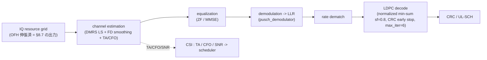

#### 9.B.1 チャネル推定

1. **標準**: DMRS シーケンス生成・マッピング（TS 38.211 §6.4.1.1）のみ標準。LS 推定・時間/周波数平均・平滑・
   補間・RSRP/EPRE/SNR 算出は実装裁量。
2. **実装**: `dmrs_pusch_estimator_impl::estimate` がポートごとに `port_channel_estimator_average_impl` を駆動。
   LS 推定 = 受信/既知パイロットの共役積（`port_channel_estimator_average_impl.cpp:490`）。TD 戦略 `average`/
   `interpolate`（`:614-676`）、FD 平滑 `filter`(raised-cosine FIR)/`mean`/`none`（`port_channel_estimator_helpers.cpp:192-233`）。
   帯域端は仮想パイロットを線形回帰で外挿（`:297-368`）。雑音分散 = 受信−再生パイロットの電力（`:763-862`）、
   SNR = `datarp / noise_var`。
3. **config**: `pusch_channel_estimator_fd_strategy`（既定 `filter`）、`_td_strategy`（既定 `average`）、
   `_cfo_compensation`（既定 `true`）（`du_low_config.h:41-52`）。
4. **定数・ヒューリスティック**: raised-cosine FIR **31 タップ・roll-off 0.2**（`port_channel_estimator_helpers.cpp:32-37`）、
   フィルタスパン ≤ 3 RB、`MAX_V_PILOTS=12`、`MAX_LAYERS=4`、雑音分散の下限 = `rsrp / 10^(MAX_SINR_DB/10)` で
   **SINR を 100 dB にクランプ**（`port_channel_estimator_average_impl.cpp:285-286`）。

   > 注意（観測した不整合）: FD 平滑戦略の選択が `upper_phy_factories.cpp:570-572` で **`pusch_channel_estimator_td_strategy`
   > キー**を読んでいる（FD キーではない）。TD キーの値域は `average`/`interpolate` のため `"none"`/`"mean"` に一致せず、
   > 結果として `--pusch_channel_estimator_fd_strategy` は FD 平滑に効かず常に既定 `filter` になると読める。バグの可能性
   > として §10 未確認に集約（firsthand 確認済み）。

#### 9.B.2 チャネル等化: ZF vs MMSE

1. **標準**: 完全実装裁量（3GPP 非規定）。
2. **実装**: factory が enum `channel_equalizer_algorithm_type{zf, mmse}`（`channel_equalizer_algorithm_type.h`）で
   `channel_equalizer_generic_impl` を生成、文字列→enum は `upper_phy_factories.cpp:563-566`（`"mmse"`→mmse、他→zf）。
   ZF は 1×N（matched filter / `‖h‖²` 正規化、`equalize_zf_1xn.h`）、2×N（2×2 閉形式擬似逆、`equalize_zf_2xn.h`）、
   M×N（Gram 行列 `H^H·H` → 逆行列 → `H_gram_inv·H^H`、`equalize_zf_mxn_simd.h`）。**MMSE は Gram 対角に雑音分散を
   加算**（`equalize_mmse_mxn_simd.h:34`）し `correction_term` で再スケール。1 層時は MMSE も ZF 1×N にフォールバック。
3. **config**: `pusch_channel_equalizer_algorithm`（既定 `"zf"`、`du_low_config.h:58`、`--pusch_channel_equalizer_algorithm`、
   許可値 `zf`/`mmse`）。
4. **定数・ヒューリスティック**: `max_nof_ports=8`、対応ポート {1,2,4,8}・層数 1–4、ZF は高速近似逆数
   `ocudu_simd_f_rcp`／MMSE・行列反転は高精度逆数 `ocudu_simd_f_precise_rcp`。雑音分散が NaN/inf/負なら出力 0・雑音 ∞
   のガード。**MMSE に固定 epsilon/floor は無い**（正則化 = 推定雑音分散そのものの対角注入）。

#### 9.B.3 LDPC デコード戦略: 最大反復・early stop

1. **標準**: LDPC 符号構造（BG1/BG2、lifting、PCM、TS 38.212）固定。復号アルゴリズム・scaling・最大反復・
   early stop は実装裁量。
2. **実装**: **layered normalized min-sum**（`ldpc_decoder_impl.cpp:101-129`）。check node で絶対値の最小・第2最小
   と符号積を取り（`ldpc_decoder_generic.cpp:28-90`）、`round(llr * scaling_factor)` でスケール（`:52-61`）。
   early stop は per-codeblock CRC（`ldpc_decoder_impl.cpp:112-119`）。driver `pusch_decoder_impl`（`:295-381`）が
   CB ごとに `decode(use_early_stop, nof_ldpc_iterations)`。
3. **config**: `pusch_decoder_max_iterations=6`（`--pusch_dec_max_iterations`）、`pusch_decoder_early_stop=true`
   （`--pusch_dec_enable_early_stop`）、`pusch_decoder_force_decoding=false`（`du_low_config.h:23-27`）。
4. **定数・ヒューリスティック ★**: **`scaling_factor = 0.8`**（`ldpc_decoder_impl.h:185`、**config override 経路なし・
   完全ハードコード**、`0 < sf < 1` を assert）。soft bit クランプ **±64**（`:192-194`）。max iter 既定 **6**。
   `early_stop_syndrome = false` 固定（`upper_phy_factories.cpp:738`）のため PUSCH は **CRC ベース early-stop のみ**。
   `INVERSE_BG1_RATE=3` / `INVERSE_BG2_RATE=5`、`MAX_BITS_CRC16=3824`。

#### 9.B.4 PRACH 検出（upper PHY 側、§8.7 と区別）

1. **標準**: preamble（ZC シーケンス・format・N_cs・restricted set、TS 38.211 §6.3.3）は標準。**検出アルゴリズムと
   検出閾値は実装裁量**（PRACH で最も裁量が大きい＝閾値 vs 誤警報のトレードオフ）。クラスは GLRT 検定に着想
   （`prach_detector_generic_impl.h:24-25`）。
2. **実装**: `detect`（`prach_detector_generic_impl.cpp:60-342`）: root ZC の共役乗算 → IDFT で PDP → modulus² →
   ポート/シンボルの**非コヒーレント結合** → cyclic shift 窓ごとに metric = signal/noise → ピーク探索 → **閾値比較**
   （`:322-323`）。
3. **config**: 直接 tunable キーは無い（閾値はテーブル固定）。format/SCS/ZCZ/ports/root はセル設定由来。
4. **定数・ヒューリスティック ★**: **閾値テーブル `all_threshold_and_margins`**
   （`prach_detector_generic_thresholds.cpp:146-1049`、約 1060 行）。key=(nof_rx_ports, SCS, format, ZCZ)、
   value=(`threshold`, `combine_symbols`, `win_margin`) ＋品質フラグ red/orange/green。例:
   `{1, 1.25kHz, format0, ZCZ0}` → `{0.147F, true, 5}`（orange）、`{2, …}` → `{0.085F, …}`（閾値はポート数で約半減）。
   **default fallback**（テーブル未掲載時、`:115-118`、`todo(david)` コメント付き）: long → `{2.0F, false, 5}`、
   short → `{0.3F, false, 12}`。検出窓**末尾 1/5 を無視**（`delay < max * 0.8`、"spurious peaks 回避"、`:320-323`）。
   `MAX_IDFT_SIZE=4096`、`nof_sequences=64`。

   > これは upper PHY が IQ から PRACH を検出する層。OFH の PRACH U-plane 受信（§8.7、別 eAxC・別 data flow）とは別。

#### 9.B.5 タイミング / 周波数オフセット推定

1. **標準**: 完全実装裁量。標準は TA コマンド粒度のみ規定。
2. **実装**: **TA** は DFT ベース（`time_alignment_estimator_dft_impl.cpp:47-94`、「generic impl」は無く DFT 実装が唯一）:
   チャネル推定を IDFT → PDP → 非コヒーレント結合 → ピーク探索（`:178-236`）→ サブサンプルは曲線フィッティング補間。
   **CFO** は DMRS シンボル間の位相回転（`port_channel_estimator_average_impl.cpp:468-525`）: 第1・第2 DMRS の LSE 内積
   → `arg()` → シンボル間時間差で正規化。補償は `polar(1, -2π·epoch·cfo)`。
3. **config**: `pusch_channel_estimator_cfo_compensation`（既定 `true`）。TA は常時動作（`max_ta` は API 引数）。
4. **定数・ヒューリスティック**: TA 最大 = **半 CP 長**（`κ=144` をハードコード、`time_alignment_estimator_dft_impl.cpp:184`）、
   サブサンプル補間 tap = `(max_ta_samples > 2) ? 5 : 3`、CFO 推定は **DMRS 2 シンボル以上**必要（不足時 `nullopt`）、
   hop 間で TA を `/= 2` / CFO を平均、CSI へは **best-SNR ポート**の TA/CFO を採用（`dmrs_pusch_estimator_impl.cpp:303-310`）。

---

## 10. 横断⑤ スケーリング（cell / UE / RU 単位とリソース割当）

本章は「**cell 数 / UE 数 / RU(sector) 数が増えたとき、何がスケール単位になるか**」を、スレッド・
executor・per-instance オブジェクトの生成カウント、CPU affinity 割当規則、config 上限の観点で確定する。
executor の**機構**は §6.1（main_pool・4 優先度）、§2.4（DU-High cell/UE/control）、§3.4（DU-Low）、
§4.4（CU-CP 単一 strand）、§5/§6.3（CU-UP per-UE strand）、§8.8（OFH ru_timing/txrx）で既出のため
再掲せず参照し、本章は「N が増えると何が何倍になり、どこで詰まるか」の合成と、未充足の穴を埋める。

### 10.1 前提: モノリシック単一プロセス

`gnb` / `cu` / `du` は **単一 OS プロセス**で動く（`apps/gnb/gnb.cpp` ほか、プロセス分割は無い）。したがって
**スケール単位は「OS プロセス」ではなく「スレッド/executor ＋ per-instance オブジェクト」**である。
「セル毎にプロセスが増える」式の理解は誤りで、cell 増で増えるのは `cell_scheduler` /
`mac_cell_processor` / `upper_phy` などのオブジェクトと、worker 数の見積り（§10.3）に応じた main_pool
スレッド数であって、**セル専用スレッドが立つわけではない**（§10.4）。

### 10.2 スケール単位 × 生成物カウント表（本章の中心）

| スケール単位 | 増える per-instance object | スレッド増の有無・方式 | 律速になりうる箇所 | 関連 config 上限 |
|---|---|---|---|---|
| **プロセス** | （増えない。単一プロセス） | — | — | — |
| **cell** | `cell_scheduler`（`scheduler_impl.cpp:30`）、`mac_cell_processor`、`upper_phy`（cell 毎）、cell strand（`du_high_executor_mapper.cpp:117-121`） | **専用スレッドは増えない**。各 cell は共有 main_pool（`rt_prio_exec`）上の **per-cell strand**。worker 数式が cell に比例増（§10.3） | main_pool の worker 数、（CA 時）`cell_group_mutex`、OFH txrx 多重度 | `MAX_CELLS_PER_DU = 32`（`gnb_constants.h:13`） |
| **UE** | scheduler `ue` / RLC bearer / PDCP・SDAP（CU-UP）等 | **増えない**。DU-High は cell 当り **1 UE strand** に集約（per_cell, `max_nof_strands=1`）、CU-UP は per-UE strand を round-robin 割当（上限 `max_nof_ue_strands`） | strand 内直列化、UE executor キュー長 | CU-CP `max_nof_ues=8192`、CU-UP `max_nof_ues=16384`、`max_nof_drbs_per_ue=8` |
| **RU / sector** | OFH `sector_impl` / data flow / `eth_frame_pool`（sector 毎） | `ru_txrx_#i` は `txrx_affinities` 個、sector は `nof_sectors_per_txrx_thread` で多重化。`ru_timing` は**共有 1 本** | txrx スレッド多重度、`ru_timing` 単一スレッド | sector 数（= OFH cells）、`MAX_CELLS_PER_DU=32` |

要点: **N が増えてもスレッド本数は基本増えない**（worker pool / strand の密度が上がる）。スレッドが増えるのは
worker 数式（cell・アンテナに比例、§10.3）と OFH の `ru_txrx`（`txrx_affinities` 指定数）のみ。

### 10.3 worker 数の決定式と spare CPU

main_pool の worker 数は `get_default_nof_workers`（`apps/services/worker_manager/worker_manager.cpp:267-298`）が
決める。実コードは以下（§6.1 で触れた近似式の実体）:

```
avail_cpus = main_pool_affinity_cfg.mask.count();            // :270
if (avail_cpus == 0) avail_cpus = host_nof_available_cpus(); // :271-272  未指定なら全ホスト CPU
spare_cpus = min(avail_cpus, 3);                             // :276  kernel/RU timing 用に最大 3 確保
if (nof_main_pool_threads) nof_workers = その値;            // :279-280  明示指定の override
else {
  for each du_low cell: nof_workers += dl_ant[i] + ul_ant[i]; // :284-288  ★アンテナ和（per-cell）
  if (du_hi)            nof_workers += nof_cells * 1;          // :289-291  ★cell 数
  nof_workers += 2;                                            // :292
}
return max(min(nof_workers, avail_cpus - spare_cpus), 1);   // :297  [1, avail-spare] にクランプ
```

> §6.1 が引いた近似式 `nof_cells*(dl_ant+ul_ant+1)+2` は、実は **コード内コメント**（`:282-283`）の概算で
> ある。実コードは「du_low の **per-cell アンテナ和** Σ(dl_ant[i]+ul_ant[i]) ＋ du_hi の **nof_cells** ＋ 2」。
> 全セル同一アンテナ数なら両式は一致するが、**セルごとにアンテナ数が異なると一致しない**（実体は和形）。
> worker 数を駆動するのは du_low のアンテナ数と du_hi の cell 数、上限は `avail_cpus - spare_cpus`。

main_pool 自体は 4 優先度 executor（`rt_prio_exec` / `high_prio_exec` / `medium_prio_exec` /
`low_prio_exec`、§6.1）。lock-free キューの事前確保プロデューサ数は `get_nof_prealloc_producers`
（`worker_manager.cpp:301-321`）= `nof_workers + 2`（epoll/main）＋ RU timing 1 ＋ RU cell 毎 txrx ＋ …。

### 10.4 cell スケール: executor 方式（strand 固定）とセル並列性

#### (a) executor 方式の選択 — dedicated は存在するが production では未配線

`create_du_high_executor_mapper`（`du_high_executor_mapper.cpp:458`）は `config.cell_executors`（`std::variant`）が
どちらの alternative を持つかで方式を選ぶ:

- `dedicated_cell_worker_list` を持てば `dedicated_cell_worker_executor_mapper`（cell 毎に専用ワーカ＝**真の
  per-cell スレッド**、`:52-99`、選択 `:168-170`）。
- `strand_based_worker_pool` を持てば `strand_cell_worker_executor_mapper`（共有 pool 上の **per-cell strand**、
  `:104-162`、選択 `:173-174`）。

**実アプリの `worker_manager` は無条件に `strand_based_worker_pool` を設定**し、`pool_executors = {rt_hi_prio_exec}`
（単一プール）を渡す（`worker_manager.cpp:246-250`）。**dedicated を選ぶ config 分岐は存在しない**。ツリー全体で
`dedicated_cell_worker_list` を構築するのは **test double のみ**（`tests/test_doubles/du/test_du_high_worker_manager.cpp:76-78`、
`cell_executors.emplace<dedicated_cell_worker_list>()`）。

> **結論（断定）**: gnb / du / cu アプリでは cell executor は **strand 方式に固定**。dedicated 方式は
> ライブラリに実在し `du_high_executor_config` に直接 `dedicated_cell_worker_list` を入れれば到達するが、
> それを行うのはテストのみで、**production には dedicated に切り替える config が無い**（前述の「既定は strand、
> ただし切替可」ではなく「**切替不可・strand 固定**」が正確）。

ただし **strand 固定 ≠ セルが直列化される、ではない**。`strand_cell_worker_executor_mapper` は cell 毎に
別 strand を生成し（`du_high_executor_mapper.cpp:117-121`、`cfg.pool_executors[i % size]` に割当）、各 strand は
共有 `rt_prio_exec`（multi-worker）へタスクを dispatch する。よって**異なるセルの strand は main_pool の worker 数だけ
並列に走る**。直列化されるのは (i) **同一セルの strand 内**（`slot_ind`/`mac_cell` は `execs[0]`、`rlc_lower` は
`execs[1]` の 2 優先度レーン、`:122-132`、strict priority は §6.3）と、(ii) 後述の **CA 時 `cell_group_mutex`**
（scheduler 層）のみ。

#### (b) MAC scheduler のセル並列性 — CA の有無で非対称

`scheduler_impl` は cell ごとに `cell_scheduler` を保持し（`cells`、`scheduler_impl.cpp:30`）、cell-group ごとに
`ue_scheduler_impl` を 1 つ生成して同一 group の全セルで共有させる（`groups`、`:24-31`）。`slot_indication(sl_tx,
cell_index)`（`:215-231`）は当該セルの `cell.run_slot()` のみを実行し、**ロックを取らない**。`cell_scheduler::run_slot`
（`cell_scheduler.cpp:54-110`）は cell-local の sub-scheduler（ssb/csi/si/prach/ra/pg）を回したのち
`ue_sched->run_slot()`（`:96`）で共有 `ue_scheduler_impl` に入る。

共有点である `cell_group_mutex` の獲得タイミングと粒度（実読、`ue_scheduler_impl.{h,cpp}`）:

- **粒度**: `cell_group_mutex` は `ue_scheduler_impl` インスタンスごとに 1 つ（`ue_scheduler_impl.h:117`）。
  `ue_scheduler_impl` は cell-group ごとに 1 つなので、**mutex の粒度は「cell-group 単位」**（全セル共通の単一ロック
  ではない）。1 group は最大 `MAX_NOF_DU_CELLS = 32` セル。
- **獲得条件**: `run_slot_impl`（`ue_scheduler_impl.cpp:114-125`）で
  `std::unique_lock lock(cell_group_mutex, defer_lock); if (cells.size() > 1) lock.lock();`。つまり
  **その group が複数セル（= Carrier Aggregation）のときだけロック**する（`:116-119`、コメント "Only mutex if the
  cell group has more than one cell"）。
- **CA 時の動作**: 同一 slot を group の最初のセルが処理すると `last_sl_ind == sl_tx` で残りのセルは即 return
  （`:121-123`）。最初の run_slot が `for (auto& group_cell : cells)` で **group の全セルをまとめてスケジュール**する
  （`:127`、joint carrier scheduling）。

**スケール特性（重要な但し書き）**:

- **非 CA（1 セル / group の典型構成）**: `cells.size() == 1` でロックを取らない。異なる group のセルは共有状態なしで
  **完全並列**（main_pool の worker 数が並列度の上限）。→ セル数を増やすとほぼリニアに並列スケール。
- **CA（1 UE が複数セルを跨ぐ = 同一 group に複数セル）**: その group のセル群は `cell_group_mutex` で**直列化**され、
  1 セルの slot_indication が group 全体を 1 パスで処理する。→ **同一 CA group 内のセルは並列化されず**、group を
  増やしてもグループ内セル数の分は逐次。group 間は並列。
- 「セル数を増やせばリニアにスケールする」という素朴な期待は **非 CA でのみ成立**し、CA 構成では group 単位で頭打ちに
  なる、という非対称がこの 1 行（`cells.size() > 1`）に集約されている。

### 10.5 UE スケール: UE→strand 写像と strand 密度

- **DU-High**: `worker_manager` は `ue_executors.policy = per_cell`、`max_nof_strands = 1` を設定
  （`worker_manager.cpp:251-252`）。mapper は per_cell のとき `pcell_ue_executor_mapper` を使う
  （`du_high_executor_mapper.cpp:364`）。→ **cell 当り UE strand は 1 本**（`ctrl`/`ul`/`dl` の 3 優先度）で、その
  cell の全 UE が共有する。UE が増えてもスレッドも strand も増えず、**1 本の strand に積まれる UE タスクの密度が上がる**
  （`pool_executor = non_rt_medium_prio_exec`）。
- **CU-UP**: per-UE strand を `max_nof_ue_strands`（既定 16、§5.4）本だけ作り、UE を **round-robin** で strand に割り当てる
  （`cu_up_executor_mapper.cpp` の round-robin pool、§5.4）。UE 増 → strand 当り UE 数が増える（strand 本数は 16 で頭打ち）。
  crypto のみ共有 `medium_prio_executor`（唯一の並列パス）。
- → DU-High / CU-UP とも **UE 増でスレッドは増えず**、strand/executor の密度（キュー長・strand 内直列化）が律速。

### 10.6 RU / sector スケール

- `ru_timing` は **共有 1 本**（`worker_manager.cpp:446-464`、RT `max()-0`）。全 sector の OTA シンボル境界を 1 スレッドが
  刻むため、sector を増やしても増えない＝潜在的な単一点（§8.2/§8.8）。
- `ru_txrx_#i` は `config.txrx_affinities` の指定数だけ生成（`worker_manager.cpp:470-486`、RT `max()-1`）。sector→txrx の
  写像は `nof_sectors_per_txrx_thread = ceil(nof_sectors / nof_txrx_threads)`（`ru_ofh_executor_mapper.cpp:67-78`）で、
  sector i は `txrx_executors[i / nof_sectors_per_txrx_thread]` に割り当てられる（**txrx スレッドが足りなければ複数 sector を
  多重化**）。
- `downlink` / `uplink` executor は共有 `rt_hi_prio_exec`（uplink は strand、§8.8）。
- → sector 増の律速は **txrx スレッド多重度**と **ru_timing 単一スレッド**。

### 10.7 CPU affinity 割当規則

affinity の型は **2 カテゴリのみ**: `sched_affinity_mask_types { ru, main, last }`
（`os_sched_affinity_manager.h:12`、`last` は番兵）。pin ポリシーは `round_robin`（mask 内 CPU を 1 個ずつ RR で pin）/
`mask`（全スレッドが同一 mask を共有）（`:15-21`）。

- **`main`** → main_pool worker（`worker_manager.cpp:347`）、非 RT 時の `phy_worker`（`:404`）。
- **`ru`** → `ru_timing` / `ru_txrx`（`:454,480`）、`radio` / lower PHY（`:546`）など RU・PHY 系。per-cell の
  `affinity_mng` が保持する。
- **未指定時の既定**: `main_pool_cpu_cfg = {main, 空 mask, policy=mask}`（`worker_manager_appconfig.h:14`）。空 mask は
  `calculate_mask()` が空を返す（`os_sched_affinity_manager.h:100-105,128`）＝**pin なし（OS が全ホスト CPU に配置）**。
  worker 数算出でも空 mask 時は `avail_cpus = 全ホスト CPU`（`worker_manager.cpp:270-272`）。`ru` も未指定なら `ru_timing` は
  **先頭セルの `ru` mask に fallback**（`:452-454`）。
- **重なり / 分離**: 既定は `main`・`ru` とも空 mask＝**全 CPU で overlap**（明示的なコア分離なし）。分離するには
  isolated CPU を `main` / `ru` の mask に config で与える（CLI は `cli11_cpu_affinities_parser_helper.*`、cell の
  `ru_cpus` / `ru_pinning`、OFH の `timing_cpu` / `txrx_cpus`、§8.9）。

> ★制約（有用な発見）: **PHY DL / UL を個別にコア pin する mask 型は存在しない**（srsRAN にあった l1_dl/l1_ul 等の
> 細分は無い）。粒度は `ru` と `main` の **2 つだけ**で、cell / PHY 系は一律 `ru`（RU 系スレッド）または `main`
> （main_pool）に乗る。将来コア割当をチューニングする際、「l1 を細かく pin したくても粒度は ru/main の 2 つ」という
> 制約として効く。

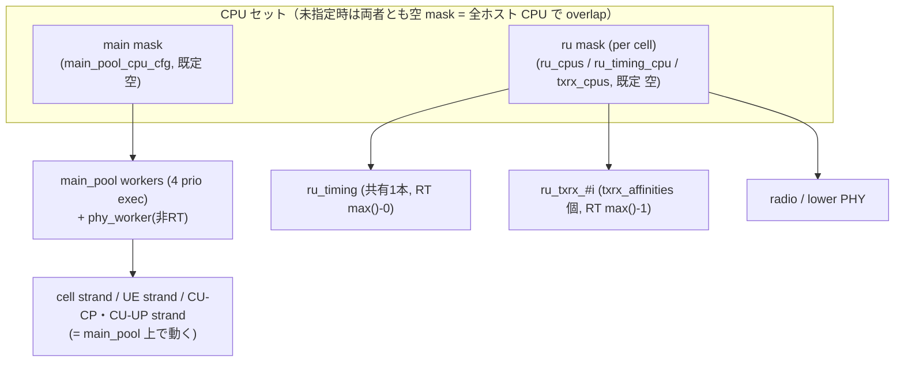

### 10.8 config 上限一覧

| スコープ | キー / 定数 | 値 | 箇所 |
|---|---|---|---|
| DU | `MAX_CELLS_PER_DU` | 32 | `gnb_constants.h:13` |
| DU | `MAX_NOF_DU_CELLS` / `MAX_DU_CELL_GROUPS` | 32 / 32 | `du_cell_index.h:18` / `du_types.h:37` |
| CU-CP | `max_nof_dus` | 6 | `cu_cp_unit_config.h`（§4.6） |
| CU-CP | `max_nof_cu_ups` | 6 | 〃 |
| CU-CP | `max_nof_ues` | 8192 | 〃 |
| CU-CP | `max_nof_drbs_per_ue` | 8 | 〃 |
| CU-UP | `max_nof_ues` | 16384 | `cu_up_unit_config.h`（§5.6） |
| worker | `max_nof_ue_strands`（CU-UP） | 16 | `worker_manager_config.h`（§5.4） |
| worker | `nof_main_pool_threads` | optional（未指定なら §10.3 の式） | `worker_manager_config.h` |

### 10.9 「N を増やしたとき」のボトルネック

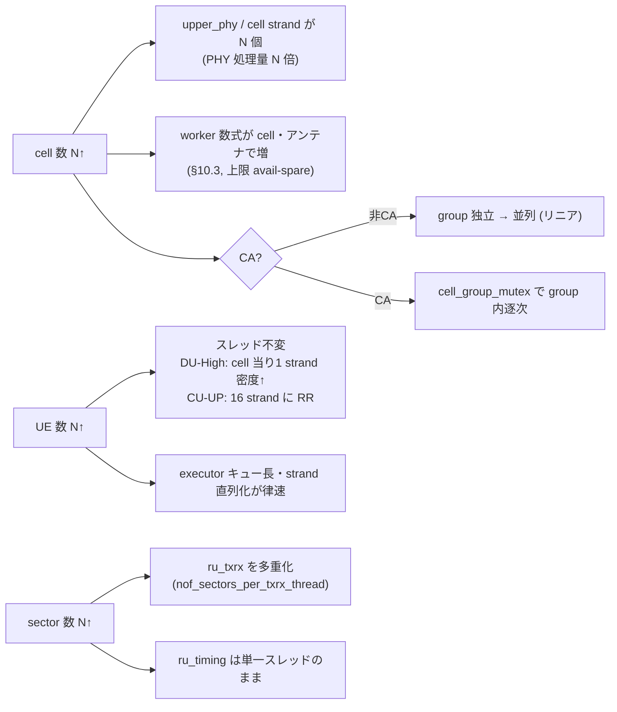

要約: cell 増 → PHY/cell strand と main_pool worker（CA なら `cell_group_mutex`）、UE 増 → strand 密度と
executor キュー、sector 増 → txrx 多重度と単一 `ru_timing`、がそれぞれの律速。スレッド本数が増えるのは
worker 数式（cell・アンテナ）と `ru_txrx`（`txrx_affinities`）のみで、それ以外は密度で吸収される。

---

## 11. 横断⑥ ライフサイクルと障害時挙動

本章は「定常状態」ではなく **初期化・停止・異常系** に絞り、(1) 起動順序、(2) graceful shutdown、
(3) エラー伝播設計、(4) assert/abort 方針、(5) ランタイム障害処理を横断的に合成する。executor 機構は
§6、F1/E1/NG の procedure・notifier は §7、OFH の `err_notifier`・`closed_rx_window_handler`・
`iq_compression_death_impl` は §8、worker pool 構成は §10 を参照し、再掲しない。対象は monolithic
`gnb` アプリを主とし、分離 `cu` / `du` アプリとの差分を併記する。

### 11.1 起動順序

`gnb` アプリは独立した `run()` を持たず、`main()` 本体（`apps/gnb/gnb.cpp:207-647`）で順に組み立てる。

**(a) 前処理**: `set_error_handler(app_error_report_handler)`（`gnb.cpp:210`、§11.5）→
`register_interrupt_signal_handler` / `register_cleanup_signal_handler`（`:216-217`）→ `enable_backtrace`
（`:220`）→ CLI parse・validation・log 初期化（`:269,291`）→ buffer pool（`:336`）→ `timer_manager`（`:357`）。

**(b) 生成順（コンストラクタのみ。まだ start しない）**:
`worker_manager`（`:380`、**コンストラクタで worker pool スレッドを spawn**）→ `io_broker`（epoll、`:385`）→
DU-high clock controller / timer source（`:388`）→ PCAP（`:396-401`）→ XN-C SCTP gateway（`:406`）→
**`f1c_local_connector`（`:424`）/ `e1_local_connector`（`:426`）**（後述、in-process）→ GTP-U TEID allocator
（`:443,449`）→ E2 client gateway（`:466-483`）→ O-CU-CP（`:499`）→ O-CU-UP（`:519`）→ O-DU（`:539`）→
metrics manager（`:546`）。

**(c) start（"power-on"）順（`gnb.cpp:575-609`）**:
1. E1AP を CU-CP に attach（`:576`）、XN-C を attach（`:579`）
2. **O-CU-CP start**（`:585`）。CU-CP は `connect_to_amf`（`cu_cp_impl.cpp:163`）→ `amf_connection_setup_routine`
   → `ng_setup_procedure`（`lib/ngap/procedures/ng_setup_procedure.cpp:33`）を **イベント駆動（async）** で実行。
3. **NG Setup ゲート**: `amfs_are_connected()` を **一度だけ同期チェック**し、未接続なら `report_error`（quick_exit）
   （`gnb.cpp:589-590`）。ループ待ちはせず、CU-CP start 完了時点の接続状態に依存。
4. F1-C を CU-CP に attach（`:600`）→ **O-CU-UP start**（`:603`）→ **O-DU start（`:606`、ブロックする）** →
   metrics start（`:609`）。
5. main wait loop: `while (is_app_running) sleep_for(250ms)`（`:619-621`、`is_app_running` は静的 atomic）。

**(d) O-DU start の内部順と F1 Setup ゲート**:
`flexible_o_du_impl::start`（DU→RU の順、`flexible_o_du_impl.cpp:24-28`）→ `o_du_impl::start`（DU-high `:59` →
DU-low `:60` は stateless で no-op）→ `du_high_impl::start` → `du_manager_controller_impl::start`。ここが
**ブロック点**で、`du_setup_procedure` をスケジュールして `ev.wait()` で待つ（`du_manager_controller_impl.cpp:31-50`）。
`du_setup_procedure` は F1-C TNL 確立 → `configure_du_cells()` → `start_f1_setup_request()`（F1 Setup Request 送出）→
**F1 Setup Response 受領まで待ち** → CU-CP が示した `cells_to_activate` に従い **cell を activate**。RU(OFH) は
`ru_ofh_controller_impl::start`（`:10-16`）で **timing controller を最初に**（`realtime_timing_worker::start`、§8.2）
→ その後 sector の Tx/Rx。

> 要点: **NG Setup はイベント駆動で接続を待ち（一度だけ同期確認）、F1 Setup ＋ cell activation は O-DU start
> がブロックして完了を待つ**。つまり `gnb main` は cells が activate されるまで wait loop に進まない。

**(e) cu/du アプリの差分**: `cu_cp` は in-process でなく **実 SCTP の F1-C/E1 server**（`cu_cp.cpp:327,338`）、
`cu_up` は E1 SCTP client（`cu_up.cpp:384`）、`du` は F1-C client（`du.cpp:306`）。signal handling・wait loop・
worker_manager は 4 アプリ共通。

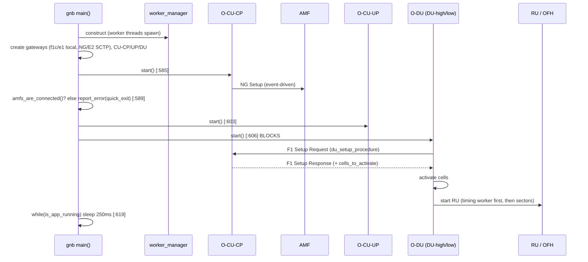

### 11.2 graceful shutdown

**(a) シグナル**: `interrupt_signal_handler` が `is_app_running=false`（`gnb.cpp:88-91`）、`cleanup_signal_handler`
が pcap flush 等（`:96-101`）。低レベルは `lib/support/signal_handling.cpp`: SIGINT/TERM/HUP/ALRM を捕捉
（`:49-57`）、初回割り込みでユーザハンドラ実行＋ **`::alarm(TERMINATION_TIMEOUT_S)` を arm**（`:39-44`）、SIGALRM
で "Forcing exit" → **`std::raise(SIGKILL)`**（`:29-34`）。`TERMINATION_TIMEOUT_S` 既定 **5 秒**（`:14-19`、
`TERM_TIMEOUT_S` / CMake `EXIT_TIMEOUT` で上書き、`CMakeLists.txt:109,293-296`）。これが **hang を強制 kill する
watchdog**。

**(b) stop chain（`gnb.cpp:625-646`、start の逆順）**: metrics（`:625`）→ remote（`:629`）→ **O-DU**（`:633`）→
**O-CU-UP**（`:636`）→ **O-CU-CP**（`:639`）→ `f1c_gw`（`:642`）→ `e1_gw`（`:643`）→ `return` 後に RAII で
逆生成順に破棄（最後に **`worker_manager` デストラクタ → `stop()`**、`worker_manager.cpp:155-158`）。O-DU stop は
RU→DU の順（`flexible_o_du_impl.cpp:30-34`、`o_du_impl::stop` は MAC-FAPI→DU-low→DU-high、`o_du_impl.cpp:63-70`）。

**(c) worker pool の drain — 未処理タスクは drop**: `worker_manager::stop`（`:160-168`）→ `exec_mng.stop()` →
`task_worker_pool::stop` が各 worker に `queue.request_stop(); w.join();`（`task_worker_pool.cpp:170-182`）。
worker ループは `if (not consumer.pop_blocking(job)) break;`（`:22-28`）で、`request_stop` 後は queue に要素が
残っていても pop が `failed` を返す（`blocking_queue.h:366,380`）→ **残存タスクは drain されず破棄される**。
（`wait_pending_tasks()` は存在するが shutdown 経路では呼ばれない、`task_worker_pool.cpp:184-232`。）

**(d) RT スレッド停止**: `realtime_timing_worker::stop`（`:81-90`）が stop token を立て notifier を clear。
`timing_loop` は毎反復で stop を確認して抜ける（`:92-97`）。スレッド join 自体は後段の executor pool stop で行う。

**(e) hang 候補**: ①SIGALRM→SIGKILL watchdog（5 秒、`signal_handling.cpp:30-34`）が最終安全網。②各 AP の
リンク断 "Keep trying" defer ループ（`ngap_connection_handler.cpp:126-130`、`f1ap_du_connection_handler.cpp:134-138`、
`e1ap_cu_up_connection_handler.cpp:80-84`、`e2_connection_handler.cpp:122-126`）。③`du_manager_controller_impl::stop`
の `ev.wait()`（`:62-70`）。④worker `w.join()`（`task_worker_pool.cpp:177`）。⑤`execute_on` の spin
（`execute_on.h:53-56`）。

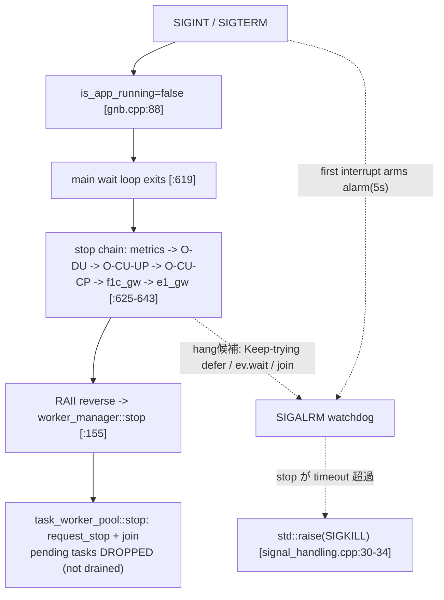

### 11.3 エラー伝播設計

エラー/失敗の上げ方は大きく **3 系統**ある。

**Style 1 — `error_notifier`（リアルタイム層、非同期）**: スロットに間に合わない "late" を datapath から通知する
抽象 notifier 群。
- `upper_phy_error_notifier`（`upper_phy_error_notifier.h:12`）: `on_late_downlink_message` / `on_late_uplink_message`
  / `on_late_prach_message`。
- `lower_phy_error_notifier`（`lower_phy_error_notifier.h:14`）: `on_late_resource_grid` / `on_prach_request_late`
  / `on_prach_request_overflow` / `on_puxch_request_late`。
- `ru_error_notifier`（`ru_error_notifier.h:20`）: `on_late_{downlink,uplink,prach}_message(ru_error_context)`。
  OFH 実装 `ru_ofh_error_handler_impl`、SDR は `ru_lower_phy_error_adapter`。
- `ofh::error_notifier`（`ofh_error_notifier.h:21`、§8）: OFH 送信窓ミス時（`ofh_downlink_handler_impl.cpp:94` 等）。

連鎖は **lower PHY / OFH → `ru_error_notifier` → `upper_phy_error_handler` → `upper_phy_error_notifier`（FAPI P7）
→ FAPI ERROR.indication → MAC**。MAC 側 `fapi_to_mac_error_indication_fastpath_translator`（`:74-86`）が
`mac_cell_slot_handler::error_event`（`pdsch_discarded`/`pdcch_discarded`/`pusch_and_pucch_discarded`）に変換し、
`mac_cell_processor::handle_error_indication`（`mac_cell_processor.cpp:194-198`）→ scheduler の `error_outcome`
（`ocudu_scheduler_adapter.cpp:298-307`）で **当該スロットの grant を破棄**する。
→ 各層では observe＋log＋critical trace だが、最終的に MAC/scheduler に届いて **スロット単位の grant 無効化という
回復**を起こす（コネクション単位の回復ではない）。late UL は `upper_phy_error_handler_impl.cpp:36` で即
`discard_slot()` も行う。

**Style 2 — AP の failure / error indication（F1AP / NGAP / E1AP）**: 手続きが成功/不成功 outcome を出すか、
ErrorIndication をピアへ送る。F1AP `generate_error_indication`（`f1ap_common_messages.cpp:12-39`）/
`f1ap_du_impl::send_error_indication`（`f1ap_du_impl.cpp:498-505`）、NGAP `send_error_indication`
（`ngap_error_indication_helper.h:30-65`）、E1AP bearer context setup の failure outcome
（`bearer_context_setup_procedure.cpp:73-85`）。→ **ピア/呼び出し元へ signaling として伝播**（ローカルでは
自己回復せず outcome を返す/送る）。

**Style 3 — 同期戻り値（`expected<>` / `bool` / `optional`）＋ log**: `expected<T,E>` / `error_type<E>`
（`include/ocudu/adt/expected.h:23,33`）、`byte_buffer::create` の `make_unexpected`（`byte_buffer.cpp:196,206`）、
config validator の `validator_result`（`serving_cell_config_validator.cpp:26,111`）、factory の `nullptr` 返し
（`du_processor_factory.h:17` 等）。最下層は `ocudulog` の `.error()/.warning()`（`logger.h:135-141`）。
→ **即時に呼び出し元へ伝播**（失敗箇所では回復しない）。

```mermaid
flowchart TD
  subgraph S1["Style 1: error_notifier (realtime)"]
    LP["lower PHY / OFH late"] --> RUE["ru_error_notifier"]
    RUE --> UPE["upper_phy_error_handler"]
    UPE --> FAPI["upper_phy_error_notifier -> FAPI ERROR.indication"]
    FAPI --> MACSCHED["MAC handle_error_indication -> scheduler: slot grant 破棄"]
  end
  subgraph S2["Style 2: AP failure / error indication"]
    APF["F1AP/NGAP/E1AP 手続き失敗"] --> PEER["ErrorIndication / unsuccessful outcome -> peer・caller"]
  end
  subgraph S3["Style 3: 戻り値 + log"]
    RET["expected / nullptr / bool / nullopt"] --> CALLER["呼び出し元が判断 (+ ocudulog .error/.warning)"]
  end
```

### 11.4 assert / abort 方針（fatal/abort 棚卸し）★

**(a) 終了マクロの意味（`include/ocudu/support/error_handling.h` / `ocudu_assert.h`）**:

| マクロ | 動作 | release で有効か | 箇所 |
|---|---|---|---|
| `report_fatal_error` / `_if_not` | `ocudu_terminate` → **`std::abort()`** | **常時** | `error_handling.h:41,68-75` |
| `report_error` / `_if_not` | **`std::quick_exit(1)`**（graceful 寄り） | **常時** | `error_handling.h:49-61` |
| `ocudu_assert` | `std::abort()` | **`ASSERTS_ENABLED` 定義時のみ** | `ocudu_assert.h:78-79` |
| `ocudu_sanity_check` | `std::abort()` | **`PARANOID_ASSERTS_ENABLED` 時のみ** | `ocudu_assert.h:82-83` |

**(b) debug-only が release で no-op である根拠**: `ocudu_assert` は `OCUDU_ALWAYS_ASSERT_IFDEF__(ASSERTS_ENABLED, …)`
= `(void)((not OCUDU_IS_DEFINED(ASSERTS_ENABLED)) || (…))`（`ocudu_assert.h:66-79`）。`OCUDU_IS_DEFINED(x)` は
`#x[0]` を見るマクロトリック（`compiler.h:19-20`）で、`ASSERTS_ENABLED` が未定義なら false → 短絡して
**条件式すら評価されない**（完全に no-op）。`ASSERTS_ENABLED` は `if(NOT ASSERT_LEVEL_DERIVED STREQUAL "NONE")` の
ときだけ `-D` 定義（`CMakeLists.txt:284-290`）。`ASSERT_LEVEL=AUTO`（既定）の派生は **Debug→PARANOID /
RelWithDebInfo→NORMAL / それ以外（Release 等）→NONE**（`CMakeLists.txt:96-106`）。
→ **Release ビルドでは `ocudu_assert` / `ocudu_sanity_check` は完全にコンパイルアウト**。一方
`report_fatal_error` / `report_error` は **ビルド種別に関係なく常に有効**。

**(c) 出現数（全件 grep、数え方を明記）**: 下記コマンドを `/home/user/ocudu` で実行（4 パターンは相互排他＝
`report_fatal_error(` は `_if_not(` を含まない）。lib + apps 合計:

```
rg -o 'report_fatal_error\('        lib/ apps/ | wc -l   # 176
rg -o 'report_fatal_error_if_not\(' lib/ apps/ | wc -l   # 251
rg -o 'report_error\('              lib/ apps/ | wc -l   # 160
rg -o 'report_error_if_not\('       lib/ apps/ | wc -l   #  97
```

| 系統 | 出現数（lib+apps） | 終了方法 |
|---|---|---|
| `report_fatal_error` 系（`(` ＋ `_if_not(`） | **427**（176 + 251） | `std::abort()` |
| `report_error` 系（`(` ＋ `_if_not(`） | **257**（160 + 97） | `std::quick_exit(1)` |
| 計（release で生き残る終了点） | **684** | — |
| `ocudu_assert(`（debug 限定・参考） | 2543 | abort（release で消滅） |
| `ocudu_sanity_check(`（debug 限定・参考） | 172 | abort（release で消滅） |

主な分布（`report_fatal_error_if_not`）: `lib/phy` 166 が突出（多くは factory/startup、一部 baseband runtime）。
`report_error` は `apps/units/*`（config 翻訳）に集中（startup）。

**(d) release-active な終了点のカテゴリ（運用中に効きうるか＝runtime / startup の別）**:

| カテゴリ | 例（path:line） | runtime / startup |
|---|---|---|
| OFH IQ 圧縮 未対応 | `iq_compression_death_impl.cpp:14,21`（`report_error`→quick_exit）、`packing_utils_avx512.h:231`（`report_fatal_error`→abort） | **runtime（データプレーン）** |
| scheduler grant 割当 | `ue_cell_grid_allocator.cpp:376`「Unsupported RNTI type」、`search_space_helper.h`、`grant_params_selector.cpp:91` | **runtime（毎スロット）** |
| MAC DL PDU 組立 | `dl_sch_pdu_assembler.cpp:194,459` | **runtime** |
| ASN.1 PDU 種別分類 | `ngap_asn1_utils.cpp:48`、`f1ap_asn1_utils.h:52`、`e1ap_asn1_utils.h:47` | **runtime（制御プレーン）** |
| lower PHY baseband | `downlink_processor_baseband_impl.cpp:170`、`lower_phy_baseband_processor.cpp:158` | **runtime** |
| executor/worker 生成失敗 | `worker_manager.cpp:187,203,351,461,482`「Failed to instantiate … execution context」 | startup |
| config 検証 | `apps/units/*config*`（`report_error`→quick_exit）、PHY factory pool 検証（`upper_phy_factories.cpp:444,447`） | startup |
| HW/DPDK 未対応・init 失敗 | `hw_accelerator_factories.cpp:45`、`dpdk_ethernet_receiver.cpp:53`（`report_error`） | startup |
| memory/pool 確保 | `byte_buffer.cpp:31-39`（startup）、baseband buffer 枯渇（runtime） | mixed |

> Terry さんの停止デバッグ向け: **運用中（running gNB）に abort/quick_exit しうる**のは主に scheduler grant 割当・
> MAC PDU 組立・ASN.1 種別分類・lower PHY baseband・OFH live 圧縮。一方 `apps/units/*` の `report_error` 群や
> worker 生成失敗は **起動時のみ**。

**(e) error handler hook**: `set_error_handler`（`error_handling.h:20`）。各アプリは `app_error_report_handler`
（**緊急ログ flush のみ**、backtrace は出さない）を登録（`gnb.cpp:104,210`、cu/du/cu_cp/cu_up/du_low も同型）。
abort/quick_exit 直前に `error_report_handler.exchange(nullptr)` で **一度だけ**呼ばれる。

### 11.5 ランタイム障害処理

実行中の障害は、**リンク断（reconnect か peer 削除か）／UE 単位の解放・再確立／reset・removal／cell 停止再活性**
に大別される。**いずれの経路もプロセス終了（exit/abort）はしない**（後述）。

**(a) リンク断（SCTP）と断後アクション**:

| リンク | 検出 → 断後アクション | 箇所 |
|---|---|---|
| **NG-C (AMF)** | `handle_connection_loss` → NGAP イベント drain → `on_n2_disconnection` → `amf_connection_loss_routine`: ①新規 UE を当該 PLMN でブロック ②`cell_deactivation_routine` で **当該セルの全 UE を release** ③`reconnect_to_amf`（`amf_reconnection_retry_time` で再接続） | `ngap_connection_handler.cpp:119-149`、`amf_connection_loss_routine.cpp:31-52`、`cell_deactivation_routine.cpp:39-44` |
| **E1（CU-CP 側、CU-UP 切断）** | `handle_e1_gw_connection_closed` → `remove_cu_up`（`get_e1ap_handler().stop()` で当該 CU-UP の UE/transaction を解放）→ processor 削除。**再接続せず**新 CU-UP を待つ | `cu_up_connection_manager.cpp:165-191`、`cu_up_processor_repository.cpp:59-82` |
| **E1（CU-UP 側、CU-CP 切断）** | `on_connection_loss` → `cu_up_e1_connection_loss_routine`: **E1 上の全 UE を remove** ＋ **再接続ループ（1000ms retry）** | `e1ap_cu_up_connection_handler.cpp:73-102`、`cu_up_e1_connection_loss_routine.cpp:32-49` |
| **F1（CU-CP 側、DU 切断）** | `handle_f1c_gw_connection_closed` → `remove_du`（`get_f1ap_handler().stop()` で当該 DU の UE を解放）→ processor 削除。**再接続せず** | `du_connection_manager.cpp:167-193`、`du_processor_repository.cpp:58-81` |
| **F1（DU 側、CU-CP 切断）** | `handle_f1c_connection_loss` → `f1c_disconnection_handling_procedure`: **全 active cell を停止**（`ue_removal_mode::no_f1_triggers`＝F1 メッセージなしでローカル UE 削除）＋ **`du_setup_procedure` で再接続** | `f1ap_du_connection_handler.cpp:141-160`、`f1c_disconnection_handling_procedure.cpp:19-45` |

> monolithic `gnb` では **F1-C/E1 は in-process の local connector**（`f1c_local_connector_impl`、
> `f1c_local_connector_factory.cpp:50-91`：`handle_du_connection_request` が CU-CP↔DU の notifier を直結し、
> `get_listen_port()→nullopt`・`stop()` 空＝SCTP なし。E1 も同型 `e1_local_connector_factory.cpp:48-72`）。
> SCTP 版 connector は「testing purposes only」（`:95`）。よって **gnb では F1/E1 のリンク断は起こらず、外部
> SCTP 断は NG-C(AMF) と E2(RIC) のみ**。分離 `cu`/`du` では F1/E1 が実 SCTP となり上表の F1/E1 経路が効く。

**(b) UE 単位の解放・再確立**:
- `ue_context_release_routine`（`:28-96`）: **E1AP bearer context release → F1AP UE context release → UE 削除**
  （RRC/NGAP は `handle_ue_removal_request` で teardown）。
- `reestablishment_context_modification_routine`（`:38-162`）: RRC 再確立に伴う bearer/UE-ctxt 再構成。
  **RRC Reconfiguration 失敗時は cause `release_due_to_ngran_generated_reason` で AMF へ release を要求**（`:143-149`）。
- `ue_amf_context_release_request_routine`（`:23-42`）: NGAP UE Context Release Request を AMF へ。送れない場合は
  ローカル release に fallback。
- inactivity: CU-UP からの **E1AP Bearer Context Inactivity Notification**（`e1ap_cu_cp_impl.cpp:299-377`）→
  `cu_cp_impl.cpp:265-347`。RRC-Inactive 条件を満たせば `ue_suspend_routine`（suspend、UE 保持）、そうでなければ
  `request_ue_release(user_inactivity)`（release）。

**(c) reset / removal と cell 停止・再活性**:
- F1 Reset 受信（DU）: 全 or 部分の **UE context を削除** ＋ Reset Ack（`f1ap_du_reset_procedure.cpp:42-68`）。
- NG Reset: NG RESET 送出のみで **ack 処理は TODO/log のみ**（`ng_reset_procedure.cpp:24-86`、`:42`）。それ自体は
  UE を解放せず signaling に留まる。
- cell 停止/再活性: `cell_scheduler::stop/start`（§10、`cell_scheduler.cpp:146-173,135-144`）、
  `du_cell_stop_procedure`（UE 削除モード 3 種: `trigger_f1_ue_release_request`＝F1 UE Context Release Request
  で 500ms grace 後強制、`trigger_f1_reset`＝F1 Reset cause `cell_removal`、`no_f1_triggers`＝F1 なしローカル削除）。

**(d) watchdog / health 監視**: **アプリ層の watchdog / health / liveness 監視は実装されていない**
（`watchdog`/`health_check`/`heartbeat`/`liveness` を全 grep してアプリ層ヒット無し）。存在する "heartbeat" は
**SCTP トランスポートの heartbeat のみ**（`sctp_socket.cpp:139,165`、config `sctp_appconfig.h:21` の
heartbeat interval）。プロセス健全性の能動監視は、§11.2(e) の **SIGALRM→SIGKILL 強制終了 watchdog（停止時のみ）**
を除いて無い。

> 横断的事実: 追跡したランタイム障害経路はいずれも **プロセスを exit/abort しない**。NG-C・E1(CU-UP 側)・
> F1(DU 側) は **再接続**、E1/F1 の CU-CP 側は **peer processor を削除**（その UE を解放）して新規接続を待つ。
> NG Reset と DU 起動 reset は signaling のみ（ack 処理は log/TODO）。

---

## 12. 横断⑦ メトリクスと可観測性

本章は「各層がどの metric/counter を生成し、どう集約され、どの backend へ出力されるか」を横断的に整理する。
中心成果物は §12.6 の **カウンタ索引表（症状 → 見る counter → 出どころ → 何がわかるか）** である。

> **metrics と error_notifier の境界**: 本章の metrics は **周期的な観測**（`report_period` ごとに集計してから出力、
> §12.3）である。一方 §11.3 の `error_notifier`（late/overflow の即時通知）は **イベント駆動の障害通知**で、
> スロット粒度で即座に上がる別系統である。両者は出どころが重なる場合があるが（例: OFH の late）、metrics は
> 「期間内の集計値」、error_notifier は「その瞬間のイベント」を表す。OFH の送受信窓 counter は §8.5 で詳述済みの
> ため本章では再掲せず、索引（§12.6）から参照する。

### 12.1 metric 生成点（各層）

各層は `*_metrics` 構造体を持ち、collector/notifier 経由で値を出す。主な生成点（構造体と path）:

| 層 | metric 構造体 | path |
|---|---|---|
| Scheduler | `scheduler_ue_metrics` / `scheduler_cell_metrics` / `scheduler_metrics_report` | `include/ocudu/scheduler/scheduler_metrics.h:23,119,175` |
| MAC | `mac_dl_cell_metric_report` / `mac_metric_report` | `include/ocudu/mac/mac_metrics.h:15,61` |
| RLC | `rlc_metrics`（`rlc_tx_metrics` + `rlc_rx_metrics`） | `include/ocudu/rlc/{rlc_metrics.h:16, rlc_tx_metrics.h, rlc_rx_metrics.h:42}` |
| PDCP | `pdcp_{tx,rx}_metrics_container` | `include/ocudu/pdcp/{pdcp_tx_metrics.h:23, pdcp_rx_metrics.h:23}`（container は `pdcp_entity.h:17`） |
| F1-U (CU-UP) | `f1u_{tx,rx}_metrics_container` | `include/ocudu/f1u/cu_up/{f1u_tx_metrics.h:21, f1u_rx_metrics.h:21}`（container は `f1u_bearer.h:17`） |
| CU-CP | `cu_cp_metrics_report` / `rrc_du_metrics` / `ngap_metrics` / `mobility_management_metrics` | `include/ocudu/cu_cp/cu_cp_metrics_notifier.h:19`、`include/ocudu/rrc/rrc_metrics.h:111`、`include/ocudu/ngap/{ngap_metrics.h:117, mobility_management_metrics.h:10}` |
| CU-UP (E1AP) | `e1ap_cu_up_metrics_container` | `include/ocudu/e1ap/cu_up/e1ap_cu_up_metrics.h:17` |
| RU / OFH | `ru_metrics` / `ofh_*_metrics`（受信窓 counter は §8.5） | `include/ocudu/ru/ru_metrics.h`、`include/ocudu/ofh/{ofh_metrics.h, receiver/ofh_receiver_metrics.h, transmitter/ofh_transmitter_metrics.h, timing/ofh_timing_metrics.h}` |
| PHY upper | `upper_phy_metrics` / `phy_metrics_reports` | `include/ocudu/phy/upper/upper_phy_metrics.h:317`、`include/ocudu/phy/metrics/phy_metrics_reports.h` |
| executor/worker | `executor_metrics` / `executor_metrics_channel` | `include/ocudu/support/executors/metrics/{executor_metrics.h:13, executor_metrics_channel.h:19}` |
| resource usage | `resource_usage_metrics`（cpu/memory/power） | `include/ocudu/support/resource_usage/resource_usage_metrics.h:23` |

### 12.2 集約フレームワーク

App-services のフレームワーク（`apps/services/metrics/`）が層横断で集約する。

- **`metrics_producer`**（各層ラッパ）: `on_new_report_period()` で蓄積 metric を `metrics_set` として吐く。
- **`periodic_metrics_report_controller`**（`periodic_metrics_report_controller.h:18`）: unique timer ＋ `report_period`
  を持ち、周期ごとに `report_metrics()`（`:65`）が timer を再 arm して各 producer の `on_new_report_period()`
  を呼ぶ（`:77-79`）。`report_period==0` なら start/stop とも no-op（`:39,53`）。
- **`metrics_manager`**（`metrics_manager.h:20`、`metrics_notifier` 実装）: producer と consumer を登録し、
  `on_new_metric(metrics_set)`（`:72`）で当該 metric を登録済み consumer 群へ fan-out する（`:85`）。
- **`metrics_consumer`**（出力 backend、§12.3）: log / JSON / STDOUT 各形式で emit。

> 注: 一部の producer は `on_new_report_period()` が空実装で（例: `cu_cp_metrics_producer.h:23`、
> `flexible_o_du_metrics_producer.h:24`）、その層は controller の pull ではなく**内部の独自タイミングで push** する。
> つまり pull（周期 controller）と push（層内タイマ/イベント）が混在する。

### 12.3 出力 backend

`metrics_config`（`apps/helpers/metrics/metrics_config.h:14-23`）の `enable_log_metrics` / `enable_json_metrics` /
`enable_verbose` で有効化する。実在する emitter は次の通り。

| backend | 形式・トランスポート | 実体 | 有効化 |
|---|---|---|---|
| **LOG** | ログ行 | 各層 `*_metrics_consumers.{h,cpp}`（log 形式） | `enable_log_metrics` |
| **JSON** | JSON 文字列 | `apps/helpers/metrics/json_generators/{du_high,cu_cp,cu_up,ru}/` ＋ json consumer | `enable_json_metrics` |
| **Remote（JSON push）** | **WebSocket**（`remote_server` は "WebSocket server"、`remote_server.h:32-33`）。`remote_server_metrics_gateway::send(std::string)`（`remote_server_metrics_gateway.h:19`）で push | `apps/services/remote_control/{remote_server.cpp, remote_server_metrics_gateway.h}` | `remote_control_appconfig`（`enabled`、`bind_addr="127.0.0.1"`、`port=8001`、`remote_control_appconfig.h:14-16`） |
| **STDOUT（対話）** | cmdline 表示 | `apps/services/cmdline/stdout_metrics_command.h` | cmdline コマンド |
| **E2 / E2SM-KPM** | ASN.1（RIC へ） | `lib/e2/e2sm/e2sm_kpm/`（§12.4） | E2 agent 有効時 |

> **Prometheus は実装されていない**（ネガティブ根拠）。`prometheus` / `exporter` / `scrape` / `openmetrics` を
> `apps lib include` 全体で grep してヒット **0 件**。OCUDU dev には Prometheus exporter / scrape endpoint は無く、
> 外部監視は JSON（WebSocket remote）か E2/KPM 経由となる。

### 12.4 E2 / E2SM-KPM 経由の metric 公開

E2SM-KPM による RIC 向け metric 公開は **実装あり**（在の根拠を以下に示す）。E2SM-RC / E2SM-CCC も併存
（`lib/e2/e2sm/{e2sm_rc, e2sm_ccc}`）。

- **(a) meas provider（DU/CU）**: `e2sm_kpm_du_meas_provider_impl`（`lib/e2/e2sm/e2sm_kpm/e2sm_kpm_du_meas_provider_impl.{h,cpp}`）、
  `e2sm_kpm_cu_meas_provider_impl`（同 `e2sm_kpm_cu_meas_provider_impl.{h,cpp}`）。各 metric を getter 関数に紐づけた
  `supported_metrics` map を持つ（DU: `cpp:14-89`、CU: `cpp:16-49,219-223`）。connector は
  `include/ocudu/e2/{e2_du_metrics_connector.h, e2_cu_metrics_connector.h}`。
- **(b) report service（周期報告の駆動側）**: `e2sm_kpm_report_service_base`（`e2sm_kpm_report_service_impl.h:16`）。
  `collect_measurements()`（`:25`）と `granul_period`（`:38`）を持ち、style 1〜5 を実装。RIC の subscription に従い
  granularity period ごとに meas provider から値を収集して報告する。
- **(c) 公開される measurement — 限定的な curated subset**: 仕様カタログ自体は **3GPP TS 28.552 の 279 件 ＋
  O-RAN の 9 件**（`e2sm_kpm_metric_defs.h:65,68`、`get_e2sm_kpm_28_552_metrics()`）と大きいが、meas provider が
  **実際にサポートするのはその部分集合のみ**:
  - **DU 側（約 18 件）**: `CQI` / `RSRP` / `RSRQ`、`RRU.PrbAvailDl/Ul`・`RRU.PrbUsedDl/Ul`・`RRU.PrbTotDl/Ul`、
    `DRB.RlcSduDelayDl`・`DRB.UEThpDl/Ul`・`DRB.RlcPacketDropRateDl`・`DRB.RlcSduTransmittedVolumeDL/UL`、
    `DRB.AirIfDelayUl`・`DRB.RlcDelayUl`、`RACH.PreambleDedCell`（`e2sm_kpm_du_meas_provider_impl.cpp:15-89`）。
  - **CU 側（約 11 件）**: `RRC.ConnMean`・`RRC.ConnMax` ほか（`e2sm_kpm_cu_meas_provider_impl.cpp:16-49,219-223`）。
  - 構築時に `check_e2sm_kpm_metrics_definitions()` で上記カタログとの整合を検証する（`du_meas_provider_impl.cpp:92-93`）。
  - → **「E2SM-KPM の枠組みは在るが、公開される measurement は主要 KPI（CQI/RSRP、PRB 使用率、DRB スループット/遅延/
    ドロップ、RRC 接続数、RACH）に限定された curated subset」**であり、279 件全部が出るわけではない。

> **内部 metric との関係**: E2-KPM の getter（`get_cqi` / `get_prb_used_dl` / `get_drb_dl_mean_throughput` 等）は、
> LOG/JSON consumer が読むのと **同じ内部 metric 源**（scheduler / RLC 等）を読む。すなわち **E2-KPM で外部公開される
> KPM は内部 metric の subset を RIC 向けに再公開したもの**であり、別系統の計測ではない。§12.6 索引表で E2-KPM
> 公開対象の counter には「E2-KPM」印を付す。

### 12.5 config キー一覧

| キー | 既定 | 箇所 |
|---|---|---|
| `enable_log_metrics` | false | `apps/helpers/metrics/metrics_config.h:15` |
| `enable_json_metrics` | false | `:18` |
| `enable_verbose` | false | `:20` |
| `cu_cp_report_period`（CU-CP、ms） | 1000 | `apps/units/o_cu_cp/cu_cp/cu_cp_unit_config.h:363`（`--cu_cp_report_period`） |
| DU/RU/CU-UP の report period（`metrics_period_ms` 等、各 unit） | 各 unit | 各 unit の metrics config（layer ごとに別キー） |
| remote `enabled` / `bind_addr` / `port` | false / `127.0.0.1` / `8001` | `apps/services/remote_control/remote_control_appconfig.h:14-16` |

layer 選択（どの層の metrics を出すか）は各 unit の metrics 設定（`enable_*` フラグ群）で行う。`report_period==0` は
当該 controller を無効化する（§12.2）。

### 12.6 カウンタ索引表（症状 → 見る counter → 出どころ → わかること）★

> OFH の late/drop（受信窓 counter）と RT timing 遅延は §8.5 / §8.2 で詳述済みのため、ここでは参照に留める。
> 「E2-KPM」列に ✓ がある counter は RIC へも公開される（§12.4）。

| 症状 / 観点 | 見る counter（field） | 出どころ path | わかること | E2-KPM |
|---|---|---|---|---|
| **DL BLER** | `scheduler_ue_metrics::dl_nof_ok` / `dl_nof_nok` | `scheduler_metrics.h:38,40` | DL HARQ-ACK/NACK 比＝DL ブロック誤り率 | |
| **UL BLER** | `scheduler_ue_metrics::ul_nof_ok` / `ul_nof_nok` | `scheduler_metrics.h:55,57` | UL CRC 成否＝UL ブロック誤り率 | |
| **PHY 復号 BLER / 反復** | `pusch_processing_metrics::decoding_bler`、LDPC `avg_nof_iterations` | `upper_phy_metrics.h:243,26` | upper PHY の PUSCH 復号失敗率・LDPC 反復数（早期停止効果） | |
| **MCS / CQI / OLLA** | `dl_mcs` / `ul_mcs` / `cqi_stats` / `last_dl_olla` / `last_ul_olla` | `scheduler_metrics.h:31,48,96,85,86` | リンクアダプテーション挙動・OLLA オフセット（§9.A.3） | CQI ✓ |
| **無線品質** | `pusch_snr_db` / `pusch_rsrp_db` / `pucch_snr_db` | `scheduler_metrics.h:42,44,46` | UL SINR・RSRP | RSRP/RSRQ ✓ |
| **HARQ 再送（RLC AM）** | `rlc_am_tx_metrics_lower::num_retx_pdus` / `num_retx_pdu_bytes` | `rlc_tx_metrics.h:72,73` | RLC AM 再送量 | |
| **late-HARQ で grant 落ち** | `scheduler_cell_metrics::nof_failed_pdsch_allocs_late_harqs` / `nof_failed_pusch_allocs_late_harqs` | `scheduler_metrics.h:154,156` | HARQ が間に合わず割当失敗した回数 | |
| **PRACH / RACH** | `nof_prach_preambles` / `avg_prach_delay_slots` / `nof_msg3_ok` / `nof_msg3_nok` | `scheduler_metrics.h:138,152,148,150` | プリアンブル検出数・Msg3 成否（RACH 成功率） | `RACH.PreambleDedCell` ✓ |
| **接続 UE 数** | `cu_cp_metrics_report::ues`（size）、`rrc_du_metrics::mean/max_nof_rrc_connections` | `cu_cp_metrics_notifier.h:43`、`rrc_metrics.h:113,114` | RRC 接続中 UE 数（容量・輻輳） | `RRC.ConnMean/Max` ✓ |
| **RRC 接続成功率** | `attempted/successful/failed_rrc_connection_establishments`（cause 別） | `rrc_metrics.h:118-120` | 接続確立の成功/失敗（原因別） | |
| **PDU session 成否** | `ngap_metrics::pdu_session_metrics`（req/succ/fail、cause 別） | `ngap_metrics.h:118,108` | PDU session セットアップ成功率 | |
| **ハンドオーバ** | `mobility_management_metrics::nof_*_handover_*` | `mobility_management_metrics.h:12-17` | HO 準備/実行の成否 | |
| **DL/UL スループット** | `dl_brate_kbps` / `ul_brate_kbps`（MAC）、`DRB.UEThp*`（E2） | `scheduler_metrics.h:36,53` | UE 実効スループット | `DRB.UEThpDl/Ul` ✓ |
| **RLC drop** | `rlc_rx_metrics::num_lost_pdus`、`rlc_tx_metrics_higher::num_dropped_sdus` | `rlc_rx_metrics.h:50`、`rlc_tx_metrics.h:19` | RLC の喪失/キュー溢れ廃棄 | `DRB.RlcPacketDropRateDl` ✓ |
| **PDCP drop / integrity** | `pdcp_rx::num_dropped_pdus` / `num_integrity_failed_pdus`、`pdcp_tx::num_dropped_sdus` / `num_discard_timeouts` | `pdcp_rx_metrics.h:28,33`、`pdcp_tx_metrics.h:26,29` | PDCP 廃棄・完全性失敗・discard timeout | |
| **F1-U drop** | `f1u_rx::num_dropped_pdus`、`f1u_tx::num_dropped_sdus` | `f1u_rx_metrics.h:23`、`f1u_tx_metrics.h:24` | F1-U の廃棄 | |
| **PRB 使用率** | `tot_pdsch_prbs_used` / `tot_pusch_prbs_used`、`RRU.Prb*`（E2） | `scheduler_metrics.h:33,50` | 無線リソース使用率 | `RRU.PrbUsed/Tot/Avail*` ✓ |
| **scheduler 飽和/エラー** | `nof_error_indications` / `nof_failed_pdcch_allocs` / `nof_failed_uci_allocs` / `nof_filtered_events` | `scheduler_metrics.h:162,144,146,158` | error indication・割当失敗・イベント溢れ（§11.3 と連動） | |
| **scheduler レイテンシ** | `average/max_decision_latency` / `latency_histogram` | `scheduler_metrics.h:163-166` | スケジューラ判断遅延 | |
| **MAC レイテンシ / CPU** | `mac_dl_cell_metric_report::{sched_latency, dl_tti_req_latency, …}`、`count_{voluntary,involuntary}_context_switches` | `mac_metrics.h:32-47,49,51` | MAC 各段の遅延・コンテキストスイッチ（CPU 逼迫） | |
| **executor / strand 飽和** | `executor_metrics::{nof_defers, avg/max_enqueue_latency_us, avg/max_task_us, cpu_load}` | `executor_metrics.h:19,21,23,25,27,31` | キュー詰まり・enqueue 遅延・CPU 負荷（§10 のスケール律速） | |
| **プロセス CPU/メモリ** | `resource_usage_metrics::{cpu_stats.cpu_usage_percentage, memory_stats.memory_usage, power_usage_watts}` | `resource_usage_metrics.h:13,19,26` | アプリ全体の CPU/メモリ/電力 | |
| **遅延（DRB エアIF）** | `DRB.AirIfDelayUl` / `DRB.RlcDelayUl` / `DRB.RlcSduDelayDl` | `e2sm_kpm_du_meas_provider_impl.cpp:78,82,52` ／ RLC latency（`rlc_*_metrics.h`） | UL エアIF/RLC 遅延 | ✓ |
| **OFH late/drop** | §8.5 参照（`ofh_receiver/transmitter_metrics`） | §8.5 | 受信/送信窓ミス・破棄（計数≠破棄） | |
| **RT timing 遅延** | §8.2 参照（`ofh_timing_metrics` skipped symbols） | §8.2 | タイミングスレッド遅延 | |

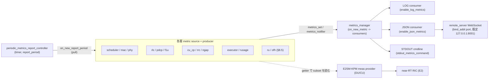

---

## 13. 未確認事項一覧

本書の作成過程で、実ツリーから確証を得られなかった事項を以下にまとめる。

- `ngap_pdu_session_resource_setup_procedure::operator()` の正確な行番号。ファイル
  `lib/ngap/procedures/ngap_pdu_session_resource_setup_procedure.cpp` は存在するが、本文での
  行レベル引用は未照合。
- DU-Low の flexible executor 構成に渡される `non_rt_low_prio_exec`
  （`du_low_executor_mapper.h:58`）の mapper 実装内での具体的用途。定義はあるが利用箇所が未確認。
- scheduler の CLI11 オプション文字列（`--` 名）と `scheduler_expert_config` の struct field 名の
  完全な対応。struct field は確認済みだが CLI 文字列リテラルとの全件照合は未実施。
- （§8.2 OFH 同期源）OFH の OTA タイミングが読む system clock（`CLOCK_REALTIME`）の **PTP/SyncE 規律は
  外部依存**（`ptp4l`/`phc2sys`、NIC/OS 層）であり、本ツリーに servo は無い（断定）。一方で、うるう秒定数
  `18`（`realtime_timing_worker.h:49`）の将来更新運用と、クロック未規律時の fallback の有無は **未確認**
  （コードは `CLOCK_REALTIME` をそのまま信頼し、劣化は "woke up late" のスキップ計数として現れるのみ）。
  PTP インターフェース/PHC index を指す config option は OFH unit には **無いことを確認済み**。
- （§8.9）`dl_processing_time` / `ul_processing_time`（`ru_ofh_config.h:198,200`）は struct field として
  存在するが CLI `--` option が未登録。YAML/struct binding 以外の設定経路は未確認。
- （§8.9）DU-Low `max_processing_delay_slots` と OFH の T1a/Ta4 窓・`nof_symbols_to_process_uplink` の
  整合検証はコード上に見当たらない（validator の cross-check 無し）。設計意図としての結合はあり得るが、
  コードによる強制は未確認。
- （§9.B.1 要確認・バグの可能性）FD 平滑戦略の選択が `upper_phy_factories.cpp:570-572` で
  `pusch_channel_estimator_td_strategy`（TD キー）を参照している。TD キーの値域は `average`/`interpolate` で
  `"none"`/`"mean"` に一致しないため、`--pusch_channel_estimator_fd_strategy` は FD 平滑に効かず常に既定
  `filter` になると読める（firsthand 確認済み）。**意図的な仕様か実装ミスかは未確認**。
- （§9.A.4）`max_consecutive_kos`（CLI 結線は確認）の既定値、および `max_nof_msg3_harq_retxs`
  （`scheduler_expert_config.h:239`）が独立 CLI flag を持つか、は未照合。
- （§9.A.3 / §9.B.3 補足・事実）OLLA の `delta_up` 係数と LDPC `scaling_factor=0.8` は config override 経路を
  持たないハードコード（未確認ではなく確定事実だが、運用上 override 不可である点に留意）。
- （§10.8）CU-CP / CU-UP の `max_nof_*` 既定値（`max_nof_dus=6` 等、`max_nof_ues=8192/16384`、
  `max_nof_ue_strands=16`）は §4.6 / §5.6 / §5.4（既存章）で firsthand 確認した値を参照しており、本章 §10 では
  再オープンしていない。行番号は当該章を参照のこと。
- （§10.5 補足・事実）DU-High の UE→strand も `dedicated` cell executor（§10.4）と同型で、`round_robin`
  （`index_based_ue_executor_mapper`）が実在するが `worker_manager` は `per_cell` を配線する。production が
  `index_based` を選ぶ経路の有無は未照合（dedicated と同様、テスト/直接 API 経由と推測されるが未確認）。
- （§11.1）NG-C / N2 の SCTP gateway は `o_cu_cp_app_unit->create_o_cu_cp` ユニット factory 内で生成され、
  本文では gnb.cpp レベルの依存注入（`ngap_pcap`/`broker`、`gnb.cpp:489-490`）のみ確認。N2 SCTP gateway を
  生成する正確なファイル:line は未照合。
- （§11.5）NG Reset と DU 起動 F1 Reset の **ACK 内容処理はコード上 TODO/log のみ**（`ng_reset_procedure.cpp:42`
  の `// TODO`）。ack 受領後に追加の UE アクションを取るかは未確認（コードは明示的に処理していない）。
- （§11.3 Style 2）F1AP DU 側で **受信した** ErrorIndication に対する能動ハンドラは PDU dispatch 内に見当たらず、
  log 止まりと推測されるが、受信 ErrorIndication への具体アクションの有無は未確認。
- （§12.5）`report_period` の config キーは CU-CP の `cu_cp_report_period`（既定 1000ms）を firsthand 確認した
  のみ。DU-high / RU / CU-UP の各 report period の正確なキー名は layer ごとに別で、全件は未照合。
- （§12.4）E2SM-KPM の supported metrics は DU 側 約18件・CU 側 約11件を確認したが、CU 側の全 `emplace` の網羅と、
  各 getter が読む内部 metric 源の完全な対応付けは未照合（公開対象が「限定的 subset」である事実は確定）。
- （§12.2）metric producer の pull（`on_new_report_period` 実装）／push（層内独自タイミング）の混在は、
  `cu_cp` / `flexible_o_du` の producer が空実装＝push であることを確認した範囲で、全層の分類は未照合。
- 本書の `path:line` は作業ツリー（コミット `7a2b9e3`）時点のもの。以後の編集で行番号がずれる
  可能性がある。

---

## 付録: 引用ファイル索引（主要分）

- 全体・DU 合成: `lib/du/o_du_impl.h`
- DU-High: `lib/du/du_high/{du_high_impl.h, o_du_high_impl.h, du_high_executor_mapper.cpp}`,
  `lib/du/du_high/du_manager/du_manager_impl.{h,cpp}`,
  `lib/mac/{mac_impl.h, mac_dl/mac_cell_processor.cpp, mac_ul/pdu_rx_handler.cpp, mac_sched/ocudu_scheduler_adapter.h}`,
  `lib/scheduler/scheduler_impl.h`, `lib/rlc/rlc_factory.cpp`, `lib/f1ap/du/f1ap_du_impl.{h,cpp}`,
  `include/ocudu/mac/{mac_config.h, mac_cell_result.h, mac_executor_mapper.h}`
- DU-Low: `lib/du/du_low/{du_low_impl.{h,cpp}, o_du_low_impl.{h,cpp}, du_low_executor_mapper.cpp}`,
  `lib/phy/upper/{upper_phy_impl.h, downlink_processor_pool_impl.cpp, downlink_processor_multi_executor_impl.cpp}`,
  `include/ocudu/phy/upper/{upper_phy.h, downlink_processor.h, upper_phy_rg_gateway.h, upper_phy_execution_configuration.h}`,
  `include/ocudu/ru/ru_adapters.h`, `lib/ofh/transmitter/ofh_downlink_handler_impl.cpp`,
  `lib/ru/ofh/ru_ofh_downlink_plane_handler_proxy.cpp`
- CU-CP: `lib/cu_cp/{cu_cp_impl.h, cu_cp_executor_mapper.cpp, du_processor/du_processor_impl.{h,cpp},
  routines/initial_context_setup_routine.cpp, routines/pdu_session_resource_setup_routine.cpp}`,
  `lib/rrc/{rrc_du_impl.h, ue/rrc_ue_impl.h, ue/rrc_ue_srb_context.h, ue/procedures/rrc_setup_procedure.cpp}`,
  `lib/ngap/{ngap_impl.{h,cpp}, procedures/...}`, `lib/f1ap/cu_cp/f1ap_cu_impl.cpp`,
  `lib/e1ap/cu_cp/e1ap_cu_cp_impl.cpp`, `apps/units/o_cu_cp/cu_cp/cu_cp_unit_config.h`
- CU-UP: `lib/cu_up/{cu_up_impl.{h,cpp}, cu_up_executor_mapper.cpp, pdu_session_manager_impl.cpp}`,
  `lib/pdcp/{pdcp_entity_tx.h, pdcp_entity_rx.h}`, `lib/sdap/sdap_entity_impl.h`,
  `lib/gtpu/gtpu_demux_impl.h`, `lib/e1ap/cu_up/e1ap_cu_up_impl.{h,cpp}`,
  `apps/units/o_cu_up/cu_up/cu_up_unit_config.h`
- 横断（thread/executor）: `apps/services/worker_manager/worker_manager.cpp`,
  `include/ocudu/adt/detail/concurrent_queue_params.h`,
  `include/ocudu/support/executors/priority_task_worker.h`,
  `include/ocudu/support/executors/detail/priority_task_queue.h`,
  `lib/support/executors/priority_task_queue.cpp`, `lib/support/executors/priority_task_worker.cpp`
- 横断（scheduler policy）: `lib/scheduler/policy/{scheduler_policy.h, scheduler_policy_factory.cpp,
  scheduler_time_qos.cpp, scheduler_time_rr.cpp}`, `include/ocudu/scheduler/config/scheduler_expert_config.h`
- 横断（非標準アルゴリズム / scheduler）: `lib/scheduler/ue_scheduling/{intra_slice_scheduler.{h,cpp},
  ue_cell_grid_allocator.{h,cpp}, grant_params_selector.{h,cpp}}`,
  `lib/scheduler/support/{outer_loop_link_adaptation.h, mcs_calculator.{h,cpp}, mcs_tbs_calculator.{h,cpp},
  pusch_power_controller.{h,cpp}, pucch_power_controller.{h,cpp}, rb_helper.h}`,
  `lib/scheduler/ue_context/{ue_link_adaptation_controller.{h,cpp}, ue_channel_state_manager.{h,cpp}}`,
  `lib/scheduler/cell/cell_harq_manager.{h,cpp}`,
  `lib/scheduler/slicing/{inter_slice_scheduler.{h,cpp}, ran_slice_instance.{h,cpp}, ran_slice_candidate.h}`,
  `lib/scheduler/pucch_scheduling/{pucch_allocator_impl.{h,cpp}, pucch_resource_manager.{h,cpp}}`,
  `lib/scheduler/uci_scheduling/uci_allocator_impl.{h,cpp}`,
  `include/ocudu/ran/power_control/tpc_mapping.h`, `include/ocudu/ran/pucch/pucch_constants.h`,
  `include/ocudu/ran/rrm.h`
- 横断（非標準アルゴリズム / 受信 DSP）: `lib/phy/upper/signal_processors/channel_estimator/{port_channel_estimator_average_impl.{h,cpp},
  port_channel_estimator_helpers.{h,cpp}}`, `lib/phy/upper/signal_processors/pusch/dmrs_pusch_estimator_impl.{h,cpp}`,
  `lib/phy/upper/equalization/{channel_equalizer_generic_impl.{h,cpp}, equalize_zf_1xn.h, equalize_zf_2xn.h,
  equalize_zf_mxn_simd.h, equalize_mmse_mxn_simd.h, gram_matrix.h, matrix_inverse.h}`,
  `include/ocudu/phy/upper/equalization/channel_equalizer_algorithm_type.h`,
  `lib/phy/upper/channel_processors/pusch/{pusch_processor_impl.cpp, pusch_decoder_impl.cpp}`,
  `lib/phy/upper/channel_coding/ldpc/{ldpc_decoder_impl.{h,cpp}, ldpc_decoder_generic.cpp}`,
  `lib/phy/upper/channel_processors/prach/{prach_detector_generic_impl.{h,cpp}, prach_detector_generic_thresholds.cpp}`,
  `lib/phy/support/time_alignment_estimator/time_alignment_estimator_dft_impl.{h,cpp}`,
  `lib/phy/upper/upper_phy_factories.cpp`, `apps/units/flexible_o_du/o_du_low/du_low_config.h`
- 横断（スケーリング）: `apps/services/worker_manager/{worker_manager.cpp, worker_manager_config.h,
  worker_manager_appconfig.h, os_sched_affinity_manager.h, cli11_cpu_affinities_parser_helper.{h,cpp}}`,
  `lib/du/du_high/du_high_executor_mapper.cpp`, `tests/test_doubles/du/test_du_high_worker_manager.cpp`,
  `lib/scheduler/{scheduler_impl.{h,cpp}, cell_scheduler.{h,cpp}}`,
  `lib/scheduler/ue_scheduling/ue_scheduler_impl.{h,cpp}`, `lib/ru/ofh/ru_ofh_executor_mapper.cpp`,
  `include/ocudu/ran/{gnb_constants.h, du_cell_index.h, du_types.h}`,
  `apps/units/o_cu_cp/cu_cp/cu_cp_unit_config.h`, `apps/units/o_cu_up/cu_up/cu_up_unit_config.h`
- 横断（ライフサイクル・障害時挙動）: 起動/停止 `apps/gnb/gnb.cpp`, `apps/{cu,du,cu_cp,cu_up,du_low}/*.cpp`,
  `lib/support/signal_handling.cpp`, `apps/services/worker_manager/worker_manager.cpp`,
  `lib/support/executors/{task_worker_pool.cpp, task_execution_manager.cpp}`, `include/ocudu/adt/blocking_queue.h`,
  `apps/units/flexible_o_du/split_helpers/flexible_o_du_impl.cpp`, `lib/du/o_du_impl.cpp`,
  `lib/du/du_high/du_manager/du_manager_controller_impl.cpp`,
  `lib/du/du_high/du_manager/procedures/{du_setup_procedure.cpp, f1c_disconnection_handling_procedure.cpp, du_cell_stop_procedure.cpp}`;
  abort/assert `include/ocudu/support/{error_handling.h, ocudu_assert.h, compiler.h}`, `CMakeLists.txt`,
  `lib/ofh/compression/iq_compression_death_impl.cpp`, `lib/scheduler/ue_scheduling/ue_cell_grid_allocator.cpp`;
  error 伝播 `include/ocudu/phy/upper/upper_phy_error_notifier.h`, `include/ocudu/phy/lower/lower_phy_error_notifier.h`,
  `include/ocudu/ru/ru_error_notifier.h`, `lib/phy/upper/upper_phy_error_handler_impl.cpp`,
  `lib/fapi_adaptor/{phy/p7/phy_to_fapi_error_event_fastpath_translator.cpp, mac/p7/fapi_to_mac_error_indication_fastpath_translator.cpp}`,
  `include/ocudu/adt/expected.h`, `lib/ngap/ngap_error_indication_helper.h`;
  リンク断/復旧 `lib/ngap/ngap_connection_handler.cpp`, `lib/cu_cp/routines/{amf_connection_loss_routine.cpp, cell_deactivation_routine.cpp, ue_context_release_routine.cpp, reestablishment_context_modification_routine.cpp}`,
  `lib/cu_cp/cu_cp_controller/{cu_up_connection_manager.cpp, du_connection_manager.cpp}`,
  `lib/cu_up/routines/cu_up_e1_connection_loss_routine.cpp`, `lib/f1ap/du/f1ap_du_connection_handler.cpp`,
  `lib/{f1ap/gateways/f1c_local_connector_factory.cpp, e1ap/gateways/e1_local_connector_factory.cpp}`,
  `lib/gateways/sctp_socket.cpp`, `apps/helpers/network/sctp_appconfig.h`
- 横断（メトリクス・可観測性）: フレームワーク `apps/services/metrics/{metrics_manager.h, metrics_producer.h,
  metrics_consumer.h, metrics_notifier.h, periodic_metrics_report_controller.h, metrics_config.h}`,
  `apps/helpers/metrics/{metrics_config.h, json_generators/}`;
  各層 metric `include/ocudu/scheduler/scheduler_metrics.h`, `include/ocudu/mac/mac_metrics.h`,
  `include/ocudu/rlc/{rlc_metrics.h, rlc_tx_metrics.h, rlc_rx_metrics.h}`,
  `include/ocudu/pdcp/{pdcp_tx_metrics.h, pdcp_rx_metrics.h}`, `include/ocudu/f1u/cu_up/{f1u_tx_metrics.h, f1u_rx_metrics.h}`,
  `include/ocudu/cu_cp/cu_cp_metrics_notifier.h`, `include/ocudu/rrc/rrc_metrics.h`,
  `include/ocudu/ngap/{ngap_metrics.h, mobility_management_metrics.h}`, `include/ocudu/e1ap/cu_up/e1ap_cu_up_metrics.h`,
  `include/ocudu/phy/upper/upper_phy_metrics.h`, `include/ocudu/support/executors/metrics/executor_metrics.h`,
  `include/ocudu/support/resource_usage/resource_usage_metrics.h`;
  backend `apps/services/{remote_control/{remote_server.h, remote_server_metrics_gateway.h, remote_control_appconfig.h}, cmdline/stdout_metrics_command.h}`;
  E2-KPM `lib/e2/e2sm/e2sm_kpm/{e2sm_kpm_du_meas_provider_impl.cpp, e2sm_kpm_cu_meas_provider_impl.cpp, e2sm_kpm_report_service_impl.h, e2sm_kpm_metric_defs.h}`,
  `include/ocudu/e2/{e2_du_metrics_connector.h, e2_cu_metrics_connector.h}`
- 横断（OFH timing/deadline）: タイミング `include/ocudu/ofh/timing/{slot_symbol_point.h,
  ofh_ota_symbol_boundary_notifier_manager.h}`, `lib/ofh/timing/realtime_timing_worker.{h,cpp}`,
  `lib/ru/ofh/ru_ofh_impl.cpp`; 受信側締め切り `lib/ofh/receiver/{ofh_rx_window_checker.{h,cpp},
  ofh_sequence_id_checker_impl.h, ofh_message_receiver_impl.cpp, ofh_uplane_rx_symbol_data_flow_writer.cpp,
  ofh_closed_rx_window_handler.{h,cpp}, ofh_data_flow_uplane_uplink_data_impl.cpp, ofh_receiver_factories.cpp}`,
  `include/ocudu/ofh/receiver/ofh_receiver_timing_parameters.h`; 送信側 `lib/ofh/transmitter/{ofh_downlink_handler_impl.cpp,
  ofh_tx_window_checker.h, ofh_uplink_request_handler_impl.cpp, ofh_message_transmitter_impl.cpp,
  ofh_transmitter_ota_symbol_task_dispatcher.h, helpers.h}`,
  `include/ocudu/ofh/transmitter/ofh_transmitter_timing_parameters.h`, `include/ocudu/ofh/ethernet/ethernet_frame_pool.h`;
  serdes/compression `lib/ofh/serdes/*`, `lib/ofh/compression/iq_compression_bfp_impl.{h,cpp}`,
  `include/ocudu/ofh/compression/compression_params.h`; executor `lib/ru/ofh/ru_ofh_executor_mapper.cpp`,
  `apps/services/worker_manager/worker_manager.cpp`; config
  `apps/units/flexible_o_du/split_7_2/helpers/{ru_ofh_config.h, ru_ofh_config_cli11_schema.cpp, ru_ofh_config_translator.cpp}`,
  `apps/units/flexible_o_du/o_du_low/du_low_config.h`
